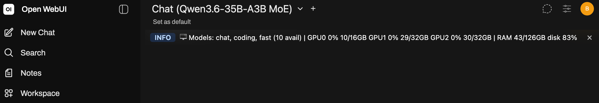
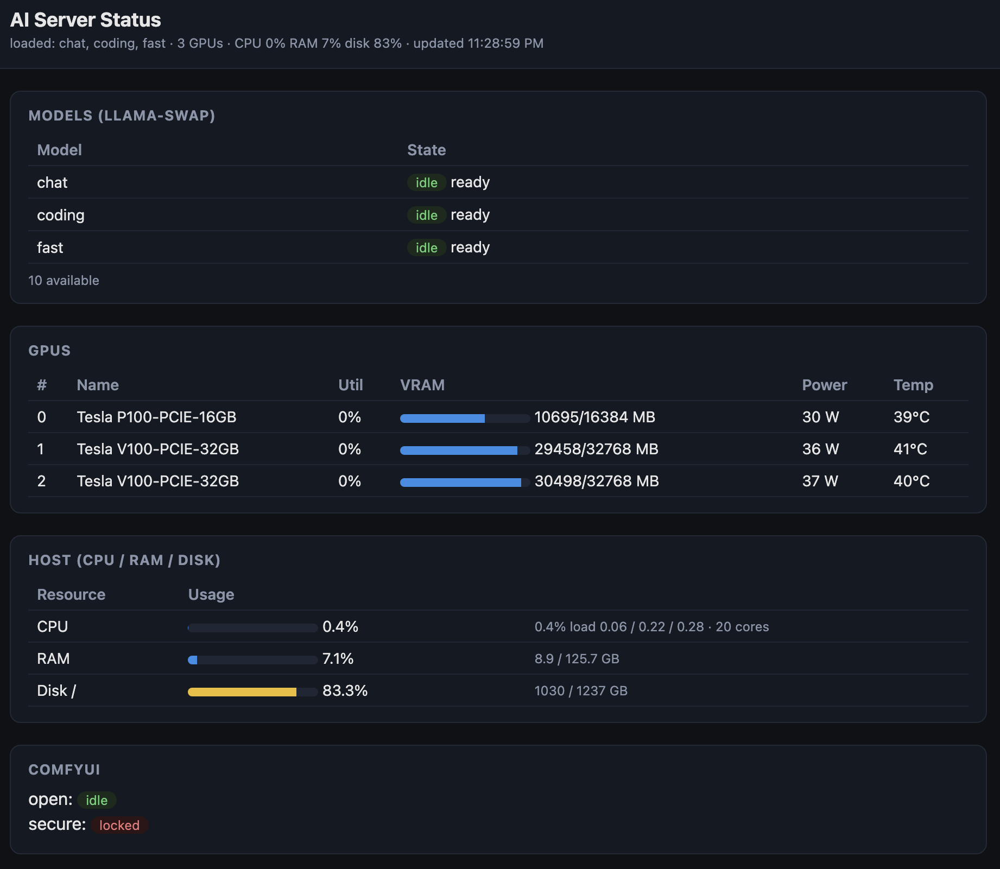

# Headless AI Server (For home or small business)

Configuration, operational scripts, and design docs for a personal headless AI
server (development + AI workloads for me and my family). The box serves local LLMs,
speech-to-text, embeddings/RAG, image generation, and long-running agents behind a
single OpenAI-compatible API. The same setup scales naturally to a **small office or
workgroup** — a handful of people (and their editors, chat apps, and agents) can share
one private endpoint instead of paying per-seat for a cloud API.

> This repo tracks **docs** and **scripts** only. Large/local artifacts — models,
> Python venvs, source checkouts, datasets, and per-service data — live on the box
> under `/srv/ai/` and are intentionally git-ignored.

## Contents

- [What it does](#what-it-does)
- [Hardware](#hardware)
- [Build cost](#build-cost)
- [Power usage](#power-usage)
- [Retrospective — what I'd do differently](#retrospective--what-id-do-differently)
- [Layout](#layout)
- [Notable components & scripts](#notable-components--scripts)
- [Documentation](#documentation)
- [Conventions](#conventions)
- [Attribution](#attribution)
- [License](#license)

## What it does

This is the full config + runbook for turning a single multi-GPU workstation into a
private, always-on AI appliance — one OpenAI-compatible endpoint that a household of
users (and their editors, chat apps, and agents) can point at instead of a paid cloud
API. The design goal is to squeeze modern models onto older, cheap datacenter GPUs
(Pascal/Volta, no NVLink) and keep them running cool, reliably, and unattended.

> **Before you build one of these, read the whole guide first** — or at the very least the
> [Retrospective — what I'd do differently](#retrospective--what-id-do-differently). This
> build hit real hardware traps (GPU ordering, thermals, PCIe-lane limits, a bare-partition
> disk layout) that are much cheaper to avoid up front than to fix after the fact.

Capabilities:

- **Local LLM serving with automatic model swapping.** [llama.cpp](https://github.com/ggml-org/llama.cpp)
  behind [llama-swap](https://github.com/mostlygeek/llama-swap) loads models on demand
  and a *matrix router* picks co-resident model sets that fit across the three GPUs, so
  a coding model, a chat model, and a fast model can stay hot simultaneously and swap in
  heavier models on request — no manual juggling.
- **One OpenAI-compatible API for everything.** [LiteLLM](https://github.com/BerriAI/litellm)
  fronts the local router (and optional cloud fallbacks) so any OpenAI client — editors,
  scripts, [Open WebUI](https://github.com/open-webui/open-webui), IDE assistants — works
  unchanged. A helper script even points GitHub Copilot at the box (BYOK).
- **Image & video generation as callable tools.** Two [ComfyUI](https://github.com/comfyanonymous/ComfyUI)
  instances (an open one and a password-locked one) run natively; curated style workflows
  (z-image, FLUX.1/FLUX.2, Krea-2, WAN video, song generation) are exposed as **MCP tools**
  so chat models and agents can generate media by name.
- **Local VLM, RAG & embeddings.** Vision-language inference runs inside ComfyUI; the app
  tier includes vector-DB/RAG plumbing and web search ([SearXNG](https://github.com/searxng/searxng)).
- **An agent/tool ecosystem.** [mcpo](https://github.com/open-webui/mcpo) surfaces MCP tool
  servers (time, fetch, git, ComfyUI, and a custom **plan-and-build** tool) to any client —
  including a "plan with one model, implement with another" GPU-aware coding workflow.
- **Thermal & power safety, unattended.** A custom daemon drives per-GPU shroud fans from
  memory temperature and applies self-healing power caps, keeping V100 HBM under its
  throttle point for longevity and quiet operation on a headless box.
- **Live status at a glance.** A host-side status service aggregates loaded models, ComfyUI
  queues, and per-GPU util/VRAM/power/temp (JSON + HTML on `:9095`) and pushes a live
  **banner into Open WebUI** — so the blank new-chat screen shows what's currently running
  on the box before you type a word.

  | Open WebUI status banner | Host status page (`:9095`) |
  |---|---|
  |  |  |

## Hardware

- **CPU/RAM:** Intel i7-6950X (MSI X99A), 128 GB RAM, 2 TB NVMe
- **GPUs:** 2× Tesla V100-32GB (sm_70) + 1× Tesla P100-16GB (sm_60), no NVLink (PCIe)
- **OS:** Ubuntu 24.04, NVIDIA driver 580-server, CUDA 12.x toolkit

## Build cost

A rough bill of materials for the build. The goal was capable multi-GPU inference on
a tight budget by using previous-generation datacenter GPUs and a used base PC.

| Item | Qty | Cost |
|------|----:|-----:|
| Used PC (motherboard, RAM, Intel SSD, Titan X GPU†, Rosewill 1200W PSU†) | 1 | $650 |
| Corsair HX1200i PSU (replaced the Rosewill) | 1 | $321 |
| NVIDIA Tesla V100 PCIe 32GB | 2 | $1,612 |
| NVIDIA Tesla P100 PCIe 16GB | 1 | $79 |
| Additional GPU power cable | 1 | $14 |
| Dual-GPU-to-single-connector power adapters | 4 | $30 |
| Fan ARGB extension cables | 4 | $8 |
| GPU fan shrouds | 1 | $54 |
| Arctic S4028-15K fans | 2 | $25 |
| Arctic S4028-6K fan | 1 | $9 |
| Rolling tower stand | 1 | $45 |
| GPU support bracket | 1 | $16 |
| Smart power plug | 1 | $23 |
| **Total (all taxes and shipping included)** | | **$2,886** |

† The Titan X GPU and Rosewill 1200W PSU came bundled with the used PC and are no
longer used.

> **Power usage & running costs:** to be added after real-world power measurement.

## Power usage

Measured with `nvidia-smi dmon`. These are **GPU-only** figures — whole-system draw at
the wall is higher (CPU, motherboard, NVMe, fans, and PSU conversion losses on top).

### Idle — daily models loaded (warm)

Normal running state: the `fast` model resident on the P100 plus `coding` + `chat` on the
V100s, no active inference.

| GPU | Card | Power | Core temp | Mem temp | SM clock |
|-----|------|-------|-----------|----------|----------|
| 0 | Tesla P100-16GB | ~30 W | 39 °C | n/a¹ | 1189 MHz |
| 1 | Tesla V100-32GB | ~36 W | 41 °C | 40 °C | 1230 MHz |
| 2 | Tesla V100-32GB | ~37 W | 40 °C | 39 °C | 1230 MHz |
| **Total** | | **~103 W** | | | |

### Idle — nothing loaded (true cold idle)

All LLMs unloaded **and both ComfyUI instances stopped**, so no CUDA context is resident on
any card:

| GPU | Card | Power | Core temp | Mem temp | SM clock |
|-----|------|-------|-----------|----------|----------|
| 0 | Tesla P100-16GB | ~24 W | 36 °C | n/a¹ | 405 MHz |
| 1 | Tesla V100-32GB | ~24 W | 38 °C | 38 °C | 135 MHz |
| 2 | Tesla V100-32GB | ~25 W | 38 °C | 37 °C | 135 MHz |
| **Total** | | **~73 W** | | | |

¹ The P100 does not report an HBM memory-junction temperature.

**Why the ~30 W gap?** These datacenter Teslas won't deep-idle while *any* CUDA context is
resident. Whenever a model — LLM **or** a ComfyUI instance — is loaded, the V100 SM clock
stays pinned at 1230 MHz (its memory clock sits at 877 MHz regardless); with everything
unloaded the SM clock falls to 135 MHz and draw drops accordingly. Notably, keeping the two
ComfyUI instances warm alone (LLMs unloaded) is enough to hold both V100s at ~36–37 W — the
LLMs add only a few watts on top. Power caps applied at boot by the fan-control daemon cap
the *ceiling* (P100 200 W, V100 175 W each), not this idle floor.

### Whole-system idle (at the wall)

| Metric | Value |
|--------|-------|
| Whole-system draw (daily models loaded, idle) | **170 W** |
| Electricity rate | $0.105 / kWh |
| Cost per day (24 h) | ~$0.43 |
| Cost per month (~730 h) | **~$13** (~124 kWh) |
| Cost per year | ~$156 (~1,489 kWh) |

The extra ~67 W over the ~103 W of GPUs is the CPU, motherboard, NVMe, fans, and PSU
conversion losses. Running costs under sustained inference load will be higher.

> **Optional quiet-hours deep idle:** the `server-status` service can run a configurable
> overnight window (default 02:00–09:00) that unloads the models and stops ComfyUI so the
> V100s fall to the ~73 W cold-idle floor, then auto-wakes on the first client request.
> Disabled by default — see [docs/server-setup.md](docs/server-setup.md#quiet-hours-deep-idle-window).

> **Load draw:** whole-system wall power and $/month under sustained inference to be
> added after measurement.

### Why not full sleep / hibernate / Wake-on-LAN?

A deeper power-down (suspend-to-RAM, hibernate, or powering off with Wake-on-LAN) was
considered and **deliberately not pursued** — it trades a lot of reliability for a small
saving on this hardware:

- **Wake-on-LAN isn't "connect and wake."** WoL fires only on a **magic packet**, not on a
  normal SSH/HTTP/Tailscale connection, and it doesn't traverse Tailscale/the internet (it's
  an L2 broadcast). Clients would get connection-refused until some always-on LAN helper sent
  the packet — so it can't be transparent.
- **GPU resume is the real hazard.** Keeping models across suspend needs the NVIDIA driver's
  `PreserveVideoMemoryAllocations=1`, which copies **all in-use VRAM (~76 GB) into system RAM**
  on every suspend over PCIe gen 3 — slow, RAM-tight, and unproven on these older Teslas, where
  resume can hang and require a hard reboot. Not acceptable for a headless always-available box.
- **Hibernate needs a huge swap.** Swap is 8 GB vs 125 GB RAM; hibernate requires swap ≥ used
  RAM, so it would fail without a 128 GB+ swap file and slow RAM→disk dumps.
- **Modest payoff.** Suspend might save ~110 W over deep idle during the ~7 h window
  (~$30/yr) — real, but small next to the added fragility (resume hangs, WoL misfires,
  connection-refused UX).

The quiet-hours deep-idle window above captures most of the practical saving (cards fall to
~73 W, everything stays responsive and wakes instantly on the actual request) with none of the
suspend/WoL fragility. If ever revisited, suspend must only be tested from the physical console
or via `rtcwake` with a timed auto-wake — never over SSH, which the suspend would freeze.

## Retrospective — what I'd do differently

Things I'd change on a second build, learned the hard way:

1. **Use SXM2 V100s with NVLink instead of PCIe cards.** Buy the SXM2 version of the
   V100 and do the extra work to fit the PCIe-adapter carrier boards that enable NVLink
   between the two cards. NVLink would give a significant performance boost on larger
   models split across the pair (the current no-NVLink PCIe PHB link is the bottleneck
   for tensor-split inference). It also unlocks much cheaper and easier-to-source water
   cooling: SXM2 waterblocks are $35–45 versus the single PCIe V100 waterblock that
   exists at $175–300, so the system could run cooler and quieter. If/when I grow total
   VRAM to 128 GB I may sell the current cards and switch. I'm holding off because there
   are very few attractive models that need that size — 64 GB already covers most models
   useful today, and the larger open-weight models easily need 256 GB+ of VRAM to run
   acceptably.

2. **Better GPU cooling than one 40 mm fan per card.** The current 40 mm high-static-
   pressure fans aren't optimal running just one per card. I have a dual-40 mm fan mount
   to test whether two per card cool better — the goal is to raise the power limit
   slightly while keeping noise down. I also have a blower-style fan and shroud to try
   alongside the dual-40 mm shroud. The SXM2 cards (point 1) with water cooling would
   sidestep this problem entirely.

3. **A motherboard with more PCIe lanes and a newer PCIe revision.** The current X99A
   board is stretched to its limit with only 40 PCIe lanes. Adding a PCIe SSD complicated
   the lane budget considerably and hurt the already-slow inter-card communication. Next
   time I'd pick a board with more lanes and a newer PCIe generation — even if these
   cards can't use PCIe 4.0 speeds, it would be more future-proof.

4. **Put the OS/data on LVM instead of a bare ext4 partition.** Root is a plain ext4
   partition on the NVMe, so the filesystem can't be transparently grown onto a second
   disk — adding storage means a separate mount or a union filesystem rather than just
   extending the volume. Had I set it up on LVM (or ZFS/btrfs) from the start, I could
   add the spare drive to the volume group and expand in place. Something to fix on the
   next rebuild.

## Layout

| Path | Tracked | Contents |
|------|---------|----------|
| `docs/` | ✅ | Runbook (`server-setup.md`), architecture (`architecture.md`), ADRs (`adr/`) |
| `scripts/` | ✅ | Setup, build, benchmark, and service scripts (fan/power control, CUDA, llama.cpp) |
| `config/` | ✅ | llama-swap router config, ComfyUI MCP workflow definitions |
| `docker/` | ✅ | Compose stack for the CPU app tier (LiteLLM, Open WebUI, mcpo, SearXNG, plan-build MCP) |
| `models/`, `venvs/`, `src/`, `datasets/`, … | ❌ (local) | Model weights, virtualenvs, source builds, data |

## Notable components & scripts

Things others running older multi-GPU boxes may find reusable:

| Component | What it gives you |
|-----------|-------------------|
| `config/llama-swap.yaml` | Matrix router that auto-swaps **co-resident model sets** across 3 GPUs so daily models stay hot and heavy models swap in on demand. |
| `docker/mcpo/plan_build_mcp.py` | **Plan-and-build MCP tool** — plan a task with one model, implement it with another; GPU-aware so planner + coder stay co-resident (no swap). |
| `config/comfyui-mcp/workflows/*.json` + `scripts/comfyui-mcp-launch.py` | Turn ComfyUI style workflows into **MCP image/video/song tools** callable by name from chat/agents. |
| `scripts/install-comfyui-instances.sh` + `comfyui-*.service` | **Dual ComfyUI** setup — an open instance plus a password-locked one — from a single install, as systemd services. |
| `scripts/comfyui-free-gpu-node.py` | ComfyUI node that **unloads llama-swap LLMs and waits for VRAM** to actually free before a render, avoiding OOM on shared GPUs. |
| `scripts/comfyui-snapshot.sh` | **Reversible snapshots** of the ComfyUI custom-node/pip state so you can undo a bad node-pack install. |
| `scripts/gpu-fan-control.py` (+ `.service`, `.config.json`) | Temperature-driven **shroud-fan control + self-healing power caps** (drives off V100 HBM temp; re-caps GPUs that fall off/return on the bus). |
| `scripts/server-status-service.py` (+ `server-status.service`) | Host-side **status service** (JSON + HTML on `:9095`) aggregating loaded models, ComfyUI queues, and per-GPU util/VRAM/power/temp. Optionally pushes a live **status banner** into Open WebUI (shown on the blank new-chat screen), keeps the **`fast` model warm on the P100**, and can run an optional **quiet-hours deep-idle window** (unloads models + stops ComfyUI overnight to drop the V100s out of P0; auto-wakes on client activity). |
| `docker/open-webui/functions/server_status_inlet.py` | Open WebUI **new-chat status banner** — shows what's running at the start of each chat, sourced from the status service. |
| `scripts/build-llama.sh` + `scripts/patches/p100-fast-fp16-carveout.patch` | Build llama.cpp for **sm_60/sm_70** with the P100 fp16-precision carveout applied. |
| `scripts/bench-models.sh` | **Re-run llama.cpp benchmarks** for any subset of the served models; reads the model→GPU pinning registry straight from `llama-swap.yaml` so it never drifts. |
| `scripts/hf-dl` | Hugging Face downloads with the token **injected from the system keyring** (no plaintext token on disk). |
| `scripts/install-*.sh` | One-shot installers: CUDA 12.9, Docker + NVIDIA toolkit, llama-swap / ComfyUI / fan systemd services. |
| `scripts/bench-*.sh`, `power-cap-sweep.sh`, `verify-gpu-*.sh` | Benchmarking, power/thermal sweeps, and GPU/fan-mapping verification helpers. |
| `scripts/copilot-byok.sh` | Point **GitHub Copilot** at the local endpoint (bring-your-own-key). |

## Documentation

- **[docs/server-setup.md](docs/server-setup.md)** — central runbook: hardware,
  CUDA/driver, llama.cpp build, benchmarks, fan/power control, GPU topology. Includes
  an **operator cheat-sheet** (restart services, common edits, reboot into Windows).
- **[docs/architecture.md](docs/architecture.md)** — serving architecture: topology,
  VRAM budget, model→backend routing, component matrix, phased rollout.
- **[docs/adr/](docs/adr/README.md)** — Architecture Decision Records (the *why*
  behind settled choices).

## Conventions

- All work lives under `/srv/ai` (ADR-0001).
- Significant decisions are recorded as ADRs (`docs/adr/`), never deleted — reversed
  by adding a new ADR.
- Privileged setup is delivered as scripts run with `sudo`; the fan/power daemon runs
  as a systemd service.

## Attribution

This server stands on the shoulders of many excellent open-source projects. None of
the projects below require attribution under their licenses, but they made this build
possible and deserve credit. (Model weights served by the stack are licensed
separately by their respective creators and are not redistributed here.)

### Core serving stack (native)

| Project | Link | How it's used |
|---------|------|---------------|
| llama.cpp | https://github.com/ggml-org/llama.cpp | GGUF LLM inference engine; built from source for the P100 (sm_60) and V100 (sm_70) GPUs. |
| llama-swap | https://github.com/mostlygeek/llama-swap | Model router / on-demand loader in front of llama.cpp; the matrix router picks co-resident model sets per GPU. |
| ComfyUI | https://github.com/comfyanonymous/ComfyUI | Node-based image/video generation server (run as two native instances: open + password-locked). |
| comfyui-mcp-server | https://github.com/joenorton/comfyui-mcp-server | Exposes ComfyUI style workflows as MCP tools (vendored, lightly patched). |

### Application tier (Docker Compose)

| Project | Link | How it's used |
|---------|------|---------------|
| LiteLLM | https://github.com/BerriAI/litellm | Client-facing OpenAI-compatible gateway that fronts llama-swap and cloud providers. |
| Open WebUI | https://github.com/open-webui/open-webui | Primary chat / RAG web front-end. |
| mcpo | https://github.com/open-webui/mcpo | MCP-to-OpenAPI proxy that surfaces MCP tool servers (e.g. ComfyUI) to Open WebUI. |
| SearXNG | https://github.com/searxng/searxng | Self-hosted metasearch engine used for web-search tooling. |
| Filebrowser | https://github.com/filebrowser/filebrowser | Web file manager for browsing/downloading generated assets and models. |

### ComfyUI custom nodes

| Project | Link | How it's used |
|---------|------|---------------|
| ComfyUI-Manager | https://github.com/ltdrdata/ComfyUI-Manager | Custom-node management and reproducible install snapshots. |
| ComfyUI-GGUF | https://github.com/city96/ComfyUI-GGUF | Loads GGUF-quantized diffusion models (e.g. Qwen-Image-Edit, FLUX.2) that don't fit as fp8 on the V100. |
| ComfyUI-KJNodes | https://github.com/kijai/ComfyUI-KJNodes | Utility nodes used across image/video workflows. |
| ComfyUI-WanVideoWrapper | https://github.com/kijai/ComfyUI-WanVideoWrapper | WAN text/image-to-video generation with block-swap and VAE tiling for the 32 GB V100. |
| ComfyUI-Frame-Interpolation | https://github.com/Fannovel16/ComfyUI-Frame-Interpolation | Frame interpolation for generated video. |
| rgthree-comfy | https://github.com/rgthree/rgthree-comfy | Quality-of-life nodes incl. the Power Lora Loader used by style workflows. |
| ComfyUI-Custom-Scripts | https://github.com/pythongosssss/ComfyUI-Custom-Scripts | Editor/UX enhancements for the ComfyUI graph. |
| ComfyUI-Easy-Use | https://github.com/yolain/ComfyUI-Easy-Use | Simplified/composite nodes for building workflows. |
| ComfyUI_Text_Translation | https://github.com/TFL-TFL/ComfyUI_Text_Translation | In-graph prompt translation. |
| ComfyUI-llama-cpp_vlm | https://github.com/mickeylan/ComfyUI-llama-cpp_vlm | Runs local VLM (GGUF + mmproj) inference inside ComfyUI for image captioning/analysis. |
| ComfyUI-Login | https://github.com/liusida/ComfyUI-Login | Password authentication for the locked ComfyUI instance. |
| llama-cpp-python (JamePeng fork) | https://github.com/JamePeng/llama-cpp-python | Python bindings backing the VLM node; built from source (v0.3.40) for sm_60/sm_70. |

### Tooling & infrastructure

| Project | Link | How it's used |
|---------|------|---------------|
| Hugging Face Hub / `hf` CLI + Xet | https://github.com/huggingface/huggingface_hub | Fast model downloads (Xet backend) into local model dirs. |
| NVIDIA Container Toolkit | https://github.com/NVIDIA/nvidia-container-toolkit | GPU access for the containerized app tier. |
| Tailscale | https://github.com/tailscale/tailscale | Private mesh network for remote access to the headless box. |
| GitHub Copilot CLI | https://github.com/github/copilot-cli | AI pair-programmer used throughout to build, debug, and document this server. |
| iTerm2 | https://github.com/gnachman/iTerm2 | macOS terminal emulator used to drive SSH sessions and the Copilot CLI against the server. |
| iTerm2 `imgcat` | https://iterm2.com/documentation-images.html | Bundled in `scripts/imgcat` to preview generated images inline in the terminal over SSH. |
| P100 FAST_FP16 carveout (apollo-mg) | https://gist.github.com/apollo-mg/9218d50a209d70a85f033bf182657818 | 3-line llama.cpp patch disabling `FAST_FP16` on the P100 (sm_60) to stop fp16 accuracy drift; sourced from apollo-mg's write-up, merged in [llama-cpp-turboquant PR #212](https://github.com/TheTom/llama-cpp-turboquant/pull/212) ([TurboQuant+ tqp-v0.3.0](https://github.com/TheTom/llama-cpp-turboquant/releases/tag/tqp-v0.3.0)). See [docs/adr/0014](docs/adr/0014-p100-fast-fp16-carveout.md). |

## License

Released under the [MIT License](LICENSE).
