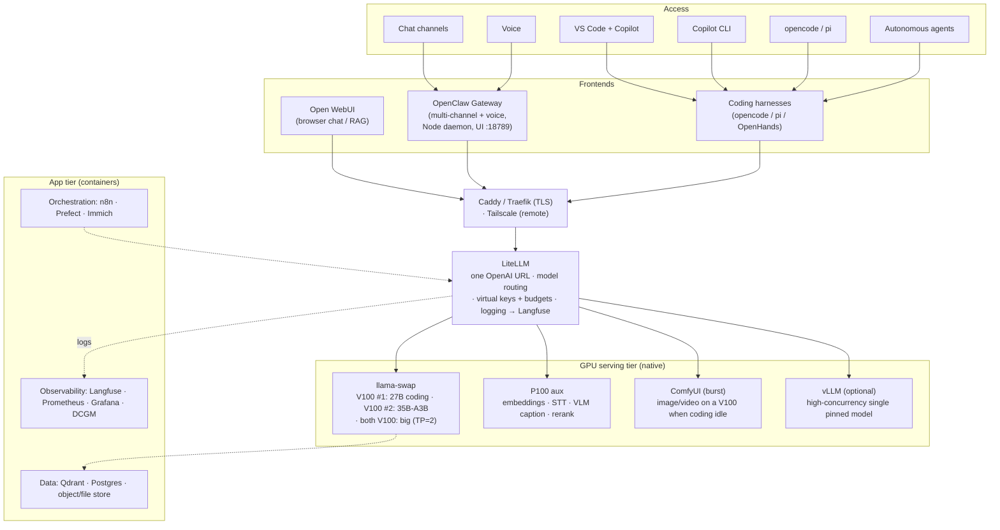

# AI Server — Serving Architecture (design doc)

Companion to **ADR-0010** (overall architecture). ADRs capture *decisions*; this doc
holds the *detail*: topology, GPU/VRAM budget, the model→backend routing table,
component run-as matrix, tooling alternatives, and the phased rollout. Living
document — update as the build proceeds.

Related ADRs: 0004 (llama.cpp primary), 0005 (GPU split), 0006 (hybrid deploy),
0007 (LiteLLM gateway), 0008 (coding model), 0009 (fan/power), 0010 (this arch).

## Contents

- [1. Topology](#1-topology)
- [2. GPU allocation & VRAM budget](#2-gpu-allocation--vram-budget)
- [3. Model → backend routing (LiteLLM) — draft](#3-model--backend-routing-litellm--draft)
- [4. Component run-as matrix (ADR-0006 hybrid)](#4-component-run-as-matrix-adr-0006-hybrid)
- [5. Tooling options (primary → alternatives)](#5-tooling-options-primary--alternatives)
- [6. Phased rollout](#6-phased-rollout)
- [7. Open questions / to validate](#7-open-questions--to-validate)

## 1. Topology

## 2. GPU allocation & VRAM budget

Power caps (ADR-0009): V100 175W, P100 200W. Caps don't affect VRAM.

| GPU | Idx / bus | Primary role | Resident VRAM (typical) | Spare |
|-----|-----------|--------------|-------------------------|-------|
| V100 #1 | 1 / bus03 | Qwen3.6-27B **coding** (Q6_K + MTP, 180k ctx) | ~31.5 GB (q8_0 KV, MTP) | ~0.75 GB |
| V100 #2 | 2 / bus04 | Qwen3.6-35B-A3B **chat** (UD-Q6_K + MTP, 96k ctx) | ~31.5 GB (q8_0 KV, MTP) | ~0.9 GB |
| both V100 | 1+2 | *Occasional* big/high-quant (TP=2 `-sm layer`) | preempts the two above | — |
| P100 | 0 / bus01 | **Gemma-4-12B `fast`** (always-on) + aux mix (co-resident) | ~10.8 GB + aux, see below | — |

**P100 16 GB budget:** the always-on `fast` chat model (Gemma-4-12B QAT, `--reasoning-budget 0`,
ctx 131072) now occupies ~10.8 GB, leaving ~5 GB for the aux mix below. Phase 4 (embeddings/STT/caption)
must fit in that remainder — pick the smaller variants, lower `fast`'s ctx, or move `fast` to a V100 spare slot
if the P100 aux mix grows.

**P100 16 GB aux budget (co-resident, on-demand):**
| Service | Model (example) | VRAM |
|---------|-----------------|------|
| Embeddings | BGE-M3 / Qwen3-Embedding | ~1–2 GB |
| STT (real-time) | faster-whisper distil-large-v3 / medium | ~2–4 GB |
| VLM captioner | small VLM (image metadata) | ~4–6 GB |
| Reranker (optional) | bge-reranker-base | ~1 GB |
| **Total** | | **~8–12 GB (fits 16 GB)** |

Notes:
- Measured throughput (llama.cpp, under 175W): 27B dense ~25 tg t/s; 35B-A3B ~97–102
  tg t/s (Q4_K_M single V100); Q6_K_P needs both V100s (~93 tg t/s). See `server-setup.md`.
- Co-residency = separate processes sharing a GPU; VRAM partitioned, compute
  time-sliced. Fine for the P100's intermittent mix; avoid two hot LLMs on one card.
- A 9B-class model won't co-reside with the full aux mix on the P100 (too much VRAM) —
  run it on a V100 spare slot or as its own on-demand P100 profile instead.

## 3. Model → backend routing (LiteLLM) — draft

| Client-facing model name | Backend | GPU | Notes |
|--------------------------|---------|-----|-------|
| `coding` (→ Qwen3.6-27B) | llama-swap → llama-server | V100 #1 | default for VS Code/CLI/opencode |
| `chat` (→ Qwen3.6-35B-A3B) | llama-swap → llama-server | V100 #2 | fast MoE; reasoning model |
| `big` (→ high-quant/large) | llama-swap **TP profile** | both V100 | preempts `coding`+`chat` |
| `fast` (→ Gemma-4-12B) | llama-swap → llama-server | P100 | always-on, non-reasoning snappy chat |
| `gemma-31b` (→ Gemma-4-31B) | llama-swap → llama-server | V100 #1 | comparison model (evicts `coding`, ttl 600s) |
| `gemma-26b` (→ Gemma-4-26B-A4B) | llama-swap → llama-server | V100 #2 | comparison model (evicts `chat`, ttl 600s) |
| `embeddings` | TEI/Infinity | P100 | RAG + Immich + Open WebUI |
| `whisper` (audio→text) | faster-whisper server | P100 | real-time STT |
| `caption` (image→text) | VLM captioner | P100 | image metadata pipeline |
| `rerank` | TEI/Infinity | P100 | RAG reranking |

Virtual keys: one per surface (Open WebUI, OpenClaw, Copilot, each family member,
each autonomous agent) with per-key budgets/rate limits → doubles as agent guardrails.

## 4. Component run-as matrix (ADR-0006 hybrid)

| Component | Run as | GPU |
|-----------|--------|-----|
| Fan/power control (ADR-0009) | native systemd | — (host `/sys`) |
| llama.cpp + **llama-swap** | native systemd | V100×2 (+P100 LLMs) |
| faster-whisper / embeddings / captioner / rerank | native venv | P100 |
| ComfyUI (image/video) | native venv | V100 (burst) |
| vLLM (optional) | native venv | V100 |
| OpenClaw | native systemd (Node 24) | — |
| LiteLLM | container | — |
| Open WebUI | container | — |
| SearXNG (web search) | container | — |
| mcpo (MCP→OpenAPI proxy, ADR-0011) | container | — |
| Qdrant / Postgres | container | — |
| Immich | container (+ GPU ML worker) | P100 for ML (TBD) |
| n8n / Prefect | container | — |
| Langfuse / Prometheus / Grafana / DCGM | container | — |

**Idle power management (quiet hours).** The always-on `server-status` service keeps the P100
`fast` model warm and can run an optional overnight **deep-idle window**: it unloads the daily
models and stops the ComfyUI units so the V100s fall out of P0 (~103 W → ~73 W), auto-waking on
client activity and re-idling after a GPU-utilization lull. ⚠️ **The machine clock is `Etc/UTC`
but the owner is US Eastern**, so the window is evaluated in `QUIET_TZ` (e.g. `America/New_York`),
not the system clock — otherwise it fires ~5 h early. See
[server-setup.md](server-setup.md#quiet-hours-deep-idle-window).

## 5. Tooling options (primary → alternatives)

| Need | Primary | Alternatives |
|------|---------|--------------|
| Gateway | LiteLLM | — |
| LLM router/serving | llama.cpp + **llama-swap** | Ollama · vLLM (V100-only) · SGLang · TGI |
| Family chat + web search | Open WebUI | LibreChat · AnythingLLM (search: SearXNG/Brave/Tavily) |
| Personal assistant (multi-channel/voice) | OpenClaw | — |
| MCP tools hosting/inventory (ADR-0011) | mcpo (config = inventory, hot-reload) | native MCP stdio for coding harnesses |
| STT | faster-whisper | whisper.cpp · WhisperX · Wyoming (streaming) |
| TTS (later) | Piper (CPU) | Kokoro · XTTSv2 · OpenedAI-speech |
| Embeddings | TEI / Infinity | llama.cpp embeddings |
| Reranker | bge-reranker via TEI/Infinity | — |
| Vector DB | Qdrant | pgvector · Milvus · Chroma |
| RAG (docs) | RAGFlow / R2R | LlamaIndex/Haystack · Open WebUI built-in (parse: Docling/Unstructured) |
| Image library | Immich (CLIP search + faces) | + custom captioner → ExifTool metadata |
| Image/video gen | ComfyUI | A1111/Forge · SD.Next |
| Orchestration / agents | n8n + Prefect | Flowise/Langflow · OpenHands · Temporal |
| Observability | Langfuse + Grafana/Prometheus/DCGM | — |
| Runtime | Docker Compose + NVIDIA Container Toolkit | (app tier only) |

## 6. Phased rollout

1. ✅ **Foundation** — Docker + NVIDIA Container Toolkit; validate a GPU container.
   (llama.cpp/llama-swap stay native.)
2. ✅ **Core serving** — llama-swap (`coding` + `chat` on-demand, `big` TP=2 profile) →
   LiteLLM gateway → point Copilot CLI/VS Code at it (BYOK, verified tool-calling+streaming).
   - _Future — hybrid local/cloud model routing:_
     - **Copilot CLI `/subagents`** — assign delegated subagent tasks (explore, task-runner)
       to the local `coding` model while a frontier model drives; role-based, no new cost. Quick win.
     - **LiteLLM difficulty routing** — route simple prompts → local `coding`, hard prompts →
       frontier (BYOK own cloud key). Needs all traffic through LiteLLM + a classifier (RouteLLM,
       semantic-router, or a custom pre-call hook), since LiteLLM native routing is tag/cost/fallback,
       not semantic difficulty. Re-verify tool-calling+streaming through the gateway. Mini-project.
2b. **OpenClaw** — `npm install -g openclaw@latest` → `openclaw onboard` → point at
   LiteLLM → wire Telegram + Control UI behind Tailscale. (Node 24 already installed.)
3. ✅ **Family chat** — Open WebUI + web search (SearXNG) + accounts; **mcpo** for MCP
   tool hosting/inventory (ADR-0011).
4. **Aux (P100)** — embeddings + faster-whisper (validate real-time latency) + captioner.
5. **RAG** — Qdrant + ingestion (Docling) + retrieval for family docs.
6. 🟡 **Media** — **ComfyUI** ✅ (native venv, burst on V100 idx1; FLUX.1-dev fp8 +
   SDXL; headless web UI :8188; auto-frees the card via a `free_gpu` hook on generate).
   Immich photo library still to do.
   - _Future:_ **ComfyUI multi-GPU** — install `pollockjj/ComfyUI-MultiGPU` and expose
     both V100s (`CUDA_VISIBLE_DEVICES=1,2`) so large two-model workflows (e.g. Wan 2.2
     I2V high+low-noise 14B, ~28 GB combined) hold each model on a separate card instead
     of swapping per stage. Note: not tensor-parallel (no NVLink, PCIe PHB) — this is
     memory distribution, not faster single-step compute. Tradeoff: video gen would then
     evict BOTH daily LLMs (coding idx1 + chat idx2) via the free_gpu hook.
7. **Orchestration** — n8n/Prefect for batch culling/metadata + long-running agents.
8. **Observability** — Langfuse + Grafana/DCGM dashboards.

## 7. Open questions / to validate

- faster-whisper real-time latency on the P100 (sm_60) — may need distil/medium.
- Immich ML worker on P100 vs CPU — test.
- vLLM Volta build + NCCL TP=2 under batched serving — revisit at vLLM bring-up.
- Reverse proxy choice: Caddy (auto-TLS, simplest) vs Traefik (label-driven).
- Whether the model router becomes load-bearing enough to warrant its own ADR.
- Image "style" batch-edit/culling definition — needs user's style criteria captured.
