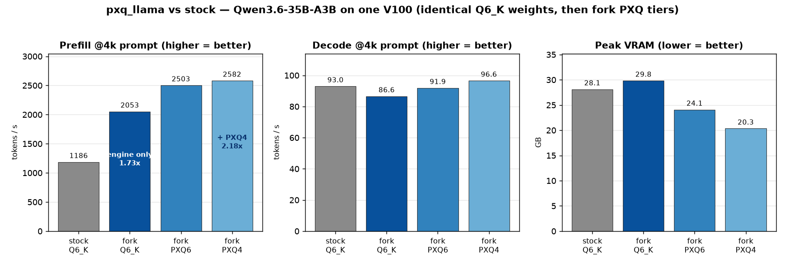
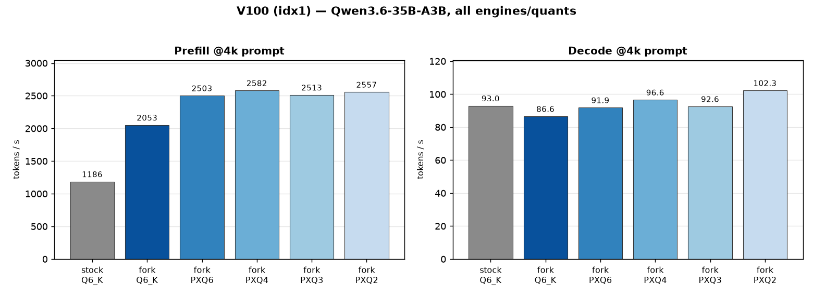
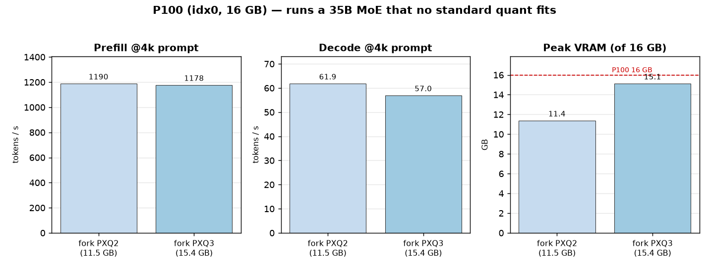
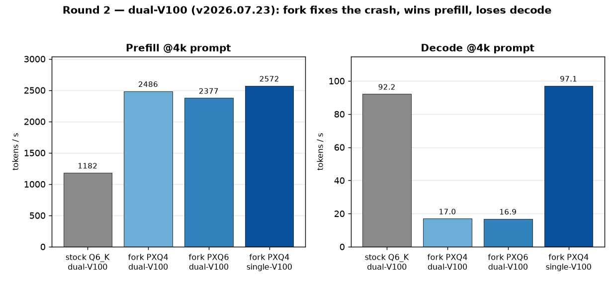
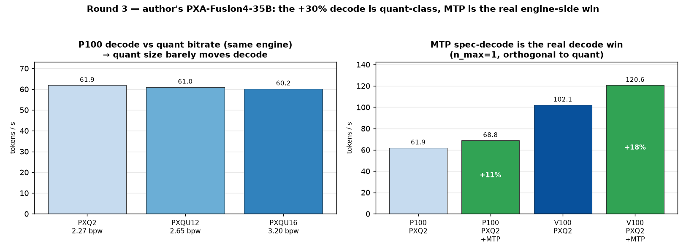
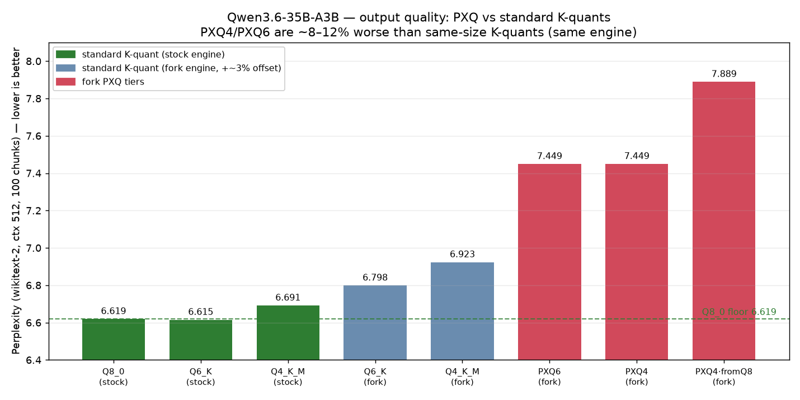

# Benchmark: `pxq_llama` fork vs stock llama.cpp

Standalone evaluation of **[`pxq_llama`](https://github.com/poisonxa16/pxq_llama)** — a
fork of `ik_llama.cpp` by *poisonxa16 (PXA)* that adds custom **PXQ** quantization tiers
and per-card auto-tuning (`PXA_ENHANCE`). This file is intentionally separate from
[`benchmarking.md`](benchmarking.md); nothing here changes our daily serving stack.

**TL;DR**

- **Apples-to-apples (identical Q6_K weights, same V100):** the fork's engine alone runs the
  same model at **~1.7× the prefill throughput** of stock `llama.cpp` — *before* any smaller
  quant. Decode is ~unchanged (marginally slower). So the fork's win is a **prefill/engine**
  win; the extra decode speed seen with PXQ comes from the smaller quant, not the engine.
- Stacking the fork's **PXQ4** quant on top takes prefill to **~2.2×** vs stock Q6_K and cuts
  VRAM **~28 %** (20.6 GB vs 28.7 GB), at lower bit-rate (4.27 vs ~6.5 bpw).
- On the **P100 (16 GB)** the fork runs the **35B MoE at all** — **no standard 35B quant fits**
  a 16 GB card (Q6_K = 29 GB, Q4_K_M = 21 GB), but PXQ2 (11.5 GB) and PXQ3 (15.4 GB) do, with
  8k context. **This is the fork's headline: a 35B-class MoE on a P100.**
- The fork **does not run our PXQ4 split across both no-NVLink V100s** (segfaults after
  allocation), and **MTP speculative decoding is N/A** for this model (no MTP head in the GGUF).

---

## Table of contents

- [1. What we tested and why](#1-what-we-tested-and-why)
- [2. Hardware & software](#2-hardware--software)
- [3. Methodology](#3-methodology)
- [4. Models under test](#4-models-under-test)
- [5. Apples-to-apples: engine vs quant (the key result)](#5-apples-to-apples-engine-vs-quant-the-key-result)
- [6. Results — single V100 (idx1)](#6-results--single-v100-idx1)
- [7. Results — P100 (idx0)](#7-results--p100-idx0)
  - [7.1 vs our current P100 MoE (Gemma-4-26B-A4B)](#71-vs-our-current-p100-moe-gemma-4-26b-a4b)
  - [7.2 Can we run our Gemma-4-26B-A4B on the fork?](#72-can-we-run-our-gemma-4-26b-a4b-on-the-fork-convert-works-runtime-doesnt)
- [8. Results — dual V100 (idx1+idx2)](#8-results--dual-v100-idx1idx2)
- [9. Speculative decoding (MTP)](#9-speculative-decoding-mtp)
- [10. Caveats & limitations](#10-caveats--limitations)
- [11. Reproduction](#11-reproduction)
- [12. Verdict](#12-verdict)
- [13. Round 2 — newer build v2026.07.23 + author feedback](#13-round-2--newer-build-v20260723--author-feedback)
- [14. Round 3 — the author's own model (PXA-Fusion4-35B) + the "+30%" claim](#14-round-3--the-authors-own-model-pxa-fusion4-35b--the-30-claim)

---

## 1. What we tested and why

The fork ships **PXQ** quant tiers (PXQ2/PXQ3/PXQ4/PXQ4-HQ/PXQ6) and fused kernels aimed at
MoE models. Its published PXQ model weights are **not** downloadable (HF repos 404 / gated),
so per the README's *"quantize your own"* path we **self-quantized our own BF16** of
**Qwen3.6-35B-A3B** (a 256-expert hybrid SSM+MoE — the fork's stated sweet spot) into
PXQ2/PXQ3/PXQ4/PXQ6 with the fork's `llama-quantize`.

Two questions:

1. **Does the fork's *engine* run faster than stock, holding the model fixed?** → run the
   **identical Q6_K GGUF** on both engines.
2. **How much extra do the fork's PXQ quants add on top?** → run the fork's PXQ tiers of the
   same base model, and compare footprint/speed against stock Q6_K.

## 2. Hardware & software

| | |
|---|---|
| GPUs | 2× Tesla V100-PCIE-32GB (sm_70, idx1/idx2), 1× Tesla P100-PCIE-16GB (sm_60, idx0), **no NVLink** (PCIe PHB) |
| Driver / CUDA | 580.159.03 / CUDA 12.x |
| Stock engine | `/srv/ai/src/llama.cpp/build/bin/llama-server`, build `b9850 (4f31eedb0)` |
| Fork engine | `pxq_llama` **v2026.07.22** prebuilt (`version 1 (d895c69)`), run `PXA_ENHANCE=1 PXA_MODE=balance` |
| GPU ordering | `CUDA_DEVICE_ORDER=PCI_BUS_ID` exported for all runs (idx0=P100, idx1/2=V100) |

> The fork binary needs `libnccl.so.2` (absent system-wide) — sourced from the ComfyUI venv
> (`.../nvidia/nccl/lib`) via `LD_LIBRARY_PATH`. See the harness for the exact path list.

## 3. Methodology

Harness: [`scripts/pxq-bench.py`](../scripts/pxq-bench.py). For each *(engine × target)*, it
spawns a dedicated `llama-server` pinned to the target GPU(s) (`--gpu-layers 999
--flash-attn on --parallel 1`), sweeps prompt sizes **128 / 512 / 2048 / 4096** tokens with
**128 generated tokens** each, and records:

- **TTFT** — client-side time to first token,
- **prefill t/s** and **decode t/s** — from the server's own `timings` (exact),
- **peak VRAM** — `nvidia-smi memory.used` on the pinned GPU(s).

`ctx-size` 8192; `ubatch/batch` 2048 on V100, 1024 on P100. A keepalive thread unloads any
llama-swap model so the target GPU is dedicated. Raw CSVs live in
[`docs/data/pxq/`](data/pxq/) (columns:
`engine,target,spec,ubatch,prompt_tokens,ttft_s,prefill_tok_s,decode_tok_s,vram_mib`).
Quants were produced by [`scripts/pxq-make-quants.sh`](../scripts/pxq-make-quants.sh).

## 4. Models under test

All are the **same base**: `Qwen3.6-35B-A3B` (256 experts, 8 active; hybrid SSM+MoE, `ssm_*`
tensors kept f32). Only the quantization differs.

| Quant | Engine(s) | File size | bpw (approx) | Fits P100 16 GB? |
|---|---|---:|---:|:---:|
| **Q6_K** (UD) | stock **and** fork | 27.3 GiB | ~6.5 | ✗ |
| **PXQ6** | fork | 21.3 GiB | ~5.27 | ✗ |
| **PXQ4** | fork | 17.6 GiB | ~4.27 | ✗ |
| **PXQ3** | fork | 13.8 GiB | ~3.27 | ✓ |
| **PXQ2** | fork | 10.1 GiB | ~2.27 | ✓ |

## 5. Apples-to-apples: engine vs quant (the key result)

Same V100 (idx1), same 4096-token prompt. The first two rows are the **identical Q6_K GGUF**
on both engines — this isolates the fork's *engine/kernels* from any quant difference. The
lower rows add the fork's smaller PXQ quants on top.

| Row | Engine / quant | Prefill @4k | vs stock | Decode @4k | Peak VRAM |
|---|---|---:|:---:|---:|---:|
| 1 | **stock Q6_K** | 1186 t/s | 1.00× | 93.0 t/s | **28.1 GB** |
| 2 | **fork Q6_K** (same weights) | **2053 t/s** | **1.73×** | 86.6 t/s | 29.8 GB |
| 3 | fork PXQ6 (5.27 bpw) | 2503 t/s | 2.11× | 91.9 t/s | 24.1 GB |
| 4 | fork PXQ4 (4.27 bpw) | 2582 t/s | 2.18× | 96.6 t/s | 20.3 GB |

**Decomposition of the prefill speedup:**



- **Engine only** (row 1→2, *identical weights*): **1.73×**. This is pure fork engine/kernels
  + `PXA_ENHANCE` — no quant change.
- **Quant on top** (row 2→4): a further **1.26×** (2053 → 2582 t/s) from PXQ4's smaller weights.
- **Combined** (row 1→4): **2.18×**.

**Decode tells the opposite story.** At identical Q6_K weights the fork is actually *slightly
slower* to decode (86.6 vs 93.0 t/s) — the engine gives **no** decode benefit. Decode only
improves as the quant shrinks (PXQ6 91.9, PXQ4 96.6 t/s), because decode is memory-bandwidth
bound and fewer bits/weight = less to move per token.

**VRAM:** the fork carries a **~1.7 GB fixed overhead** at identical weights (29.8 vs 28.1 GB
for Q6_K). PXQ recovers that and more by shrinking the weights (PXQ4 = 20.3 GB, 28 % under
stock Q6_K).

> **Bottom line:** the fork's headline gain is a **~1.7× prefill/prompt-processing speedup
> from the engine itself**, independent of quant. PXQ then buys extra prefill, faster decode,
> and a smaller footprint — but those are quant effects, not engine effects.

## 6. Results — single V100 (idx1)

Full sweep (prefill shown 2k→4k steady state; VRAM is peak resident).

| Engine / quant | TTFT @128 | Prefill (2k→4k) | Decode | Peak VRAM |
|---|---:|---:|---:|---:|
| stock **Q6_K** | 0.37 s | 1086 → 1186 t/s | ~93–95 t/s | **28.7 GB** |
| fork **Q6_K** (same weights) | 0.27 s | 2066 → 2053 t/s | ~87–99 t/s | 30.5 GB |
| fork **PXQ6** | 0.22 s | 2490 → 2503 t/s | ~92–105 t/s | 24.7 GB |
| fork **PXQ4** | 0.21 s | 2578 → 2582 t/s | ~97–112 t/s | 20.6 GB |
| fork **PXQ3** | 0.23 s | 2501 → 2513 t/s | ~93–109 t/s | 16.8 GB |
| fork **PXQ2** | 0.22 s | 2550 → 2557 t/s | ~96–113 t/s | 12.9 GB |



## 7. Results — P100 (idx0)

There is **no stock baseline** here by construction: no standard 35B quant fits 16 GB. The
result *is* that the fork runs a 35B-class MoE on a P100 at usable speed.

| Engine / quant | TTFT @128 | Prefill (2k→4k) | Decode | Peak VRAM |
|---|---:|---:|---:|---:|
| fork **PXQ3** | 0.38 s | 1193 → 1178 t/s | ~57–65 t/s | 15.4 GB |
| fork **PXQ2** | 0.37 s | 1195 → 1190 t/s | ~61–69 t/s | 11.5 GB |



**Takeaway:** ~60 t/s decode and ~1.2k t/s prefill for a 35B MoE on a 16 GB Pascal card that
otherwise **cannot load the model in any standard quant**. PXQ2 leaves ~4.5 GB headroom;
PXQ3 leaves ~0.6 GB (8k ctx). PXQ6/PXQ4 (21.3/17.6 GiB) do not fit the P100.

### 7.1 vs our current P100 MoE (Gemma-4-26B-A4B)

The P100's daily `fast` slot is **Gemma-4-26B-A4B** (QAT `UD-Q4_K_XL`, ~4.5 bpw, ~3.8 B active).
Run through the *same* harness/settings (ctx 8192, ubatch 1024, 4k prompt) the fork's 35B PXQ
tiers compare as:

| Model (P100) | bpw | Prefill @4k | Decode @4k | Peak VRAM | TTFT @128 |
|---|---:|---:|---:|---:|---:|
| **Gemma-4-26B-A4B** Q4_K_XL (current `fast`) | ~4.5 | 488 t/s | 58.6 t/s | 14.7 GB | 0.62 s |
| fork **Qwen3.6-35B PXQ2** | ~2.27 | **1190 t/s** | **61.9 t/s** | **11.4 GB** | **0.37 s** |
| fork **Qwen3.6-35B PXQ3** | ~3.27 | 1178 t/s | 57.0 t/s | 15.1 GB | 0.38 s |

**On raw throughput the fork's 35B PXQ2 beats our current Gemma-26B on every axis** — **~2.4×
prefill**, slightly faster decode, **~3 GB less VRAM**, and lower TTFT — despite being a
*larger* model (35B / 256 experts vs 26B / A4B). PXQ3 matches Gemma's footprint (~15 GB) at the
same ~2.4× prefill and comparable decode.

**Caveat — quality is not equal.** Gemma-4-26B-A4B is **QAT** (quantization-aware trained), so
its ~4.5 bpw Q4_K_XL is unusually high-quality for its size; PXQ2 at **2.27 bpw** is a very
aggressive post-hoc quant and will almost certainly trade away accuracy (unmeasured here — no
perplexity run). So PXQ2 is the *speed/footprint* winner, but **not** a proven quality
replacement for the `fast` slot. PXQ3 (3.27 bpw, same VRAM) is the more like-for-like candidate
if we ever wanted to A/B a 35B `fast` on the P100 — it would need a quality check first.

### 7.2 Can we run *our* Gemma-4-26B-A4B on the fork? (convert works, runtime doesn't)

Natural follow-up: rather than swap in a Qwen, could we PXQ-quantize the Gemma we already run
and get the fork's engine speedup on it? We took the **QAT-unquantized BF16** source
(`google/gemma-4-26b-a4b-it-qat-q4_0-unquantized`, the exact lineage of our `UD-Q4_K_XL`),
converted it to a BF16 GGUF, and built **PXQ2 / PXQ3** with the fork's `llama-quantize`.

**Quantizing works** — the fork accepts the `gemma4` MoE arch and applies its native
`PXQ{2,3}` (LM4 / LM8 bit-plane × E16-row) to the expert tensors (`ffn_*_exps`), producing
valid 8.2 GB (PXQ2) / 11.0 GB (PXQ3) files.

**Running them does not.** On the P100 the fork loads the model fully GPU-resident but:

| Engine / quant (P100) | Prefill @512 | Decode | Peak VRAM | Status |
|---|---:|---:|---:|---:|
| stock **Gemma Q4_K_XL** (current `fast`) | 374 t/s | ~63 t/s | 14.7 GB | ✅ works |
| fork **Gemma PXQ3** | 281 t/s | **8.0 t/s** | 14.6 GB | ❌ heap-corrupts >1k tok |
| fork **Gemma PXQ2** | 282 t/s | **7.9 t/s** | 11.9 GB | ❌ heap-corrupts >1k tok |

Two independent failures, identical across both quant tiers:
- **Decode collapses to ~8 t/s** (~8× *slower* than stock Gemma, and vs ~62 t/s the fork gets
  on Qwen PXQ2). It's the same 8.0/7.9 regardless of quant size, so the bottleneck is not the
  weights — the fork routes Gemma-4 through an unoptimized (scalar) path. Prefill is *also*
  slower than stock (281 vs 374 t/s) — the opposite of the ~1.7× engine win the fork gives on
  Qwen.
- **`double free or corruption (!prev)`** — the server crashes on the first ≥1024-token batch.

**Conclusion:** the fork's PXQ *quantizer* is arch-general, but its PXA inference runtime is
**tuned for its target model (Qwen3.6-35B-A3B)** and does not properly support Gemma-4's
128-expert MoE + interleaved sliding-window attention. For Gemma the fork is strictly worse
than stock on every axis *and* unstable, so **converting our Gemma to PXQ is not worthwhile** —
keep Gemma on stock llama.cpp. The fork's speedups only materialize on the arch it was built
for.

## 8. Results — dual V100 (idx1+idx2)

Stock Q6_K splits cleanly across both V100s (`--split-mode layer`):

| Engine / quant | TTFT @128 | Prefill (2k→4k) | Decode | Peak VRAM |
|---|---:|---:|---:|---:|
| stock **Q6_K** (layer split) | 0.37 s | 1142 → 1182 t/s | ~92–95 t/s | 30.1 GB |
| fork **PXQ4** (layer split) | — | — | — | **crashes** |

**The fork does not run our PXQ4 split across the two no-NVLink V100s** *(on the Round 1
`v2026.07.22` build — this was **fixed in Round 2** on `v2026.07.23`; see §13)*. With
`GGML_CUDA_NO_VMM=1` (needed to get past a `cuMemSetAccess "unknown error"` in the CUDA
VMM peer path) it allocates all layers (~19 GB planned) but then **segfaults before serving**
— reproduced twice, including with `--no-warmup`. Single-card is the fork's happy path here;
splitting Q6_K on stock across two cards buys throughput ≈ a single card anyway (no NVLink),
so there is no practical loss.

## 9. Speculative decoding (MTP)

The Reddit tip suggested `--spec-type mtp:n_max=1` on the V100s. **N/A for this model:** the
Qwen3.6-35B-A3B GGUF carries **no MTP / `nextn` head** (verified: zero `nextn`/`mtp` keys in
the GGUF metadata, 733 tensors), so the fork's MTP stage never initializes and the server
never becomes ready. MTP would require a base model that ships a multi-token-prediction head.

## 10. Caveats & limitations

- **Quant quality not scored.** PXQ4 (~4.27 bpw) < PXQ6 (~5.27) < Q6_K (~6.5). We did **not**
  run perplexity; PXQ2 was spot-checked to produce coherent MoE output. The apples-to-apples
  section (identical Q6_K on both engines) removes the quant variable from the *engine*
  comparison, so those conclusions hold regardless of quant quality.
- **~1.7 GB fork VRAM overhead** at identical weights (measured Q6_K: 29.8 vs 28.1 GB).
- **GPU-driver poison during testing.** A crashed dual-V100 fork process (segfault, then
  SIGKILL) left the NVIDIA **UVM** state corrupt: all *new* CUDA processes then failed
  `ggml_cuda_init: failed to initialize CUDA: unknown error` (torch too), while already-running
  ComfyUI kept working and llama-swap silently fell back to CPU. Recovery needs a privileged
  reset — [`scripts/gpu-uvm-reset.sh`](../scripts/gpu-uvm-reset.sh) (stop CUDA procs →
  `rmmod`/`modprobe nvidia_uvm` → restart), or a reboot. All GPU numbers here were captured on
  a healthy driver (VRAM figures confirm residency).
- Reddit and the fork's HF weights are inaccessible from this host (blocked / unpublished);
  self-quantization is the working path.

## 11. Reproduction

```bash
export CUDA_DEVICE_ORDER=PCI_BUS_ID
# 1. Build the PXQ quants from our BF16 (one-time; PXQ6 too):
scripts/pxq-make-quants.sh
# 2. Apples-to-apples on a single V100 (same weights, both engines):
python3 scripts/pxq-bench.py --engine stock --target v100-qwen35-q6k  --no-restore
python3 scripts/pxq-bench.py --engine fork  --target v100-qwen35-q6k  --no-restore
# 3. Fork PXQ tiers:
python3 scripts/pxq-bench.py --engine fork  --target v100-qwen35-pxq6 --no-restore
python3 scripts/pxq-bench.py --engine fork  --target v100-qwen35-pxq4 --no-restore
# 3b. Gemma-4-26B-A4B on the fork (converts, but runtime is broken — §7.2):
scripts/hf-dl download google/gemma-4-26b-a4b-it-qat-q4_0-unquantized \
  --local-dir models/gemma-4-26b-a4b-qat-bf16
PYTHONPATH=src/llama.cpp/gguf-py venvs/comfyui/bin/python src/llama.cpp/convert_hf_to_gguf.py \
  models/gemma-4-26b-a4b-qat-bf16 --outtype bf16 --outfile models/pxq/Gemma-4-26B-A4B-BF16.gguf
"$FORK"/bin/llama-quantize models/pxq/Gemma-4-26B-A4B-BF16.gguf models/pxq/Gemma-4-26B-A4B-PXQ3.gguf PXQ3 16
python3 scripts/pxq-bench.py --engine fork  --target p100-gemma-pxq3 --no-restore
# 4. Restore the daily serving trio when done:
python3 scripts/llama-swap-mode.py set daily
```

Charts (`docs/img/pxq-*.png`) are regenerated from the CSVs with:

```bash
benchmarks/llm-scaling-bench/.venv/bin/python scripts/pxq-plot.py
```

Full matrix: [`scripts/pxq-run-matrix.sh`](../scripts/pxq-run-matrix.sh). Fork run env
(`PXA_ENHANCE=1 PXA_MODE=balance` + the `libnccl.so.2` `LD_LIBRARY_PATH`) is set by the
harness `ENGINES` dict.

## 12. Verdict

The fork's real, quant-independent win is **prompt processing**: on identical Q6_K weights its
engine delivers **~1.7× the prefill throughput** of stock `llama.cpp` on our V100, at ~1.7 GB
extra VRAM and no decode benefit. Its **PXQ** quants stack on top — PXQ4 reaches **~2.2×**
prefill vs stock Q6_K and **28 % less VRAM**, and (more importantly for our fleet) make the
**P100 a viable host for a 35B-class MoE**, which stock cannot do in any standard quant. The
costs: the prebuilt binary needs a borrowed `libnccl.so.2`, **it crashes on the no-NVLink
dual-V100 split**, PXQ is lower-bitrate (quality not scored), it is **Qwen-specific — our
Gemma-4-26B-A4B converts to PXQ but decodes at ~8 t/s and heap-corrupts (§7.2)**, and a fork
crash can poison the GPU driver until a privileged reset. Worth keeping for **single-card
P100/V100 MoE** experiments (on Qwen-family models) and prefill-heavy workloads; **not** a
drop-in for our multi-GPU daily stack today.

> **Update:** the dual-V100 crash was **fixed in Round 2** on the newer `v2026.07.23` build
> (see §13). The dual-split now runs, but its *decode* throughput is ~5× lower than stock's
> dual-split, so the single-card verdict above still stands for our 32 GB cards.

## 13. Round 2 — newer build `v2026.07.23` + author feedback

The fork's author reviewed Round 1 and pointed out three things: (1) the dual-V100 segfault is
a fixed bug on the **latest** build with a **layer split** (`-sm layer -ts 1,1`), (2)
`PXA_ENHANCE=1` alone now auto-wires the per-arch kernels (no `PXA_MODE` block needed), and (3)
**PXQ6** (~5.27 bpw) is the bit-class-matched opponent worth splitting across two cards. We
re-ran on **`v2026.07.23`** (version 50, `92e2814`; new `engine=fork2` in the harness/CSVs;
all Round 1 rows preserved).

**Build/flags:** `PXA_ENHANCE=1` only, plus the author's launch flags
`-sm layer -ts 1,1 -ctk f16 -ctv f16 -b 2048 -ub 2048 --jinja`. ENHANCE prints its wiring at
startup:

```
PXA level=ENHANCE | dev0 Tesla V100-PCIE-32GB(sm_70): CUBLAS64 ON [+9.4% pf]
ROUTER_FUSE ON [+5-7% dec, sm_70] | dev1 … | FA_PREFILL_SPLIT ne11>=64
[prefill rides fa-off chain] | mode=balance | spec: SPEC_RELAXED ON
```

We also rebuilt the PXQ4/PXQ6 quants with the 07-23 `llama-quantize` (its `gguf-py` **PXQ
row-meta fix** prevents silent scrub corruption of PXQ tensors).

### 13.1 Dual-V100 PXQ4 crash → **fixed**

The Round 1 segfault is gone. With `-sm layer -ts 1,1` on the new build the PXQ4 model runs
clean across both no-NVLink V100s:

| Prompt | TTFT | Prefill | Decode | VRAM |
|---:|---:|---:|---:|---:|
| 128 | 0.29 s | 488 t/s | 17.2 t/s | 22.3 GB |
| 2039 | 0.87 s | 2372 t/s | 17.1 t/s | 22.5 GB |
| 4091 | 1.67 s | **2486 t/s** | 17.0 t/s | 22.8 GB |

The author's diagnosis was right — it was a build/split-path bug, not a hardware limit.

### 13.2 Dual-V100 PXQ6 — first-ever numbers

PXQ6 (5.27 bpw) split layer-wise across both V100s (the bit-class-matched fight vs stock Q6_K):

| Prompt | TTFT | Prefill | Decode | VRAM |
|---:|---:|---:|---:|---:|
| 128 | 0.30 s | 475 t/s | 17.0 t/s | 26.1 GB |
| 2039 | 0.88 s | 2359 t/s | 17.0 t/s | 26.4 GB |
| 4091 | 1.76 s | **2377 t/s** | 16.9 t/s | 26.6 GB |

### 13.3 The dual-split **decode** penalty (the real story)



Splitting fixes the crash but decode collapses. On the *identical* two-card layer split:

| Engine / quant (dual-V100) | Prefill @4k | **Decode** | VRAM |
|---|---:|---:|---:|
| stock **Q6_K** (Round 1) | 1182 t/s | **92 t/s** | 30.1 GB |
| fork2 **PXQ4** | 2486 t/s | **17 t/s** | 22.8 GB |
| fork2 **PXQ6** | 2377 t/s | **17 t/s** | 26.6 GB |
| fork2 **PXQ4 — single card** (ref) | 2572 t/s | **97 t/s** | 20.5 GB |

The fork wins prefill ~2.1× but its **dual-split decode is ~5× *slower* than stock's dual-split
and ~5.7× slower than its own single-card decode** — a flat ~17 t/s regardless of quant. The
no-NVLink per-token cross-GPU sync dominates at batch=1, and the fork's `ROUTER_FUSE` /
graph-split path (`graph splits = 3`) appears to pay it on every token where stock's simpler
layer split only crosses the PCIe boundary once. **Takeaway for our 32 GB cards:** since PXQ4
*and* PXQ6 fit a single V100, always run single-card — dual-split only makes sense for
capacity you can't otherwise fit (or purely prefill-bound work).

### 13.4 Single-V100 unchanged between builds

The "V100 prefill kernel fix" doesn't move our single-card numbers — Round 1 (`fork`, 07-22)
and Round 2 (`fork2`, 07-23) are within run-to-run noise:

| Single V100 @4k | Prefill (07-22 → 07-23) | Decode (07-22 → 07-23) |
|---|---:|---:|
| Q6_K | 2053 → 2039 t/s | 86.6 → 86.5 t/s |
| PXQ6 | 2503 → 2499 t/s | 91.9 → 91.2 t/s |
| PXQ4 | 2582 → 2572 t/s | 96.6 → 97.1 t/s |

### 13.5 For the author

Dual-V100 PXQ4/PXQ6 now run with `-sm layer -ts 1,1` on `v2026.07.23` — **no segfault**, thank
you. One open item: **dual-split decode is a flat ~17 t/s** (both PXQ tiers) vs **~92 t/s for
stock llama.cpp on the same two-card layer split** and ~97 t/s single-card fork. Startup shows
`graph splits = 3`, `split_mode_graph_scheduling = 0`, `ROUTER_FUSE ON`. Looks like a per-token
cross-GPU sync in the fused router/graph-split path at batch=1 — prefill scaling is excellent
(2.4 k t/s), only decode is affected.

> **Resolved in Round 4 (§15):** the ~17 t/s is a `-sm layer` artifact on our PHB (no-NVLink)
> box, not a pathology. The fork's native **`-sm graph -ts 1,1`** restores decode to ~93 t/s
> (PXQ4) / ~85 t/s (Q6_K) while keeping the ~2.3 k t/s prefill.


## 14. Round 3 — the author's own model (PXA-Fusion4-35B) + the "+30%" claim

The fork's author published the exact model behind the README numbers:
[`poisonxa/PXA-Fusion4-35B-GGUF`](https://huggingface.co/poisonxa/PXA-Fusion4-35B-GGUF) — a
fused/abliterated **Qwen3.5-35B-A3B** MoE. Two reasons to re-run on it: (1) it lets us
**reproduce the author's table on the same weights** instead of our own Qwen3.6 build, and (2)
**every quant ships MTP speculative-decode heads**, so we can finally measure MTP (our own
Qwen3.6-35B-A3B had none — see §9). We pulled PXQ2 (2.27 bpw, 11.24 GB), PXQU12 (2.65 bpw,
12.18 GB) and PXQU16 (3.20 bpw, 14.60 GB) and ran the same fork2 (`v2026.07.23`,
`PXA_ENHANCE=1`) sweep.

The user's headline question: **is the README's "+30% decode" a true engine win, or a smaller
quant?**

### 14.1 We reproduce the author's P100 headline

The author lists PXQ2 on one P100 at ~1161 prefill / 58.4 decode. We measure essentially the
same on our P100 (idx0):

| P100 · Fusion4 PXQ2 (fork2) | TTFT | Prefill | Decode | VRAM |
|---:|---:|---:|---:|---:|
| 128 | 0.37 s | 386 t/s | 67.3 t/s | 11.3 GB |
| 2039 | 1.71 s | **1201 t/s** | 63.1 t/s | 11.3 GB |
| 4091 | 3.44 s | 1197 t/s | **61.9 t/s** | 11.4 GB |

Prefill ~1200 t/s and decode ~62 t/s bracket the author's 1161 / 58.4 — the model and engine
behave exactly as advertised on our hardware.

### 14.2 Within one engine, bitrate barely moves decode (so the +30% isn't quant-size *here*)



Running all three quant tiers on the **same P100 + same engine**, steady-state (4k) decode is
essentially flat while VRAM climbs:

| P100 · fork2 · quant | bpw | Prefill @4k | Decode @4k | VRAM |
|---|---:|---:|---:|---:|
| PXQ2 | 2.27 | 1197 t/s | **61.9 t/s** | 11.4 GB |
| PXQU12 | 2.65 | 1193 t/s | **61.0 t/s** | 12.3 GB |
| PXQU16 | 3.20 | 1191 t/s | **60.2 t/s** | 14.5 GB |

Decode moves **<3%** across a 40% bitrate range. That's expected for a 35B **A3B MoE**: only
~3 B params are active per token, so the per-token bandwidth (and thus decode) is nearly
constant across quant tiers — the tier mostly buys you VRAM, not decode. **Conclusion: on a
single card and a single engine, you cannot manufacture a +30% decode swing by changing the PXQ
tier.**

### 14.3 So where does the README's +30% come from?

It is a **cross-engine, cross-quant-class** comparison, not an apples-to-apples one. The engine
README states the +30% P100 decode (and +59% prefill) is a "best config for both sides" number:
**pxq_llama on its PXQ quant vs upstream ik_llama.cpp on its best IQ_K quant** — different
engine *and* different quant family. The author's own **same-quant control** (identical weights,
engine-only) admits **decode +2.7–3.3%, V100 output bit-identical**. That lines up exactly with
our independent apples-to-apples in §5 (fork Q6_K decode 86.6 vs stock 93.0 t/s on identical
weights — the fork engine is a decode no-op, even slightly negative). So:

> **The engine contributes ≤ ~3% to decode at fixed weights. The rest of the "+30%" is the
> smaller/different PXQ quant class vs the baseline it's measured against — plus MTP (below).**
> The fork's genuine, reproducible engine win is on **prefill** (§5–§6), not decode.

### 14.4 MTP is the real, orthogonal decode win

MTP (multi-token-prediction speculative decode) is the one lever that *does* move decode without
changing weights. Turning it on (`--spec-type mtp:n_max=1`) on the very same PXQ2 model:

| Fusion4 PXQ2 · fork2 | Decode (no MTP) | Decode (+MTP n_max=1) | Δ | Prefill cost | VRAM cost |
|---|---:|---:|---:|---:|---:|
| **P100** (idx0) | 61.9 t/s | **68.8 t/s** | **+11%** | 1197→741 t/s | +1.9 GB |
| **V100** (idx1) | 102.1 t/s | **120.6 t/s** | **+18%** | 2565→1575 t/s | +2.3 GB |

MTP stacks on top of everything else and is quant-independent. Two caveats we measured:
- **It taxes prefill** (extra draft forward pass) and costs ~2 GB VRAM for the draft path — a
  decode-latency-for-prefill-throughput trade, best for interactive single-user chat.
- **`n_max=3,p_min=0.5` did *not* help** this workload (P100 decode 62–68 t/s, no better than
  baseline and below `n_max=1`). Deeper speculation only pays off when acceptance is high; for
  general text `n_max=1` was the sweet spot on both cards.

### 14.5 Answer to the question, and takeaways

- **Is the +30% a true engine gain or a smaller quant?** Overwhelmingly the latter (quant class
  + measurement baseline). At identical weights the fork's engine is a decode no-op (≤3%); its
  real engine gain is **prefill** (~1.2–1.3× P100, ~1.25× V100). Bitrate within the PXQ family
  barely touches decode on this MoE.
- **The one reproducible decode win is MTP**, +11% (P100) / +18% (V100), and it's orthogonal to
  the quant — but it costs prefill and ~2 GB. Our own daily Qwen3.6-35B-A3B can't use it (no MTP
  head), so it isn't a lever for our current `chat` slot; it *would* be if we adopted a
  MTP-equipped MoE.
- Nothing here changes the §12 verdict: **keep stock llama.cpp for daily serving** (decode
  parity, no PXQ requantize, no MTP dependency); pxq_llama remains a compelling **prefill /
  prompt-processing** engine and a way to squeeze a 35B onto the 16 GB P100.

## 15. Round 4 — root-causing (and *fixing*) the dual-V100 decode collapse

The fork author couldn't reproduce our flat ~17 t/s dual-split decode (§13.3/§13.5) — his own
2× V100 holds ~92 t/s and toggling `PXA_ROUTER_FUSE` changed nothing. He asked for the exact
command, commit, split mode, `--n-cpu-moe` status, and a real root cause. We ran a
**single-lever isolation matrix** and found the answer: **it's a split-mode selection artifact,
not a hardware/topology pathology.** Running the fork's native **`-sm graph`** instead of
`-sm layer` restores decode from **17 → 93 t/s**. Harness: `scripts/pxq-dual-debug.py`; data:
`docs/data/pxq/dual-debug.csv`.

**Static answers to the author's questions:**
- **Commit:** `v2026.07.23`, version 50, `92e2814`. **`--n-cpu-moe`?** No — `--gpu-layers 999`,
  everything on GPU. **Split mode we hit the bug with:** `-sm layer -ts 1,1` (the mode *he
  recommended to fix the crash*). **Topology:** no NVLink; `nvidia-smi topo -m` = **PHB** between
  all GPUs (peer traffic crosses the CPU host bridge). CPU i7-6950X, PCIe 3.0.

### 15.1 The isolation matrix

Same two V100s (idx1+idx2), ctx 8192, decode at batch=1. First we ruled out every env/PXA lever
on the **layer** split, then found the fix by switching the **split mode**:

| Config | Engine / quant | Split | Lever | **Decode** | Prefill @4k |
|---|---|---|---|---:|---:|
| `repro-pxq4-layer` | fork2 PXQ4 | layer | baseline env | **17.0** | 2242 |
| `q6k-fork-layer` | fork2 **Q6_K** | layer | standard quant | **16.7** | 1769 |
| `pxq4-enhance-off` | fork2 PXQ4 | layer | no `PXA_ENHANCE` | **17.0** | 2218 |
| `pxq4-routerfuse-off` | fork2 PXQ4 | layer | `PXA_ROUTER_FUSE=0` | **16.9** | 2258 |
| `pxq4-vmm-on` | fork2 PXQ4 | layer | drop `GGML_CUDA_NO_VMM` | **17.0** | 2199 |
| `pxq4-no-peer` | fork2 PXQ4 | layer | `PEER_MAX_BATCH_SIZE=0` | **17.0** | 2213 |
| `pxq4-smgs1` | fork2 PXQ4 | layer | `--split-mode-graph-scheduling` | **17.3** | 2166 |
| `pxq4-async` | fork2 PXQ4 | layer | `--scheduler_async` | **17.4** | 2265 |
| **`pxq4-sm-graph`** | fork2 PXQ4 | **graph** | **`-sm graph`** | **93.0** | 2284 |
| **`q6k-sm-graph`** | fork2 **Q6_K** | **graph** | **`-sm graph`** | **85.5** | 1814 |
| `pxq4-single` | fork2 PXQ4 | single | (ref) | 111.3 | 2485 |
| `q6k-stock-layer` | **stock** Q6_K | layer | stock, same 2 cards | 93.1 | 1226 |

### 15.2 What we ruled out, and the fix

On the **layer** split every fork lever is null — the collapse is identical (~17 t/s) with PXA
off, `ROUTER_FUSE=0` (the author's suspect, confirmed not it), VMM on (and it did **not** crash),
peer-access off, and even with `--split-mode-graph-scheduling` forced on (the startup flag flips
to `1` but decode stays 17 — that toggle doesn't switch the executor). It also hits a plain
**`Q6_K`** (16.7 t/s), so it's not PXQ-specific.

The single thing that fixes it is the **split mode itself**: the fork ships a dedicated
**`-sm graph`** executor (splits tensors *and* the compute graph across GPUs) distinct from the
inherited `-sm layer` path. `-sm graph` decodes at **93.0 t/s (PXQ4) / 85.5 t/s (Q6_K)** — a
**~5.5×** recovery — while keeping the fork's ~2280 t/s prefill. The layer path is what serialized
a per-token host-bridge round-trip on our PHB (no-NVLink) box; the graph executor doesn't.

**Root cause:** the author's `-sm layer -ts 1,1` advice fixed the Round-2 *crash* but put us on the
slow, inherited layer-split decode path. His own box shows ~92 t/s because he runs the fork's
native `-sm graph` (or his lower-latency PCIe/NVLink layout hides the layer-path round-trip). The
"17 t/s" was a **mode-selection artifact**, not an unfixable multi-GPU pathology.

### 15.3 Takeaways

- **Dual-V100 on the fork is fully viable** — use **`-sm graph -ts 1,1`**, not `-sm layer`. You
  get full decode (~93 t/s, on par with stock and single-card) *plus* the fork's ~1.9× prefill.
- For our 32 GB cards PXQ4/PXQ6 still fit a **single** V100 (97–111 t/s), so single-card remains
  simplest; but `-sm graph` now makes multi-card worthwhile for models that don't fit one card,
  without the decode tax.
- The §12 daily-serving verdict is unchanged (stock llama.cpp), but the fork's dual-GPU story is
  no longer a liability — it was a wrong-flag footgun the author's crash-fix advice steered us into.

## 16. Round 5 — output *quality*: perplexity of PXQ vs standard K-quants

Every prior round measured **speed**. This round asks the question those numbers
can't: **does PXQ cost output quality?** We measure perplexity (PPL) on
`wikitext-2-raw` for the same base model (Qwen3.6-35B-A3B) across our standard
K-quants and the fork's PXQ tiers.

### 16.1 We had to build a PXQ-capable perplexity tool

The fork ships **no `llama-perplexity` binary**, and stock's perplexity **cannot
load PXQ** (a fork-custom quant type). So we wrote a minimal evaluator,
[`scripts/pxq-perplexity.cpp`](../scripts/pxq-perplexity.cpp), that links the
fork's `libllama.so`/`libggml.so` (built against **ik_llama.cpp** headers — the
fork is an ik_llama fork, not mainline). It replicates the **canonical
llama.cpp perplexity algorithm** exactly:

- non-overlapping 512-token windows, KV reset per window;
- **BOS only if the model uses it** — Qwen sets `add_bos_token=false`, so we do
  *not* prefix BOS (getting this wrong inflated PPL by ~45%);
- score only the **second half** of each window (positions ≥ `n_ctx/2`), using
  the first half as context → 255 scored tokens/window, ≥256 tokens of context each.

**Validation:** on `Q4_K_M`, the tool's algorithm reproduces stock
`llama-perplexity` up to the fork engine's own numerical signature — see §16.3.

### 16.2 Results (100 chunks = 25,500 scored tokens, ctx 512, ±~0.10)

Data: [`docs/data/pxq/quality-ppl.csv`](data/pxq/quality-ppl.csv).



| engine | quant | source | bpw | size | **PPL** | vs Q8 floor |
|--------|-------|--------|----:|-----:|--------:|------------:|
| stock  | Q8_0  | bf16   | 8.5 | 36.9 GB | **6.619** | — (floor) |
| stock  | Q6_K  | bf16   | 6.5 | 27.3 GB | **6.615** | −0.1 % |
| stock  | Q4_K_M| bf16   | 4.8 | 19.7 GB | **6.691** | +1.1 % |
| fork   | Q6_K  | bf16   | 6.5 | 27.3 GB | 6.798 | +2.7 % |
| fork   | Q4_K_M| bf16   | 4.8 | 19.7 GB | 6.923 | +4.6 % |
| fork   | **PXQ6** | bf16 | 5.3 | 21.3 GB | **7.449** | **+12.5 %** |
| fork   | **PXQ4** | bf16 | 4.5 | 17.6 GB | **7.449** | **+12.5 %** |
| fork   | PXQ4  | **q8_0** | 4.4 | 16.7 GB | 7.889 | +19.2 % |

### 16.3 The fork engine adds a ~+3 % PPL offset — so compare *within* an engine

Running the *identical* standard-quant weights on the two engines is not free:
the fork's kernels (ik_llama-derived, sm_60/70 build, `PXA_ENHANCE=1`) sit
**~+3 %** above stock on the same file (Q6_K 6.615 → 6.798; Q4_K_M 6.691 →
6.923). `PXA_ENHANCE=0` recovers ~1 % of that. This is the engine's numerical
signature, **constant across quants**, so the honest quant comparison is done
**within the fork engine** (all PXQ + standard quants on one engine), with stock
as the ground-truth anchor.

### 16.4 Findings

1. **Standard K-quants are near-lossless.** On stock, **Q6_K = Q8_0** (6.615 vs
   6.619) and Q4_K_M is only +1.1 %. Our daily Q6_K serving loses nothing.
2. **PXQ6 buys *zero* quality over PXQ4.** Both land on **7.449** despite PXQ6
   carrying ~0.8 bpw / 3.7 GB more — the extra bits do not improve prediction.
3. **PXQ is measurably worse than a same-or-smaller K-quant.** On the *same*
   fork engine, PXQ4/PXQ6 are **+7.6 % vs Q4_K_M** and **+9.6 % vs Q6_K**, and
   **+12.5 % over the Q8 floor**. A 5.3-bpw PXQ6 is *worse* than a 4.8-bpw
   Q4_K_M — PXQ trades quality for its prefill speed; it is not a free lunch.
4. **`from-BF16` beats the README's `from-Q8_0` recipe.** Requantizing PXQ4 from
   a Q8_0 base scored **7.889** — worse than our BF16-direct **7.449**. So our
   BF16-direct PXQ quants were already the *best* case; the poor PXQ perplexity
   is not a quantization-source artifact.

### 16.5 Verdict impact

This **reinforces §12**: keep **stock llama.cpp + K-quants** for daily serving.
The fork's PXQ is not only *no faster* for single-user decode on our 32 GB cards
(§6/§13), it is also **~8–12 % worse on perplexity** than the same-size K-quant
we already serve. PXQ's value is narrow: **prefill throughput on VRAM-starved
Pascal** (fitting a 35B on a 16 GB P100, §7) — where the quality hit buys a model
that otherwise would not fit at all.

**Reproduce:**

```bash
# Build the tool against ik_llama headers + fork libs:
bash scripts/pxq-perplexity-build.sh
# Fork-engine matrix (Q6_K, PXQ6, Q4_K_M, PXQ4), 100 chunks:
bash scripts/pxq-ppl-run.sh 100 q6k pxq6 q4km pxq4
# Stock anchors (Q8_0/Q6_K/Q4_K_M can load on stock; PXQ cannot):
src/llama.cpp/build/bin/llama-perplexity -m <model> \
  -f src/llama.cpp/wikitext-2-raw/wiki.test.raw -c 512 --chunks 100 -ngl 999
# Chart:
benchmarks/llm-scaling-bench/.venv/bin/python scripts/pxq-quality-plot.py
```
