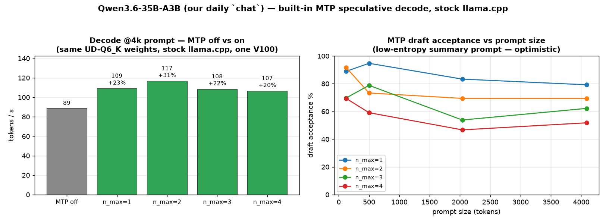
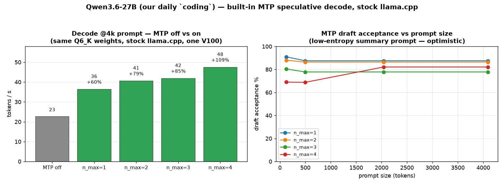
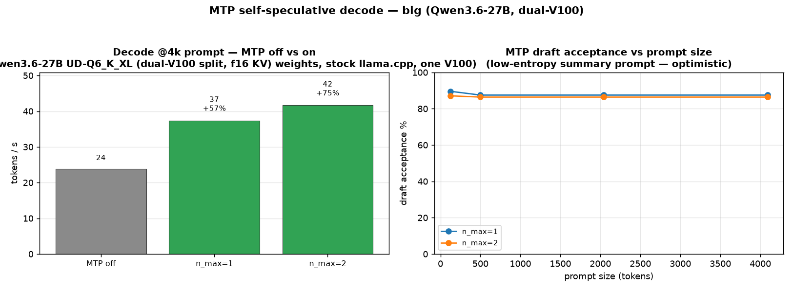
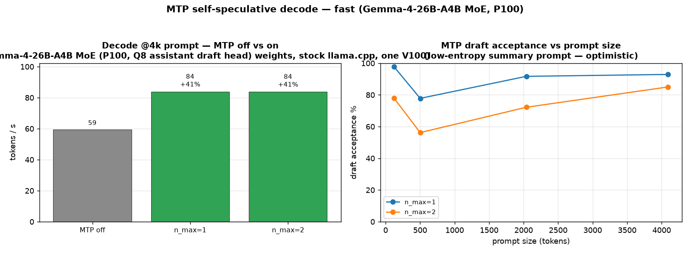
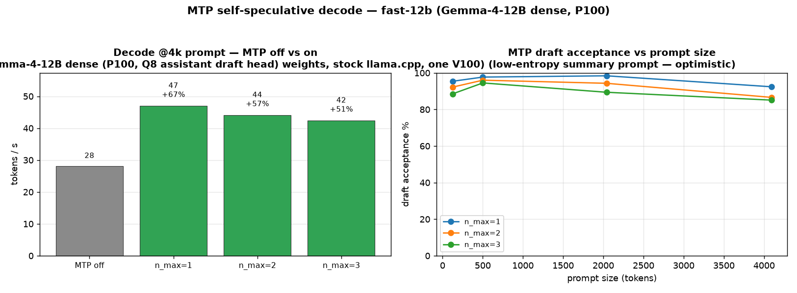
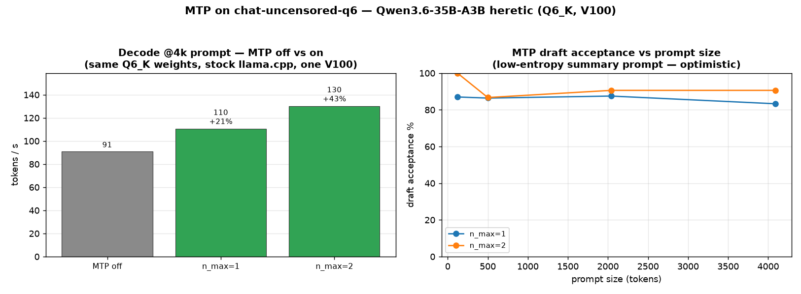

# Concurrency & throughput benchmarking

How to measure how the server behaves under concurrent load — the "tokens/sec vs
concurrent users" curve popularised by Alex Ziskind's local-LLM videos.

## Contents

- [Tooling](#tooling)
- [Quick start — Ziskind's harness against LiteLLM](#quick-start--ziskinds-harness-against-litellm)
- [The critical caveat: `--parallel N` caps concurrency](#the-critical-caveat---parallel-n-caps-concurrency)
- [Baseline results (2026-07-21)](#baseline-results-2026-07-21)
- [`--parallel` throughput sweep (2026-07-21)](#--parallel-throughput-sweep-2026-07-21)
  - [The catch: `--parallel N` divides per-request context](#the-catch---parallel-n-divides-per-request-context)
- [MoE on the P100 (16 GB) — Gemma-4-26B-A4B (2026-07-22)](#moe-on-the-p100-16-gb--gemma-4-26b-a4b-2026-07-22)
  - [Context ceiling + parallel scaling at large context (2026-07-22)](#context-ceiling--parallel-scaling-at-large-context-2026-07-22)
- [ComfyUI image generation — P100 vs V100 (txt2img, 2026-07-22)](#comfyui-image-generation--p100-vs-v100-txt2img-2026-07-22)
- [P100 `fast` slot: 12B dense vs 26B-A4B MoE — TTFT & prefill (2026-07-22)](#p100-fast-slot-12b-dense-vs-26b-a4b-moe--ttft--prefill-2026-07-22)
- [MTP speculative decode on our `chat` model — Qwen3.6-35B-A3B (2026-07-23)](#mtp-speculative-decode-on-our-chat-model--qwen36-35b-a3b-2026-07-23)
  - [MTP on the `coding` model — Qwen3.6-27B Q6_K (2026-07-23)](#mtp-on-the-coding-model--qwen36-27b-q6_k-2026-07-23)
  - [MTP on the uncensored `chat-uncensored-q6` model — Qwen3.6-35B-A3B heretic (2026-07-23)](#mtp-on-the-uncensored-chat-uncensored-q6-model--qwen36-35b-a3b-heretic-2026-07-23)
- [Single-stream engine benchmarks (`llama-bench`, 2026-07-01/02)](#single-stream-engine-benchmarks-llama-bench-2026-07-0102)
  - [Coding-model benchmark — Qwen3.6-27B on the V100s (2026-07-01)](#coding-model-benchmark--qwen36-27b-on-the-v100s-2026-07-01)
  - [MoE benchmark — Qwen3.6-35B-A3B on the V100s (2026-07-01)](#moe-benchmark--qwen36-35b-a3b-on-the-v100s-2026-07-01)
  - [Uncensored fine-tune smoke test — Qwen3.6-35B-A3B-Uncensored (HauhauCS-Aggressive, 2026-07-01)](#uncensored-fine-tune-smoke-test--qwen36-35b-a3b-uncensored-hauhaucs-aggressive-2026-07-01)
  - [Tensor-parallel / multi-GPU reality (measured 2026-07-01)](#tensor-parallel--multi-gpu-reality-measured-2026-07-01)
  - [coding context-window sweep (2026-07-02)](#coding-context-window-sweep-2026-07-02)
  - [Prompt-processing (prefill) tuning — `--ubatch-size` (2026-07-02)](#prompt-processing-prefill-tuning----ubatch-size-2026-07-02)
  - [Gemma-4 benchmarks + context/ubatch tuning (2026-07-02)](#gemma-4-benchmarks--contextubatch-tuning-2026-07-02)

## Tooling

| Tool | Layer | What it measures | Use it for |
|------|-------|------------------|-----------|
| [`llm-scaling-bench`](https://github.com/alexziskind1/llm-scaling-bench) (Ziskind) | HTTP / OpenAI API | Aggregate tokens/sec, req/sec, success rate as concurrency sweeps | End-to-end client experience through LiteLLM (matches Ziskind's methodology) |
| `llama-batched-bench` (ships with llama.cpp, in `src/llama.cpp/build/bin`) | engine | Prompt/gen throughput across N parallel sequences, no HTTP | Clean per-model/per-GPU slot-scaling numbers |
| `llama-bench` (llama.cpp) | engine | **Single-stream** prompt/gen speed only — *not* concurrency | Raw per-GPU baseline |
| [HF `inference-benchmarker`](https://github.com/huggingface/inference-benchmarker), NVIDIA GenAI-Perf, llmperf | HTTP / OpenAI API | TTFT, inter-token latency, throughput | Deeper latency metrics / engine comparisons |

`llama-bench` does **not** exercise concurrency (it's single-stream); use
`llm-scaling-bench` (whole stack) or `llama-batched-bench` (engine only) for that.

## Quick start — Ziskind's harness against LiteLLM

```sh
# Default: model=coding, users [1,2,4,8,16], via LiteLLM :4000 (key from docker/.env)
scripts/bench-concurrency.sh

# Other models / sweeps:
BENCH_MODEL=chat scripts/bench-concurrency.sh
BENCH_USERS="1,2,4,8,16,32" BENCH_MODEL=fast scripts/bench-concurrency.sh

# Bypass LiteLLM and hit the llama-swap router directly:
BENCH_API_URL=http://127.0.0.1:9090/v1/chat/completions scripts/bench-concurrency.sh
```

The script clones the harness into `benchmarks/` (gitignored), bootstraps a venv
(python3-venv/ensurepip is absent, so it fetches `get-pip.py`), writes an
env-driven `bench_aiserver.py` (no hardcoded secrets), sets the sweep, and runs.
Results land in `benchmarks/llm-scaling-bench/results/*.csv`; render charts with
`.venv/bin/python scripts/plot_results.py --latest` (HTML works; PNG needs Chrome
for Kaleido).

Env vars: `BENCH_MODEL`, `BENCH_USERS` (comma list), `BENCH_MAX_TOKENS`,
`BENCH_API_URL`, `BENCH_API_KEY`.

## The critical caveat: `--parallel N` caps concurrency

Each model's concurrency is bounded by `--parallel N` in `config/llama-swap.yaml`.
Most daily models run `--parallel 1`, so **concurrent requests serialise**:
aggregate tokens/sec stays flat and the stack returns `429 Too many requests` once
the single slot's queue overflows. `coder-next` is `--parallel 2` (two 131k slots).

To measure *real* engine concurrency, raise `--parallel` on the model block (KV
cache grows ~linearly per slot — watch VRAM with `nvidia-smi`) and re-run.

## Baseline results (2026-07-21)

`coding` (Qwen3.6-27B Q6_K, V100 idx1, `--parallel 1`), 512 max tokens, via LiteLLM:

| Concurrent users | Total time (s) | Tokens/sec | Success |
|-----------------:|---------------:|-----------:|--------:|
| 1  | 23.3  | 21.9 | 100% |
| 2  | 46.6  | 22.0 | 100% |
| 4  | 93.4  | 21.9 | 100% |
| 8  | 187.1 | 21.9 | 100% |
| 16 | 233.9 | 21.9 | 62.5% (6× `429`) |

`fast` (Gemma-4-12B, P100 idx0, `--parallel 1`), 128 max tokens: flat ~26 tok/s at
1/2/4 users.

**Reading:** total time scales linearly with users while tokens/sec is flat — pure
single-slot serialisation, exactly the behaviour Ziskind reports for stock
llama.cpp/LM Studio. Throughput does **not** improve with concurrency on a
`--parallel 1` model; past the queue depth the gateway/engine sheds load with 429s.

> The `429` is **llama-swap's** per-model `concurrencyLimit` (default **10**),
> *not* the engine — raise it per model in `config/llama-swap.yaml` if you want the
> router to admit more simultaneous requests.

## `--parallel` throughput sweep (2026-07-21)

`scripts/parallel-sweep.py` sweeps `--parallel` per model (editing the active
`llama-swap.yaml` + `concurrencyLimit` from a pristine snapshot, benchmarking
`:9090` directly, restoring on exit), 160 max
tokens, concurrency 1–16. **Raising `--parallel` splits `--ctx-size` across slots,
so KV VRAM stays ~flat** — the GPU batch-decodes N sequences for real aggregate
speedup (the *compute* buffers grow, which is what OOMs the VRAM-tight models).

Peak aggregate tokens/sec per `--parallel`, and VRAM at the best setting:


*Raw data: [`data/parallel-sweep-20260721.csv`](data/parallel-sweep-20260721.csv)
(regenerate the chart with `benchmarks/llm-scaling-bench/.venv/bin/python
scripts/plot-parallel-sweep.py docs/data/parallel-sweep-20260721.csv -o
docs/img/parallel-sweep-20260721.png`).*

| Model | GPU / kind | ctx | P=1 | P=2 | P=4 | P=8 | Best | VRAM@best |
|-------|-----------|----:|----:|----:|----:|----:|------|-----------|
| coding      | V100 idx1, dense 27B    | 204800 | 22 | 37 | 47 | **60**  | P=8 | 30.2/32 GB |
| chat        | V100 idx2, MoE 35B-A3B  | 131072 | 84 | 127 | 156 | **194** | P=8 | 30.5/32 GB |
| fast        | P100 idx0, Gemma 12B    | 131072 | 27 | 49 | **53** | OOM  | P=4 | 13.4/16 GB |
| big         | dual-V100, dense 27B Q6 | 262144 | 23 | 38 | 47 | **59**  | P=8 | ~21/32 GB/card |
| coder-next  | dual-V100, MoE 80B-A3B  | 262144 | 73 | 107 | 139 | **182** | P=8 | ~28.5/32 GB/card |
| gemma-31b   | V100 idx1, dense 31B    | 131072 | 30 | 53 | **67** | OOM  | P=4 | 29.2/32 GB |
| gemma-26b   | V100 idx2, MoE 25B-A4B  | 131072 | 100 | 171 | 221 | **281** | P=8 | ~19/32 GB |

Patterns:
- **Gains are sublinear but big** (~2.6–2.9× at the ceiling): batched decode shares
  GPU compute across sequences.
- **MoE models scale best** (chat, coder-next, gemma-26b) — few active params leave
  compute headroom; `gemma-26b` is the throughput champ at **281 tok/s**.
- **VRAM-tight dense models OOM before P=8**: `fast` (P100 16 GB) and `gemma-31b`
  (already 29 GB at P=4) cap at **P=4**; the batch *compute* buffers, not KV, grow.
- **Dual-card models** (`big`, `coder-next`) have per-card headroom and reach P=8;
  `coder-next`'s DeltaNet keeps KV flat, so it's especially cheap to parallelise.

### The catch: `--parallel N` divides per-request context

`--ctx-size` is the **total** KV, split evenly across slots, so more slots = less
context **per request**:

| Model | ctx | P=2 /slot | P=4 /slot | P=8 /slot |
|-------|----:|----------:|----------:|----------:|
| coding     | 204800 | 102400 | 51200 | 25600 |
| chat       | 131072 |  65536 | 32768 | 16384 |
| big        | 262144 | 131072 | 65536 | 32768 |
| coder-next | 262144 | 131072 | 65536 | 32768 |
| gemma-31b  | 131072 |  65536 | 32768 | 16384 |
| gemma-26b  | 131072 |  65536 | 32768 | 16384 |

So the max-throughput setting is **not** automatically the right daily setting: an
agentic coding client that needs 100k+ context can't use `--parallel 8`
(25 k/slot on `coding`). Pick `--parallel` per model by weighing **multi-user
throughput vs per-request context** for that model's real workload — e.g. single-user
agentic coding wants few slots/large context; multi-user family chat wants many slots.

## MoE on the P100 (16 GB) — Gemma-4-26B-A4B (2026-07-22)

Which MoE model fits on the **Tesla P100-16GB** (idx0, sm_60)? An MoE's *total*
params (all experts) must be resident, so weight size — not active params — sets
the floor. Of the Qwen 3.6 / Gemma 4 roster, only **Gemma-4-26B-A4B** (25B total /
~3.8B active, QAT `UD-Q4_K_XL`, 14 GB file) fits: its weight buffer is **13.6 GB**,
leaving ~2.8 GB for KV + compute. `Qwen3.6-35B-A3B` does **not** fit at any local
quant (smallest is `Q4_K_M`, 20 GB > 16 GB) — it would need a `Q2_K`/`IQ3` (~13–15 GB).
The dense Gemma 4 12B/31B and the huge `Qwen3-Coder-Next` MoE are out of scope here.

Standalone sweep (`scripts/p100-moe-sweep.py`, pins the model to idx0 on a private
port so llama-swap can't re-warm `fast` mid-run; total ctx 8192, `q8_0` KV, 256 max
tokens, concurrency 1–16, restores daily on exit):

| `--parallel` | conc 1 | 2 | 4 | 8 | 12 | 16 | Peak | VRAM@peak |
|----:|----:|----:|----:|----:|----:|----:|----:|----:|
| 1 | 51.9 | 51.7 | 51.6 | 51.7 | 51.6 | 51.6 | **51.9** | 14.3 GB |
| 2 | 52.0 | 86.3 | 86.8 | 86.8 | 86.8 | 85.5 | **86.8** | 14.5 GB |
| 4 | 52.0 | 85.7 | 105.2 | 104.9 | 102.6 | 100.6 | **105.2** | 14.8 GB |
| 8 | 51.7 | 86.4 | 105.6 | 99.3 | 100.5 | 99.1 | **105.6** | 15.0 GB |

*(aggregate tokens/sec; 100 % success at every point.)*

*Raw data: [`data/p100-moe-sweep-gemma26b-20260722.csv`](data/p100-moe-sweep-gemma26b-20260722.csv).*

Findings:
- **Single-stream ~52 tok/s** — snappy for a 25B-class model, thanks to only ~3.8B
  active params (behaves like a small dense model on decode).
- **Best aggregate ~105 tok/s at `--parallel 4` (conc ≥4)**; `--parallel 8` doesn't
  improve on 4 (2 slots per active pass already saturate the P100's compute), so
  **P=4 is the sweet spot** — fewer slots means more context per request too.
- **Never OOMs**: 14.3 → 15.0 GB across P=1→8 (KV is cheap: `q8_0` + few KV heads
  add only ~few-hundred MB even at 32k ctx). The P100 has ~1.4 GB to spare at P=8.
- Context scales cheaply too — verified **32k ctx also fits** (14.6 GB @ P=1).

So the P100 can host a genuinely useful ~105 tok/s multi-user MoE (`gemma-26b`),
not just the 12B `fast` — a viable alternative tenant for the aux card.

### Context ceiling + parallel scaling at large context (2026-07-22)

How big a context fits, and can we still parallelise it? (`gemma-26b`, `q8_0` KV,
standalone on idx0.) Gemma-4's **interleaved sliding-window attention** (5 of every
6 layers are windowed) keeps KV remarkably cheap — ~15.5 MiB per 1k tokens — so a
huge context fits before the 16 GB wall.

**Single-user context ceiling** (`--parallel 1`, total = per-request context):

| total ctx | loads? | VRAM | single-stream tok/s |
|----:|:--:|----:|----:|
| 8 k    | ✅ | 14.3 GB | 52 |
| 64 k   | ✅ | 15.2 GB | 50 |
| **128 k** | ✅ | **16.18 GB** (~0.2 GB free) | 50 |
| 192 k  | ❌ OOM | — | — |
| 256 k (native) | ❌ OOM | — | — |

**128 k is the practical single-user ceiling** — it fills the card, and decode holds
~50 tok/s. 192 k+ OOMs (KV alone would exceed the free budget).

**Parallel scaling at large context** — `--ctx-size` is the *total* KV split across
slots, so `--parallel P` gives `total/P` context **per request**. Aggregate tok/s
at **64 k total**:

| `--parallel` | per-req ctx | VRAM | peak agg tok/s |
|----:|----:|----:|----:|
| 1 | 64 k | 15.2 GB | 50 |
| 2 | 32 k | 15.3 GB | 82 |
| 4 | 16 k | 15.6 GB | **100** |
| 8 |  8 k | 16.2 GB | 97 |

At **64 k total the model still scales to ~100 tok/s at `--parallel 4`** (16 k/slot)
and even P=8 fits (16.2 GB). But at **128 k total only `--parallel 1` fits** — P≥2
OOMs (no VRAM left for a second slot's compute buffers).

**The tradeoff (VRAM-bound):** on the P100 `gemma-26b` can do *either* ~128 k
single-user context *or* ~100 tok/s multi-user throughput (64 k total, 16 k/slot) —
not both. Pick per workload: one long-context agent → `--parallel 1 --ctx 131072`;
a few concurrent chat users → `--parallel 4 --ctx 65536`.

*Raw data: [`data/p100-moe-ctx-sweep-gemma26b-20260722.csv`](data/p100-moe-ctx-sweep-gemma26b-20260722.csv).*


## ComfyUI image generation — P100 vs V100 (txt2img, 2026-07-22)

How much does the aux **P100 (sm_60)** lose to a **V100 (sm_70)** on diffusion
image generation? Unlike LLM decode (memory-bandwidth bound, where the P100's HBM2
keeps it within ~1.5× of a V100), image sampling is **fp16-compute bound** — and the
V100 has Volta **fp16 tensor cores** while the P100 has none. That gap shows.

Method: two *dedicated* temporary ComfyUI instances from the shared venv/checkpoints,
one pinned to the P100 (idx0), one to a V100 (idx1), each with its own port + temp/
output/user dirs + sqlite db; all llama-swap models unloaded (and kept unloaded) so
each card is clean. Identical core-node txt2img graph (euler/normal, cfg 7, 30 steps),
one discarded priming run then 3 timed runs. Driver:
[`scripts/comfyui-gpu-bench.py`](../scripts/comfyui-gpu-bench.py).

| Workflow | GPU | cold (load) | warm avg | sampler | VRAM | speedup |
|---|---|---:|---:|---:|---:|---:|
| **SD 1.5** 512×512, 30 steps | P100 | 10.3 s | 8.72 s | 3.7 it/s | 3.2 GB | — |
| (DreamShaper_8, fp16)        | V100 |  3.7 s | **2.23 s** | **17.0 it/s** | 3.8 GB | **3.9× / 4.6× it/s** |
| **SDXL** 1024×1024, 30 steps | P100 | 69.6 s | 78.7 s | 0.38 it/s | 5.6 GB | — |
| (sd_xl_base_1.0, fp16)       | V100 | 13.8 s | **10.6 s** | **3.22 it/s** | 7.5 GB | **7.4× / 8.5× it/s** |

**Takeaways:**
- The V100 is **~4× faster on SD 1.5 and ~7–8× faster on SDXL** — a *much* wider gap
  than the ~1.5× we see on LLM decode. Image sampling saturates fp16 matmul, which is
  exactly where Volta tensor cores (V100) beat the tensor-core-less P100 (Pascal).
- The gap **widens with resolution/model size**: SDXL's larger UNet is more
  compute-bound, so the P100 falls further behind (0.38 it/s → ~2.6 s per step).
- Both models fit the P100 comfortably (SDXL peak only 5.6 GB — no fp8 needed at
  fp16; recall sm_60/70 have no fp8 anyway). **The P100 is a fine *offload* card for
  batch/low-priority image jobs, but keep interactive ComfyUI on a V100.**

*Raw data: [`data/comfyui-p100-v100-txt2img-20260722.csv`](data/comfyui-p100-v100-txt2img-20260722.csv).*


## P100 `fast` slot: 12B dense vs 26B-A4B MoE — TTFT & prefill (2026-07-22)

Should the always-on P100 `fast` slot serve the dense **Gemma-4-12B** or the
**Gemma-4-26B-A4B MoE** (25B total / ~3.8B active)? Focus: time-to-first-token
(TTFT) and prompt-processing (prefill) speed. Both pinned to the P100 (idx0),
flash-attn on, ub2048, greedy; TTFT measured client-side over a streamed
`/completion`, prefill/decode from the server's own `timings`. Driver:
[`scripts/p100-ttft-fast-vs-moe.py`](../scripts/p100-ttft-fast-vs-moe.py).

| Prompt | TTFT (12B → MoE) | Prefill tok/s (12B → MoE) | Decode tok/s (12B → MoE) |
|---|---|---|---|
| 123 tok  | 1.02 s → **0.62 s** | 121 → **200** | 30.0 → **61.3** |
| 501 tok  | 2.12 s → **1.41 s** | 247 → **372** | 29.8 → **63.7** |
| 2 040 tok | 7.14 s → **3.61 s** | 286 → **568** | 27.4 → **60.5** |
| 6 144 tok | 23.25 s → **11.38 s** | 265 → **542** | 28.0 → **58.9** |
| VRAM | ~8.5 GB | | ~15.3 GB |

**The MoE wins every latency metric** — it fires only ~3.8B params/token, so both
prefill and decode are cheaper *despite* 25B total weights:
- **TTFT 1.6–2× faster** (gap widens with prompt length — matters for RAG/long ctx).
- **Prefill 1.5–2× faster** (568 vs 286 tok/s at 2k).
- **Decode ~2× faster** (~60 vs ~29 tok/s), plus higher quality (25B knowledge).

**The one cost is VRAM headroom.** The MoE keeps all experts resident (~15.3 GB of
16 GB) vs the 12B's ~8.5 GB, so it's VRAM-bound on the P100 — it can't do both large
ctx *and* high parallelism (measured fit envelope: ctx 32768 ub1024 P=1 → 1.2 GB
free; ctx 24576 P=2 → 1.0 GB free; **P=4 or 48k+ ctx OOMs**).

**Decision (2026-07-22): swapped `fast` → the MoE.** Deployed daily as ctx **32768**,
ub1024, `--parallel 1`, `--reasoning-budget 0` (~15.3 GB). The parallel overlays cap
`fast` at **P=2 / ctx 24576** (agentic, heavy-coding). The dense 12B stays available
as **`fast-12b`** (128k ctx, ~8.5 GB) for when you need max single-user context or
P100 headroom (e.g. a co-resident image-gen offload job).

*Raw data: [`data/p100-ttft-fast-vs-moe-20260722.csv`](data/p100-ttft-fast-vs-moe-20260722.csv).*


## Single-stream engine benchmarks (`llama-bench`, 2026-07-01/02)

These are the **single-stream** per-model / per-GPU numbers gathered during
bring-up with `llama-bench` (prefill `pp` and token-gen `tg`), plus the
context-window and `--ubatch-size` tuning that set the current `config/llama-swap`
args. They measure raw engine speed for one request — for concurrency see the
`--parallel` sweep above. (Moved here from `server-setup.md`.)

### Coding-model benchmark — Qwen3.6-27B on the V100s (2026-07-01)
Model: `Qwen3.6-27B` (dense, hybrid linear+full attention, `qwen35` arch — see
ADR-0008). GGUFs from `unsloth/Qwen3.6-27B-GGUF` in `/srv/ai/models/qwen3.6-27b/`.
Bench: `scripts/bench-qwen3.6-27b.sh` (llama-bench, -p512 -n128 -r3, depths 0/8192).
Raw: `/srv/ai/models/qwen3.6-27b/bench-*/results.md`.

**tg128 = token-gen t/s (interactive speed); pp512 = prompt-processing t/s.**

| Quant / config          | pp512 | tg128 | pp @8k | tg @8k |
|-------------------------|------:|------:|-------:|-------:|
| Q6_K  single V100       |  870  | 25.6  |  748   | 22.7   |
| Q6_K  dual — layer      |  873  | 25.6  |  754   | 24.6   |
| Q6_K  dual — row        |  203  | 21.4  |  195   | 20.4   |
| BF16  dual — layer      |  183  | 12.1  |  163   |  9.6   |
| BF16  dual — row        |  193  | 12.2  |  162   |  9.7   |

**Findings (answers the ADR-0005 TP question):**
- **Splitting a model that fits one card gives ~no throughput benefit.** Q6_K
  single vs dual-layer is a tie (~25.6 tg). Dual's value is *capacity*, not speed.
- **`-sm row` is bad on this box:** ~4× slower prompt processing (203 vs 872 pp)
  from per-layer PCIe sync (no NVLink). **Use `-sm layer` (default), never `row`.**
- **BF16 needs both cards and runs ~2× slower than Q6_K** (12 vs 25.6 tg) for a
  marginal quality gain → not worth it for serving.
- **Dual-layer helps slightly at depth** (24.6 vs 22.7 tg @8k): KV cache spread
  over 2 cards eases the memory-bandwidth hit as context grows.

**Serving recommendation:** run **Q6_K on a single V100** (`-sm none`,
`CUDA_VISIBLE_DEVICES=1`), leaving V100 #2 free for a second model (e.g. the
35B-A3B MoE or a 2nd instance). Only tensor-split (layer) when a model/context
genuinely won't fit on one card.

### MoE benchmark — Qwen3.6-35B-A3B on the V100s (2026-07-01)
Model: `Qwen3.6-35B-A3B` (MoE, 34.66B total / ~3B active, `qwen35moe` arch).
GGUF `unsloth/...UD-Q6_K` in `/srv/ai/models/qwen3.6-35b-a3b/`.
Bench: `scripts/bench-qwen3.6-35b-a3b.sh`. Raw: `.../bench-*/results.md`.

| Quant / config          | pp512 | tg128 | pp @8k | tg @8k |
|-------------------------|------:|------:|-------:|-------:|
| Q6_K  single V100       |  773  | 97.6  |  697   | 95.2   |
| Q6_K  dual — layer      |  755  | 97.1  |  704   | 95.0   |
| Q6_K  dual — row        |  467  | 42.1  |  438   | 41.4   |
| BF16  dual (layer/row)  |  — DID NOT FIT (weights ~69 GB > 64 GB VRAM) — |

**Findings:**
- **MoE is ~3.8× faster than the dense 27B** (97.6 vs 25.6 tg t/s) — only ~3B of
  35B params active per token. Big win for latency/interactive use.
- Single vs dual-layer = tie again (~97 tg): confirms splitting a model that fits
  one card yields no throughput gain (dual = capacity, not speed).
- **`-sm row` is even worse for MoE**: tg halves (42 vs 97) — expert routing +
  per-layer PCIe sync. Never use row on this box.
- **BF16 MoE won't run**: 69 GB weights > 64 GB (2×V100). Q6_K (27 GB) fits ONE
  card and is the practical max-quality config; Q8_0 (37 GB) would need both cards
  if higher precision is ever wanted.

**Serving rec:** run **35B-A3B Q6_K on a single V100** for a fast, low-latency
model — pairs well with the dense 27B Q6_K on the other V100 (one card each).

### Uncensored fine-tune smoke test — Qwen3.6-35B-A3B-Uncensored (HauhauCS-Aggressive, 2026-07-01)
Model: `HauhauCS/Qwen3.6-35B-A3B-Uncensored-HauhauCS-Aggressive` (same `qwen35moe`
arch, uncensored fine-tune, **reasoning model** with a vision mmproj available).
GGUFs in `/srv/ai/models/qwen3.6-35b-a3b/`. Live `llama-server` smoke test (not
llama-bench), single short request, cards under the **175 W cap**.

| Quant       | Size    | Layout                | VRAM        | pp t/s  | tg t/s | result |
|-------------|--------:|-----------------------|-------------|--------:|-------:|--------|
| Q4_K_M      | 21.2 GB | 1× V100 (idx1)        | 20.7 GB     | 147-196 | ~102   | ✓ correct |
| Q6_K_P      | 30.6 GB | 2× V100 (`-sm layer`) | 14.7+15.5 GB| ~107    | ~93    | ✓ correct |

**Findings:**
- **Q4_K_M on a single V100 is the practical default** — ~102 tg t/s, leaves the 2nd
  V100 free and ~11 GB headroom for context. Matches the ~97 tg of the unsloth Q6_K
  above (MoE speed is active-param-bound, not quant-bound).
- **Q6_K_P (30.6 GB) does NOT fit one V100 with usable context** → needs both cards
  via `-sm layer` (14.7+15.5 GB, well balanced). Costs the 2nd card + ~10% tg (93 vs
  102) for the higher-quality quant; the drop is PCIe cross-GPU traffic (PHB, no
  NVLink). Use only when Q6 quality is specifically wanted.
- **Reasoning model**: emits a thinking block first. Final answer is in the response
  `content`; chain-of-thought is in `reasoning_content`. Even a 3-word reply burns
  ~100-200 completion tokens on reasoning — budget `max_tokens` generously (≥256), or
  disable thinking (`/no_think` in the prompt, or `enable_thinking:false` template flag).
- Downloaded via the keyring-backed wrapper `scripts/hf-dl` (Xet backend, byte-exact).
- Temps stayed ~41 °C — a single short request doesn't stress the cards; sustained
  load would behave like the other 35B-A3B results above.

### Tensor-parallel / multi-GPU reality (measured 2026-07-01)
`nvidia-smi topo -m`: all GPU pairs = **PHB** (PCIe via CPU host bridge), **no NVLink**.
P2P test (`/tmp/p2ptest.cu`, cudaMemcpyPeer, 256MB) between the two V100s:
- **P2P peer access: ENABLED** both directions.
- **Inter-GPU bandwidth: ~5.2 GB/s** (vs NVLink 25-300 GB/s) — routed over PCIe
  gen3 through the CPU. This is the ceiling for any all-reduce.

**What "tensor parallelism" means in our tests:**
- llama.cpp **`-sm row` = tensor split** (splits each weight matrix + per-layer
  all-reduce). Tested: 4x slower prefill (dense), ~2x slower tg (MoE). This is the
  no-NVLink penalty hitting the 5.2 GB/s link every layer.
- llama.cpp **`-sm layer` = pipeline** (layers split across cards, tiny traffic).
  Tested: matches single-card speed.

**Conclusion:** TP *works* on the 2xV100 (P2P on, same sm_70) but is
**communication-bound**. Use it for **capacity** (models >32GB), not speed. For
single-stream latency, prefer **one model per card**. vLLM's NCCL TP=2 is more
optimized than llama.cpp row-split and *may* help under **batched/concurrent**
serving — retest when vLLM is brought up. P100 cannot join TP (arch/mem mismatch).

### coding context-window sweep (2026-07-02)

Qwen3.6-27B Q6_K on one V100-32GB, `--parallel 1 --flash-attn on`, f16 KV. Model's trained
context is 262144 (256k), so VRAM is the limit. KV grows ~65 MB per 1k tokens; the flash-attn
compute buffer is fixed (scales with u-batch, not prompt length), so load-time VRAM ≈ peak.

| ctx     | VRAM used | free    | notes                                   |
|---------|-----------|---------|-----------------------------------------|
| 32768   | ~23.3 GB  | ~9.4 GB | previous default                        |
| 131072  | 29.4 GB   | 3.3 GB  | meets Copilot BYOK ≥128k recommendation |
| 163840  | 31.5 GB   | 1.25 GB | earlier f16-KV pick — too tight (see below) |
| ≥172032 | —         | —       | exceeds 32 GB with f16 KV (would OOM)   |

Originally chose **163840 (160k)** with f16 KV, but that left only ~1.25 GB free — and a
large prompt's `-ub 1024` prefill compute buffer then couldn't allocate, so `coding` hit a
**CUDA OOM and crashed** on any prompt beyond a couple thousand tokens (`cuMemCreate ... out of
memory` during `graph_compute`). Fixed 2026-07-04 by switching coding to **q8_0 KV**
(`--cache-type-k q8_0 --cache-type-v q8_0`, near-lossless 8-bit): it halves KV, which both cures
the OOM and frees enough room to **raise context to 200k (204800)**. At 200k q8_0 the card sits
~29.8/32 GB (~3 GB headroom) and an 11k-token prompt prefills at ~790 t/s with no OOM. Coding
runs `--parallel 1` so the full window serves one agent (concurrent requests serialize — fine
for personal use).

### Prompt-processing (prefill) tuning — `--ubatch-size` (2026-07-02)

Raising `--ubatch-size` (`-ub`, default 512) speeds **prefill / time-to-first-token** (helps
large prompts, e.g. tool results injected into context). It does **not** change generation
speed. Cost = a larger CUDA compute buffer (VRAM). `llama-bench` on a V100:

| model              | -ub 512 | -ub 1024 | -ub 2048 | applied |
|--------------------|---------|----------|----------|---------|
| coding (27B Q6_K, 1×V100) | 746 t/s | **858 (+15%)** | 892 (+20%) | **`-ub 1024`** — with q8_0 KV @200k (~3 GB free) 1024 fits; 2048 risks OOM |
| chat (35B-A3B UD-Q6_K, 1×V100) | — | — | +~20% | **`-ub 2048`** — has ~4 GB headroom |
| big (27B BF16, 2×V100 layer-split) | **232 t/s** | 205 | 167 | **default 512** — larger *hurts* (inter-GPU sync) |

Key lesson: bigger `-ub` helps single-GPU models but **hurts layer-split multi-GPU** models.
`coding` at `-ub 1024` uses ≈ the same VRAM as 512 (free +15%). Verified both load without OOM.

### Gemma-4 benchmarks + context/ubatch tuning (2026-07-02)

`llama-bench` (`-p 2048 -n 128`, flash-attn on, `CUDA_DEVICE_ORDER=PCI_BUS_ID`). **Note:** without
`CUDA_DEVICE_ORDER=PCI_BUS_ID`, CUDA orders devices by *speed* (V100s first, P100 last) — the
opposite of nvidia-smi/llama-swap — so always export it when pinning a card for benchmarks.

**Throughput** (t/s):

| model | card | pp2048 ub512 | ub1024 | ub2048 | tg128 |
|-------|------|--------------|--------|--------|-------|
| Gemma-4-12B (dense) | **P100** | 368 | 324 | 458 | **30** |
| Gemma-4-12B (dense) | **V100** | 1526 | 1814 | **1987** | **71** |
| Gemma-4-31B (dense) | V100 | 583 | 697 | **760** | 34 |
| Gemma-4-26B-A4B (MoE) | V100 | 1486 | 1887 | **2269** | **110** |

- **P100 vs V100 (12B):** the V100 is ~4.3× faster prefill and ~2.35× faster generation. `fast`
  stays on the P100 anyway (frees both V100s for the big Qwen/Gemma models); 30 t/s is fine for
  chat, and the P100 is otherwise idle.
- **26B-A4B MoE is the fastest model on the box** — 110 t/s gen (only ~3.8B active params),
  beating even the dense 12B. Best quality/speed Gemma for daily use.
- **ubatch:** `-ub 2048` is optimal prefill for *all* single-GPU Gemmas (dense +28-30%, MoE +53%).
  Applied `-ub 2048` to `fast`, `gemma-31b`, `gemma-26b`.

**Context / VRAM.** All three Gemma-4 models are **256K-native** (`context_length 262144`) and use
**sliding-window attention** (1024 window, 5 SWA : 1 global layer), so KV cache grows very slowly —
only the 1-in-6 global layers hold full-length KV. Measured resident VRAM (f16 KV, `-ub` default):

| model | ctx 32k | 65k | 131k | 262k (full) | applied ctx |
|-------|---------|-----|------|-------------|-------------|
| 12B / P100 16GB | 8.8 | 9.3 | 10.4 | 12.6 GB | **131072** (10.8GB @ub2048; leaves P100 aux room) |
| 31B / V100 32GB | 23.2 | 25.8 | 31.0 | OOM | **131072** (q8_0 KV → 26.7GB @ub2048; f16 OOMs at 131k) |
| 26B-A4B / V100 32GB | 15.6 | 16.3 | 17.6 | 20.3 | **131072** (18.0GB @ub2048; full 256k also fits) |

Full 256K only costs +2-4 GB over 16K thanks to SWA. **31B needs `--cache-type-k/v q8_0`** (halves
KV, needs flash-attn) to reach 128k — f16 KV at 131k hits 31GB + compute buffer and OOMs; q8_0
brings it to ~26.7GB. The 12B and 26B-A4B have room to spare with f16 KV. Verified all three
co-resident after tuning: P100 10.8GB / V100#1 26GB (31B@131k) / V100#2 18.0GB, all answering.

## MTP speculative decode on our `chat` model — Qwen3.6-35B-A3B (2026-07-23)

Qwen trained a **Multi-Token-Prediction (MTP)** head directly into Qwen3.6-35B-A3B — a built-in
self-speculative-decode drafter (extra `blk.40.nextn.*` tensors) that proposes the next few
tokens for the model itself to verify in one pass. Our served `chat` GGUF
(`Qwen3.6-35B-A3B-UD-Q6_K.gguf`) was converted **without** it, so we never used it. Unsloth ships
the MTP-equipped file in a **separate** repo — `unsloth/Qwen3.6-35B-A3B-MTP-GGUF` — at the same
`UD-Q6_K` quant (30.0 GB vs our 29.3 GB; the ~0.7 GB delta is the embedded MTP head). Our stock
`llama.cpp` build already supports it via `--spec-type draft-mtp` (no separate draft model).

**This is a true apples-to-apples test: identical weights, identical engine, MTP off vs on**, so
any decode gain is the speculative head, not a smaller quant (unlike the pxq_llama "+30%" — see
`benchmark_pxq_llama.md` §14). One V100 (idx1), ctx 32768, q8_0 KV, `--parallel 1`,
batch/ubatch 2048, greedy; 256-token generations. Harness: `scripts/mtp-bench.py`.



Steady-state at a 4k-token prompt:

| Config | Prefill @4k | **Decode @4k** | Δ decode | Draft accept | Peak VRAM |
|---|---:|---:|---:|---:|---:|
| **MTP off** (baseline) | 1122 t/s | **88.9 t/s** | — | — | 29.4 GB |
| MTP `n_max=1` | 1095 t/s | 109.1 t/s | **+23%** | 79% | 30.0 GB |
| **MTP `n_max=2`** | 1100 t/s | **116.8 t/s** | **+31%** | 69% | 30.1 GB |
| MTP `n_max=3` | 1094 t/s | 108.5 t/s | +22% | 62% | 30.2 GB |
| MTP `n_max=4` | 1099 t/s | 106.6 t/s | +20% | 52% | 30.2 GB |

Takeaways:

- **MTP is a real, lossless decode win on our actual daily model**: ~**+25–31%** decode at
  identical weights (peaks ~+35–42% at shorter 512-token prompts). Output is unchanged — the
  main model verifies every drafted token.
- **`n_max=2` is the sweet spot** (matches unsloth's recommendation). Deeper drafting
  (`n_max` 3–4) *lowers* acceptance (52–62%) — more wasted draft passes — and nets less.
- **Prefill cost is negligible** here (~2%, 1122→1100 t/s) — much cheaper than the pxq_llama
  fork's MTP, which taxed prefill heavily (§14). Stock llama.cpp's in-model MTP only adds a small
  per-step draft.
- **VRAM cost is ~0.6–0.8 GB** (draft path + head). **Production fit:** our `chat` slot serves
  MTP at **ctx 98304 (96k)** — a near-full 90k prefill peaks **31.86 GB / 32 GB** (~0.9 GB
  headroom, measured). 128k would OOM with MTP, so this trades 32k of context for the speedup.
  `chat` runs alone on idx2 (comfyui-secure evicts it before image gen via the free_gpu hook), so
  the full-card peak is the real ceiling.
- **Acceptance here is optimistic**: the summarization prompt is low-entropy (highly
  predictable), so real chat/code will accept less and gain less than +31%. Still, even a
  conservative +15–20% is free throughput from a model swap + one flag.

**How to enable** (this is the shipped `chat` block — ctx capped at 96k to fit MTP):

```bash
llama-server \
  --model models/qwen3.6-35b-a3b-mtp/Qwen3.6-35B-A3B-UD-Q6_K.gguf \
  --ctx-size 98304 --cache-type-k q8_0 --cache-type-v q8_0 \
  --parallel 1 --batch-size 2048 --ubatch-size 2048 --flash-attn on \
  --spec-type draft-mtp --spec-draft-n-max 2
```

### MTP on the `coding` model — Qwen3.6-27B Q6_K (2026-07-23)

Same test, same method, on the dense **`coding`** model (`unsloth/Qwen3.6-27B-MTP-GGUF`
`Qwen3.6-27B-Q6_K.gguf`, byte-identical Q6_K weights + embedded `blk.64.nextn.*` head, +0.35 GB).
One V100 (idx1), ctx 32768, q8_0 KV, `--parallel 1`, batch/ubatch 2048, flash-attn on.



Decode throughput, MTP off vs on (steady-state at a ~4k-token prompt):

| Config | Prefill t/s | Decode t/s | Δ decode | Accept % | VRAM (32k ctx) |
| --- | --- | --- | --- | --- | --- |
| **MTP off** (baseline) | 865 t/s | **22.7 t/s** | — | — | 23.3 GB |
| MTP `n_max=1` | 809 t/s | 36.4 t/s | **+60%** | 88% | 24.3 GB |
| **MTP `n_max=2`** | 815 t/s | **40.6 t/s** | **+79%** | 86% | 24.5 GB |
| MTP `n_max=3` | 813 t/s | 41.9 t/s | **+85%** | 78% | 24.6 GB |
| MTP `n_max=4` | 811 t/s | 47.5 t/s | +109% | 82% | 24.8 GB |

Takeaways:

- **MTP is a much bigger win on `coding` than on `chat` (+79% vs +31%).** The dense 27B is
  memory-bandwidth-bound (~22.7 t/s baseline) *and* has very high draft acceptance (~86–88%), so
  each cheap draft step lands far more often than on the already-fast MoE `chat`. `n_max=2` is the
  safe sweet spot; `n_max=3/4` post higher peaks but with lower/erratic acceptance.
- **Prefill cost ~2–6%** (866→815 t/s) — negligible, as with `chat`.
- **VRAM ceiling forces a ctx trade.** MTP adds an extra ~1 GB compute buffer, so the old **200k**
  context **OOMs** with MTP. Measured ctx-ceiling (MTP `n_max=2`, near-full prefill peak):

  | ctx | Peak VRAM | Free | Fits? |
  | --- | --- | --- | --- |
  | 204800 (200k) | — | — | ❌ OOM (needs +1072 MiB it can't get) |
  | **184320 (180k)** | 32.02 GB | **~0.75 GB** | ✅ (shipped) |
  | 163840 (160k) | 31.02 GB | ~1.75 GB | ✅ |
  | 131072 (128k) | 29.42 GB | ~3.35 GB | ✅ |

  We ship **180k** — the max that fits, matching the thin-margin precedent set by the `chat` slot.
  KV scales ~48.8 MiB / 1k ctx; decode is flat ~40.7 t/s across all fitting ctx sizes. `coding`
  runs alone on idx1 (comfyui-open evicts it before image gen via the free_gpu hook), so the
  full-card peak is the real ceiling.

**How to enable** (this is the shipped `coding` block — ctx capped at 180k to fit MTP):

```bash
llama-server \
  --model models/qwen3.6-27b-mtp/Qwen3.6-27B-Q6_K.gguf \
  --ctx-size 184320 --cache-type-k q8_0 --cache-type-v q8_0 \
  --parallel 1 --batch-size 2048 --ubatch-size 2048 --flash-attn on \
  --spec-type draft-mtp --spec-draft-n-max 2
```

> MTP is a **single-stream latency** win, so the `agentic` mode (which runs `coding` as a P=2
> throughput pool) overrides back to the non-MTP Q6_K file at 200k with spec off; `heavy-coding`
> keeps MTP on the single-slot interactive `coding` primary.

### MTP on the `big` model — Qwen3.6-27B UD-Q6_K_XL, **dual-V100 split** (2026-07-23)

`big` is the max-quality dense 27B split across **both** V100s (`--split-mode layer`,
f16 KV, `--parallel 1`, 256k ctx). The open question was whether the `draft-mtp`
self-speculative path even *works* across a layer split between two GPUs — the earlier
`chat`/`coding` tests only exercised a single card. It does. Swapped to
`unsloth/Qwen3.6-27B-MTP-GGUF` `Qwen3.6-27B-UD-Q6_K_XL.gguf` (byte-identical UD-Q6_K_XL
weights + embedded `blk.64.nextn.*` head, +0.38 GB). Apples-to-apples, both V100s
(idx1+idx2), ctx 32768, **f16 KV**, `--split-mode layer`, `--parallel 1`, flash-attn on.



Decode throughput, MTP off vs on (steady-state at a ~4k-token prompt):

| Config | Prefill t/s | Decode t/s | Δ decode | Accept % | VRAM (32k, both cards) |
| --- | --- | --- | --- | --- | --- |
| **MTP off** (baseline) | 887 t/s | **23.8 t/s** | — | — | 29.2 GB |
| MTP `n_max=1` | 827 t/s | 37.4 t/s | **+57%** | 88% | 31.1 GB |
| **MTP `n_max=2`** | 821 t/s | **41.7 t/s** | **+75%** | 86% | 31.2 GB |

Takeaways:

- **The dual-card layer-split MTP path works and is a big win (+75%).** Baseline decode is
  low (~24 t/s) because the inter-GPU layer split caps utilization at ~47%; MTP verifies cheap
  drafted tokens "for free" in that idle compute, lifting decode to ~42 t/s with the *same*
  ~86–88% acceptance the dense 27B posts on a single card. `n_max=2` is again the sweet spot.
- **Prefill cost ~7%** (887→821 t/s) — a bit higher than the single-card slots but negligible
  against the decode gain for `big`'s overnight long-context use.
- **No context trade-off.** MTP adds only ~1.8 GB total across the two cards (~31 GB / 64 GB at
  32k). `big` keeps its full **262144 (256k)** native ctx — VRAM headroom is ample on the pair.

**How to enable** (this is the shipped `big` block):

```bash
CUDA_VISIBLE_DEVICES=1,2 llama-server \
  --model models/qwen3.6-27b-mtp/Qwen3.6-27B-UD-Q6_K_XL.gguf \
  --ctx-size 262144 --cache-type-k f16 --cache-type-v f16 \
  --split-mode layer --parallel 1 --flash-attn on \
  --spec-type draft-mtp --spec-draft-n-max 2
```

> `big` is `--parallel 1` in every serving mode (it preempts `coding`+`chat`), so MTP applies
> unconditionally — no mode overlay overrides it.

### MTP on the `fast` model — Gemma-4-26B-A4B MoE, **separate draft head** (2026-07-23)

Unlike Qwen3.6 (embedded `nextn` head), **Gemma-4 has no embedded MTP head** — self-spec
uses a **separate ~460 MB `gemma4-assistant` draft model** (`--model-draft` +
`--spec-type draft-mtp`), the same mechanism `fast-uncensored` already uses for the 12B.
Pulled `ironbcc/gemma-4-26B-A4B-it-MTP-GGUF` assistant heads (Q8_0 462 MB, Q4_K_M 325 MB;
vocab-matched to our `it-qat` base) and benchmarked both. P100 (idx0), ctx 32768,
f16 KV, ub1024, `--parallel 1`, `--reasoning-budget 0`, `--n-gpu-layers-draft 99`.



Decode throughput (steady-state at a ~4k-token prompt):

| Config | Decode t/s | Δ decode | Accept % | VRAM (32k) |
| --- | --- | --- | --- | --- |
| **MTP off** (baseline) | **59.4 t/s** | — | — | 15.3 GB |
| **Q8 draft, `n_max=1`** | **83.8 t/s** | **+41%** | 78–98% | 15.9 GB (~0.45 GB free) |
| Q8 draft, `n_max=2` | 83.7 t/s | +41% (erratic) | 56–85% | 15.9 GB |
| Q4 draft, `n_max=1` | 83.2 t/s | +40% | 78–98% | 15.8 GB (~0.58 GB free) |
| Q4 draft, `n_max=2` | 81.4 t/s | +37% (erratic) | 56–85% | 15.8 GB |

Takeaways:

- **MTP works on the MoE too — a solid ~+40% decode** (~60 → ~84 t/s), lossless. Smaller than
  the dense wins (coding +79%, big +75%) because the MoE fires only ~3.8B params/token so it is
  far less bandwidth-starved, but still a clear latency win for the always-on chat slot.
- **`n_max=1` is the sweet spot.** The 1-token assistant head drafts a single token with high
  acceptance (~78–98%); `n_max=2` drops acceptance to ~56% on short prompts and gets erratic.
- **Q8 vs Q4 draft: identical decode.** Q8 (462 MB) and Q4 (325 MB) both land at ~83 t/s. We
  **ship Q8** — the P100 is dedicated to `fast` while this model is loaded, so we spend the VRAM
  on the higher-precision draft head (still ~0.45 GB free at 32k). Q4 is the fallback if headroom
  ever gets tight.

**How to enable** (this is the shipped `fast` block):

```bash
CUDA_VISIBLE_DEVICES=0 llama-server \
  --model models/gemma-4-26b-a4b/gemma-4-26B-A4B-it-qat-UD-Q4_K_XL.gguf \
  --ctx-size 32768 --parallel 1 --batch-size 2048 --ubatch-size 1024 \
  --reasoning-budget 0 --flash-attn on \
  --model-draft models/gemma-4-26b-a4b/mtp-draft/gemma-4-26B-A4B-it-assistant-Q8_0.gguf \
  --spec-type draft-mtp --spec-draft-n-max 1 --n-gpu-layers-draft 99
```

> MTP is single-stream only, so the `agentic`/`heavy-coding` overlays (which run `fast` as a
> P=2 worker pool) strip the draft via `spec: none` — the mode renderer now also removes the
> separate `--model-draft` / `--n-gpu-layers-draft` flags, not just `--spec-type`.

### MTP on the `fast-12b` model — Gemma-4-12B dense, separate draft head (2026-07-23)

The dense 12B fallback. Same separate-`gemma4-assistant`-draft mechanism as `fast`, but
because it is a **dense** model it is bandwidth-bound (~28 t/s baseline) with very high draft
acceptance — so MTP wins big, like the dense `coding` slot. Draft:
`Janvitos/gemma-4-12B-it-qat-assistant-MTP-Q8_0-GGUF` (465 MB, vocab-matched). P100 (idx0),
ctx 32768, f16 KV, ub2048, `--parallel 1`, `--reasoning-budget 0`, `--n-gpu-layers-draft 99`.



Decode throughput (steady-state at a ~4k-token prompt):

| Config | Decode t/s | Δ decode | Accept % | VRAM (32k) |
| --- | --- | --- | --- | --- |
| **MTP off** (baseline) | **28.1 t/s** | — | — | 9.0 GB |
| **`n_max=1`** | **47.0 t/s** | **+67%** | 92% | 9.8 GB (~6.5 GB free) |
| `n_max=2` | 44.1 t/s | +57% | 87% | 9.8 GB |
| `n_max=3` | 42.4 t/s | +51% | 85% | 9.8 GB |

Takeaways:

- **~+67% decode** (28 → 47 t/s), lossless — far bigger than the MoE `fast` (+41%) because the
  dense 12B fires all its params per token (bandwidth-bound) and the assistant head lands ~92–98%.
- **`n_max=1` is the steady-state winner.** Shorter prompts peak higher at n=2/3 (~55–56 t/s), but
  acceptance decays past ~2k tokens, so at the 4k steady-state n=1 pulls ahead and holds the highest
  sustained acceptance. We ship **n_max=1**.
- **VRAM is a non-issue.** The 465 MB Q8 draft costs ~0.8 GB (~9.8 GB / 16 GB at 32k); the full
  128k context and P100 co-hosting headroom are unaffected.

**How to enable** (this is the shipped `fast-12b` block):

```bash
CUDA_VISIBLE_DEVICES=0 llama-server \
  --model models/gemma-4-12b/gemma-4-12B-it-qat-UD-Q4_K_XL.gguf \
  --ctx-size 131072 --parallel 1 --batch-size 2048 --ubatch-size 2048 \
  --reasoning-budget 0 --flash-attn on \
  --model-draft models/gemma-4-12b/mtp-draft/gemma-4-12B-it-qat-assistant-MTP-Q8_0.gguf \
  --spec-type draft-mtp --spec-draft-n-max 1 --n-gpu-layers-draft 99
```

> `fast-12b` is a `--parallel 1` fallback with no mode overlay override, so MTP applies in every
> serving mode.

### MTP on the uncensored `chat-uncensored-q6` model — Qwen3.6-35B-A3B heretic (2026-07-23)

Our uncensored slot ran the **HauhauCS-Aggressive** abliteration of Qwen3.6-35B-A3B, which has
**no MTP variant** (HauhauCS only ships MTP for their Gemma models), and Qwen's MTP head is
*embedded* — you can't bolt a separate draft onto abliterated weights. To get MTP here we swapped
the abliteration lineage to **`Qwen3.6-35B-A3B-uncensored-heretic-Native-MTP-Preserved`**
(repo `TopherAU/…-GGUF`), which explicitly preserves the native `blk.40.nextn.*` head. Same
in-model mechanism as `chat` (`--spec-type draft-mtp`, no separate draft file). The heretic **Q6_K
is 29.3 GB — 1.3 GB *smaller* than the old HauhauCS Q6_K_P (30.6 GB)** — so despite MTP's ~0.7 GB
buffer the tight Q6 slot has *more* headroom than before. Single V100 (idx1), q8_0 KV, ub2048,
`--parallel 1`. Harness: `scripts/mtp-bench.py`.

> We benchmarked a Q4_K_M of the same heretic model too (256k-capable, +30% decode) but **dropped
> it to save disk** — the Q6 is the sole uncensored slot.



Decode throughput, MTP off vs on (steady-state at a ~4k-token prompt) — **`chat-uncensored-q6`**
(Q6_K, 29.3 GB):

| Config | Decode t/s | Δ decode | Accept % | VRAM (32k test) |
| --- | --- | --- | --- | --- |
| **MTP off** (baseline) | **91.0 t/s** | — | — | 29.2 GB |
| `n_max=1` | 110.5 t/s | +21% | 83% | 29.8 GB |
| **`n_max=2`** | **130.1 t/s** | **+43%** | 91% | 29.8 GB |

Takeaways:

- **~+43% decode**, lossless — right in the MoE MTP band (`chat` got +31%), since Qwen3.6-35B-A3B
  fires only ~3 B active params/token. We ship **`n_max=2`**.
- **Fits at full 128k production context with MTP** (measured live via the router): **128k = 31.7 GB
  / 32 GB** (~1.1 GB headroom — still the ragged slot, but the smaller heretic weights keep 128k
  viable where the old 30.6 GB Q6_K_P left almost nothing). Do NOT raise ctx further.
- **This is a model swap, not just a flag** — the uncensoring persona changes from HauhauCS-Aggressive
  to the heretic lineage. Approved by the owner as the only path to MTP on this slot.

**How to enable** (shipped `chat-uncensored-q6` block):

```bash
CUDA_VISIBLE_DEVICES=1 llama-server \
  --model models/qwen3.6-35b-a3b/Qwen3.6-35B-A3B-uncensored-heretic-Native-MTP-Preserved-Q6_K.gguf \
  --ctx-size 131072 --cache-type-k q8_0 --cache-type-v q8_0 \
  --parallel 1 --batch-size 2048 --ubatch-size 2048 \
  --spec-type draft-mtp --spec-draft-n-max 2
```

> The uncensored slot is `--parallel 1` with no mode overlay override, so MTP applies in every
> serving mode.
