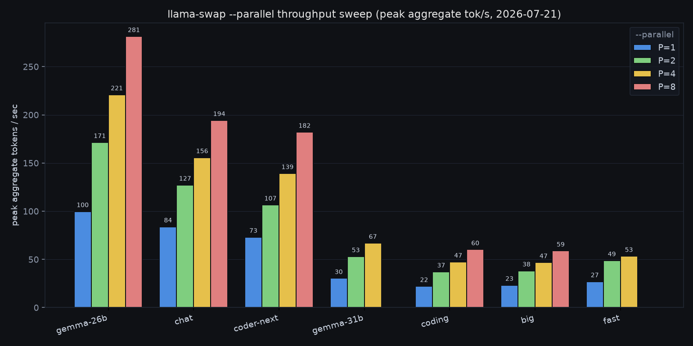

# Concurrency & throughput benchmarking

How to measure how the server behaves under concurrent load — the "tokens/sec vs
concurrent users" curve popularised by Alex Ziskind's local-LLM videos.

## Tooling

| Tool | Layer | What it measures | Use it for |
|------|-------|------------------|-----------|
| [`llm-scaling-bench`](https://github.com/alexziskind1/llm-scaling-bench) (Ziskind) | HTTP / OpenAI API | Aggregate tokens/sec, req/sec, success rate as concurrency sweeps | End-to-end client experience through LiteLLM (matches Ziskind's methodology) |
| `llama-batched-bench` (ships with llama.cpp, in `src/llama.cpp/build/bin`) | engine | Prompt/gen throughput across N parallel sequences, no HTTP | Clean per-model/per-GPU slot-scaling numbers |
| `llama-bench` (llama.cpp) | engine | **Single-stream** prompt/gen speed only — *not* concurrency | Raw per-GPU baseline |
| [HF `inference-benchmarker`](https://github.com/huggingface/inference-benchmarker), NVIDIA GenAI-Perf, llmperf | HTTP / OpenAI API | TTFT, inter-token latency, throughput | Deeper latency metrics / engine comparisons |

`llama-bench` does **not** exercise concurrency (it's single-stream); use
`llm-scaling-bench` (whole stack) or `llama-batched-bench` (engine only) for that.

## Quick start — Ziskind's harness against LiteLLM

```sh
# Default: model=coding, users [1,2,4,8,16], via LiteLLM :4000 (key from docker/.env)
scripts/bench-concurrency.sh

# Other models / sweeps:
BENCH_MODEL=chat scripts/bench-concurrency.sh
BENCH_USERS="1,2,4,8,16,32" BENCH_MODEL=fast scripts/bench-concurrency.sh

# Bypass LiteLLM and hit the llama-swap router directly:
BENCH_API_URL=http://127.0.0.1:9090/v1/chat/completions scripts/bench-concurrency.sh
```

The script clones the harness into `benchmarks/` (gitignored), bootstraps a venv
(python3-venv/ensurepip is absent, so it fetches `get-pip.py`), writes an
env-driven `bench_aiserver.py` (no hardcoded secrets), sets the sweep, and runs.
Results land in `benchmarks/llm-scaling-bench/results/*.csv`; render charts with
`.venv/bin/python scripts/plot_results.py --latest` (HTML works; PNG needs Chrome
for Kaleido).

Env vars: `BENCH_MODEL`, `BENCH_USERS` (comma list), `BENCH_MAX_TOKENS`,
`BENCH_API_URL`, `BENCH_API_KEY`.

## The critical caveat: `--parallel N` caps concurrency

Each model's concurrency is bounded by `--parallel N` in `config/llama-swap.yaml`.
Most daily models run `--parallel 1`, so **concurrent requests serialise**:
aggregate tokens/sec stays flat and the stack returns `429 Too many requests` once
the single slot's queue overflows. `coder-next` is `--parallel 2` (two 131k slots).

To measure *real* engine concurrency, raise `--parallel` on the model block (KV
cache grows ~linearly per slot — watch VRAM with `nvidia-smi`) and re-run.

## Baseline results (2026-07-21)

`coding` (Qwen3.6-27B Q6_K, V100 idx1, `--parallel 1`), 512 max tokens, via LiteLLM:

| Concurrent users | Total time (s) | Tokens/sec | Success |
|-----------------:|---------------:|-----------:|--------:|
| 1  | 23.3  | 21.9 | 100% |
| 2  | 46.6  | 22.0 | 100% |
| 4  | 93.4  | 21.9 | 100% |
| 8  | 187.1 | 21.9 | 100% |
| 16 | 233.9 | 21.9 | 62.5% (6× `429`) |

`fast` (Gemma-4-12B, P100 idx0, `--parallel 1`), 128 max tokens: flat ~26 tok/s at
1/2/4 users.

**Reading:** total time scales linearly with users while tokens/sec is flat — pure
single-slot serialisation, exactly the behaviour Ziskind reports for stock
llama.cpp/LM Studio. Throughput does **not** improve with concurrency on a
`--parallel 1` model; past the queue depth the gateway/engine sheds load with 429s.

> The `429` is **llama-swap's** per-model `concurrencyLimit` (default **10**),
> *not* the engine — raise it per model in `config/llama-swap.yaml` if you want the
> router to admit more simultaneous requests.

## `--parallel` throughput sweep (2026-07-21)

`scripts/parallel-sweep.py` sweeps `--parallel` per model (editing the active
`llama-swap.yaml` + `concurrencyLimit` from a pristine snapshot, benchmarking
`:9090` directly, restoring on exit), 160 max
tokens, concurrency 1–16. **Raising `--parallel` splits `--ctx-size` across slots,
so KV VRAM stays ~flat** — the GPU batch-decodes N sequences for real aggregate
speedup (the *compute* buffers grow, which is what OOMs the VRAM-tight models).

Peak aggregate tokens/sec per `--parallel`, and VRAM at the best setting:



*Raw data: [`data/parallel-sweep-20260721.csv`](data/parallel-sweep-20260721.csv)
(regenerate the chart with `benchmarks/llm-scaling-bench/.venv/bin/python
scripts/plot-parallel-sweep.py docs/data/parallel-sweep-20260721.csv -o
docs/img/parallel-sweep-20260721.png`).*

| Model | GPU / kind | ctx | P=1 | P=2 | P=4 | P=8 | Best | VRAM@best |
|-------|-----------|----:|----:|----:|----:|----:|------|-----------|
| coding      | V100 idx1, dense 27B    | 204800 | 22 | 37 | 47 | **60**  | P=8 | 30.2/32 GB |
| chat        | V100 idx2, MoE 35B-A3B  | 131072 | 84 | 127 | 156 | **194** | P=8 | 30.5/32 GB |
| fast        | P100 idx0, Gemma 12B    | 131072 | 27 | 49 | **53** | OOM  | P=4 | 13.4/16 GB |
| big         | dual-V100, dense 27B Q6 | 262144 | 23 | 38 | 47 | **59**  | P=8 | ~21/32 GB/card |
| coder-next  | dual-V100, MoE 80B-A3B  | 262144 | 73 | 107 | 139 | **182** | P=8 | ~28.5/32 GB/card |
| gemma-31b   | V100 idx1, dense 31B    | 131072 | 30 | 53 | **67** | OOM  | P=4 | 29.2/32 GB |
| gemma-26b   | V100 idx2, MoE 25B-A4B  | 131072 | 100 | 171 | 221 | **281** | P=8 | ~19/32 GB |

Patterns:
- **Gains are sublinear but big** (~2.6–2.9× at the ceiling): batched decode shares
  GPU compute across sequences.
- **MoE models scale best** (chat, coder-next, gemma-26b) — few active params leave
  compute headroom; `gemma-26b` is the throughput champ at **281 tok/s**.
- **VRAM-tight dense models OOM before P=8**: `fast` (P100 16 GB) and `gemma-31b`
  (already 29 GB at P=4) cap at **P=4**; the batch *compute* buffers, not KV, grow.
- **Dual-card models** (`big`, `coder-next`) have per-card headroom and reach P=8;
  `coder-next`'s DeltaNet keeps KV flat, so it's especially cheap to parallelise.

### The catch: `--parallel N` divides per-request context

`--ctx-size` is the **total** KV, split evenly across slots, so more slots = less
context **per request**:

| Model | ctx | P=2 /slot | P=4 /slot | P=8 /slot |
|-------|----:|----------:|----------:|----------:|
| coding     | 204800 | 102400 | 51200 | 25600 |
| chat       | 131072 |  65536 | 32768 | 16384 |
| big        | 262144 | 131072 | 65536 | 32768 |
| coder-next | 262144 | 131072 | 65536 | 32768 |
| gemma-31b  | 131072 |  65536 | 32768 | 16384 |
| gemma-26b  | 131072 |  65536 | 32768 | 16384 |

So the max-throughput setting is **not** automatically the right daily setting: an
agentic coding client that needs 100k+ context can't use `--parallel 8`
(25 k/slot on `coding`). Pick `--parallel` per model by weighing **multi-user
throughput vs per-request context** for that model's real workload — e.g. single-user
agentic coding wants few slots/large context; multi-user family chat wants many slots.
