# Concurrency & throughput benchmarking

How to measure how the server behaves under concurrent load — the "tokens/sec vs
concurrent users" curve popularised by Alex Ziskind's local-LLM videos.

## Contents

- [Tooling](#tooling)
- [Quick start — Ziskind's harness against LiteLLM](#quick-start--ziskinds-harness-against-litellm)
- [The critical caveat: `--parallel N` caps concurrency](#the-critical-caveat---parallel-n-caps-concurrency)
- [Baseline results (2026-07-21)](#baseline-results-2026-07-21)
- [`--parallel` throughput sweep (2026-08-24)](#--parallel-throughput-sweep-2026-08-24)
- [`--parallel` throughput sweep (2026-07-21)](#--parallel-throughput-sweep-2026-07-21)
  - [The catch: `--parallel N` divides per-request context](#the-catch---parallel-n-divides-per-request-context)
- [MoE on the P100 (16 GB) — Gemma-4-26B-A4B (2026-07-22)](#moe-on-the-p100-16-gb--gemma-4-26b-a4b-2026-07-22)
  - [Context ceiling + parallel scaling at large context (2026-07-22)](#context-ceiling--parallel-scaling-at-large-context-2026-07-22)
- [ComfyUI image generation — P100 vs V100 (txt2img, 2026-07-22)](#comfyui-image-generation--p100-vs-v100-txt2img-2026-07-22)
- [P100 `fast` slot: 12B dense vs 26B-A4B MoE — TTFT & prefill (2026-07-22)](#p100-fast-slot-12b-dense-vs-26b-a4b-moe--ttft--prefill-2026-07-22)
- [MTP speculative decode on our `chat` model — Qwen3.6-35B-A3B (2026-07-23)](#mtp-speculative-decode-on-our-chat-model--qwen36-35b-a3b-2026-07-23)
  - [MTP on the `coding` model — Qwen3.6-27B Q6_K (2026-07-23)](#mtp-on-the-coding-model--qwen36-27b-q6_k-2026-07-23)
  - [Chaining `ngram-mod` before `draft-mtp` on the `coding` slot (2026-07-25)](#chaining-ngram-mod-before-draft-mtp-on-the-coding-slot-2026-07-25)
  - [MTP draft-depth sweep on `coding` — shipping `n_max` 2→3 (2026-07-25)](#mtp-draft-depth-sweep-on-coding--shipping-n_max-23-2026-07-25)
  - [MTP on the uncensored `chat-uncensored-q6` model — Qwen3.6-35B-A3B heretic (2026-07-23)](#mtp-on-the-uncensored-chat-uncensored-q6-model--qwen36-35b-a3b-heretic-2026-07-23)
  - [MTP on the `gemma-31b` model — Gemma-4-31B dense, separate draft head (2026-07-23)](#mtp-on-the-gemma-31b-model--gemma-4-31b-dense-separate-draft-head-2026-07-23)
  - [MTP benefit by prompt type & temperature — is "MTP hurts creative writing" a Metal artefact? (2026-07-24)](#mtp-benefit-by-prompt-type--temperature--is-mtp-hurts-creative-writing-a-metal-artefact-2026-07-24)
- [Output-quality benchmark — GSM8K across the served roster (2026-07-24)](#output-quality-benchmark--gsm8k-across-the-served-roster-2026-07-24)
- [Candidate eval — Ternary-Bonsai-27B (ternary Q2_0) on the P100 (2026-07-26)](#candidate-eval--ternary-bonsai-27b-ternary-q2_0-on-the-p100-2026-07-26)
- [Candidate eval — ThinkingCap-Qwen3.6-27B (token-efficient fine-tune) vs the `coding` base (2026-07-26)](#candidate-eval--thinkingcap-qwen36-27b-token-efficient-fine-tune-vs-the-coding-base-2026-07-26)
- [ComfyUI V100 power-cap sweep — does generation benefit from more watts? (2026-08-04)](#comfyui-v100-power-cap-sweep--does-generation-benefit-from-more-watts-2026-08-04)
- [Single-stream engine benchmarks (`llama-bench`, 2026-07-01/02)](#single-stream-engine-benchmarks-llama-bench-2026-07-0102)
  - [Coding-model benchmark — Qwen3.6-27B on the V100s (2026-07-01)](#coding-model-benchmark--qwen36-27b-on-the-v100s-2026-07-01)
  - [MoE benchmark — Qwen3.6-35B-A3B on the V100s (2026-07-01)](#moe-benchmark--qwen36-35b-a3b-on-the-v100s-2026-07-01)
  - [Uncensored fine-tune smoke test — Qwen3.6-35B-A3B-Uncensored (HauhauCS-Aggressive, 2026-07-01)](#uncensored-fine-tune-smoke-test--qwen36-35b-a3b-uncensored-hauhaucs-aggressive-2026-07-01)
  - [Tensor-parallel / multi-GPU reality (measured 2026-07-01)](#tensor-parallel--multi-gpu-reality-measured-2026-07-01)
  - [coding context-window sweep (2026-07-02)](#coding-context-window-sweep-2026-07-02)
  - [Prompt-processing (prefill) tuning — `--ubatch-size` (2026-07-02)](#prompt-processing-prefill-tuning----ubatch-size-2026-07-02)
  - [Gemma-4 benchmarks + context/ubatch tuning (2026-07-02)](#gemma-4-benchmarks--contextubatch-tuning-2026-07-02)

## Tooling

| Tool | Layer | What it measures | Use it for |
|------|-------|------------------|-----------|
| [`llm-scaling-bench`](https://github.com/alexziskind1/llm-scaling-bench) (Ziskind) | HTTP / OpenAI API | Aggregate tokens/sec, req/sec, success rate as concurrency sweeps | End-to-end client experience through LiteLLM (matches Ziskind's methodology) |
| `llama-batched-bench` (ships with llama.cpp, in `src/llama.cpp/build/bin`) | engine | Prompt/gen throughput across N parallel sequences, no HTTP | Clean per-model/per-GPU slot-scaling numbers |
| `llama-bench` (llama.cpp) | engine | **Single-stream** prompt/gen speed only — *not* concurrency | Raw per-GPU baseline |
| [HF `inference-benchmarker`](https://github.com/huggingface/inference-benchmarker), NVIDIA GenAI-Perf, llmperf | HTTP / OpenAI API | TTFT, inter-token latency, throughput | Deeper latency metrics / engine comparisons |

`llama-bench` does **not** exercise concurrency (it's single-stream); use
`llm-scaling-bench` (whole stack) or `llama-batched-bench` (engine only) for that.

## Quick start — Ziskind's harness against LiteLLM

```sh
# Default: model=coding, users [1,2,4,8,16], via LiteLLM :4000 (key from docker/.env)
scripts/bench-concurrency.sh

# Other models / sweeps:
BENCH_MODEL=chat scripts/bench-concurrency.sh
BENCH_USERS="1,2,4,8,16,32" BENCH_MODEL=fast scripts/bench-concurrency.sh

# Bypass LiteLLM and hit the llama-swap router directly:
BENCH_API_URL=http://127.0.0.1:9090/v1/chat/completions scripts/bench-concurrency.sh
```

The script clones the harness into `benchmarks/` (gitignored), bootstraps a venv
(python3-venv/ensurepip is absent, so it fetches `get-pip.py`), writes an
env-driven `bench_aiserver.py` (no hardcoded secrets), sets the sweep, and runs.
Results land in `benchmarks/llm-scaling-bench/results/*.csv`; render charts with
`.venv/bin/python scripts/plot_results.py --latest` (HTML works; PNG needs Chrome
for Kaleido).

Env vars: `BENCH_MODEL`, `BENCH_USERS` (comma list), `BENCH_MAX_TOKENS`,
`BENCH_API_URL`, `BENCH_API_KEY`.

## The critical caveat: `--parallel N` caps concurrency

Each model's concurrency is bounded by `--parallel N` in `config/llama-swap.yaml`.
Most daily models run `--parallel 1`, so **concurrent requests serialise**:
aggregate tokens/sec stays flat and the stack returns `429 Too many requests` once
the single slot's queue overflows. `coder-next` is `--parallel 2` (two 131k slots).

To measure *real* engine concurrency, raise `--parallel` on the model block (KV
cache grows ~linearly per slot — watch VRAM with `nvidia-smi`) and re-run.

## Baseline results (2026-07-21)

`coding` (Qwen3.6-27B Q6_K, V100 idx1, `--parallel 1`), 512 max tokens, via LiteLLM:

| Concurrent users | Total time (s) | Tokens/sec | Success |
|-----------------:|---------------:|-----------:|--------:|
| 1  | 23.3  | 21.9 | 100% |
| 2  | 46.6  | 22.0 | 100% |
| 4  | 93.4  | 21.9 | 100% |
| 8  | 187.1 | 21.9 | 100% |
| 16 | 233.9 | 21.9 | 62.5% (6× `429`) |

`fast` (Gemma-4-12B, P100 idx0, `--parallel 1`), 128 max tokens: flat ~26 tok/s at
1/2/4 users.

**Reading:** total time scales linearly with users while tokens/sec is flat — pure
single-slot serialisation, exactly the behaviour Ziskind reports for stock
llama.cpp/LM Studio. Throughput does **not** improve with concurrency on a
`--parallel 1` model; past the queue depth the gateway/engine sheds load with 429s.

> The `429` is **llama-swap's** per-model `concurrencyLimit` (default **10**),
> *not* the engine — raise it per model in `config/llama-swap.yaml` if you want the
> router to admit more simultaneous requests.

## `--parallel` throughput sweep (2026-08-24)

Re-run of the `--parallel` sweep on the **current roster** (Qwen3.8-27B `coding`/`big`,
`small` on the GTX Titan X stopgap that replaced the dead P100), 256 max tokens,
concurrency 1–16. Harness/method unchanged from the 2026-07-21 baseline below
(`scripts/parallel-sweep.py`, benchmarking `:9090` directly, restoring the pristine
`llama-swap.yaml` on exit). Chart labels show slot **and** backing model.

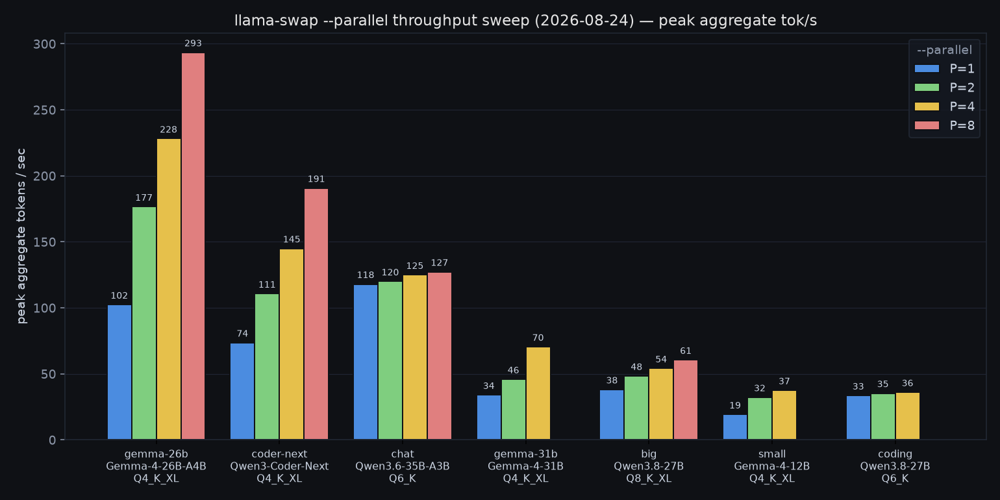

*Raw data: [`data/parallel-sweep-20260824.csv`](data/parallel-sweep-20260824.csv)
(regenerate the chart with `benchmarks/llm-scaling-bench/.venv/bin/python
scripts/plot-parallel-sweep.py docs/data/parallel-sweep-20260824.csv -o
docs/img/parallel-sweep-20260824.png --config config/llama-swap.yaml`; the
`--config` flag reads slot→model names from the live router config).*

Peak aggregate tokens/sec per `--parallel`, and VRAM at the best setting:

| Model | GPU / kind | ctx | P=1 | P=2 | P=4 | P=8 | Best | VRAM@best |
|-------|-----------|----:|----:|----:|----:|----:|------|-----------|
| coding      | V100 idx1, Qwen3.8-27B Q6_K **+MTP** | 163840 | **33** | 35 | 36 | OOM | P=4 | 31.7/32 GB |
| chat        | V100 idx2, Qwen3.6-35B-A3B MoE **+MTP** | 98304 | 118 | 120 | 125 | **127** | P=8 | 32.2/32 GB |
| small       | Titan X idx0, Gemma-4-12B (dense) | 32768 | 19 | 32 | **37** | OOM | P=4 | 11.6/12 GB |
| big         | dual-V100, Qwen3.8-27B Q8_K_XL (dense) | 262144 | 38 | 48 | 54 | **61** | P=8 | 24.8/32 GB/card |
| coder-next  | dual-V100, Qwen3-Coder-Next MoE | 262144 | 74 | 111 | 145 | **191** | P=8 | 28.5/32 GB/card |
| gemma-31b   | V100 idx1, Gemma-4-31B (dense) | 131072 | 34 | 46 | **70** | OOM | P=4 | 31.2/32 GB |
| gemma-26b   | V100 idx2, Gemma-4-26B-A4B MoE | 131072 | 102 | 177 | 228 | **293** | P=8 | 22.1/32 GB |

Patterns (and what changed vs the 2026-07-21 baseline):
- **MTP self-speculative decode reshapes the curve.** The two Qwen slots now run MTP
  (`coding`, `chat`). MTP **boosts single-user speed** — `coding` P=1 22→**33** tok/s,
  `chat` P=1 84→**118** — but **flattens `--parallel` scaling**: MTP already spends the
  batch dimension on draft+verify, so extra sequences find little compute headroom.
  `coding` is nearly flat (33→36) and its compute buffers are already ~31.7 GB at P=4,
  so **P=8 OOMs**; `chat`'s ceiling actually *dropped* (P=8 194→127). Net: MTP is a win
  for interactive single-user coding, a wash-to-loss for many-slot throughput. Daily
  keeps both at `--parallel 1`, which is the right call.
- **Non-MTP models scale as before.** `gemma-26b` is still the throughput champ
  (**293 tok/s** at P=8), `coder-next` reaches **191**, `big` **61** — all within a few
  percent of July, confirming the harness and the dual-V100 path are stable.
- **VRAM-tight dense models cap early.** `small` (12 GB Titan X) and `gemma-31b`
  (31 GB at P=4) OOM before P=8 — the batch *compute* buffers, not KV, are what grow.
- **`small` is the slowest tier by design** (Titan X Maxwell stopgap): 19 tok/s single
  user, best 37 at P=4. This is the "not actually fast" slot the rename fixed.

The per-request-context tradeoff from the baseline still applies verbatim: raising
`--parallel` divides `--ctx-size` across slots, so the max-throughput setting is not
automatically the right daily setting — see the table under the 2026-07-21 section.

## `--parallel` throughput sweep (2026-07-21)

`scripts/parallel-sweep.py` sweeps `--parallel` per model (editing the active
`llama-swap.yaml` + `concurrencyLimit` from a pristine snapshot, benchmarking
`:9090` directly, restoring on exit), 160 max
tokens, concurrency 1–16. **Raising `--parallel` splits `--ctx-size` across slots,
so KV VRAM stays ~flat** — the GPU batch-decodes N sequences for real aggregate
speedup (the *compute* buffers grow, which is what OOMs the VRAM-tight models).

Peak aggregate tokens/sec per `--parallel`, and VRAM at the best setting:

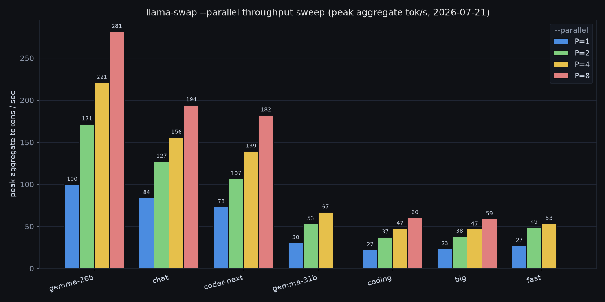

*Raw data: [`data/parallel-sweep-20260721.csv`](data/parallel-sweep-20260721.csv)
(regenerate the chart with `benchmarks/llm-scaling-bench/.venv/bin/python
scripts/plot-parallel-sweep.py docs/data/parallel-sweep-20260721.csv -o
docs/img/parallel-sweep-20260721.png`).*

| Model | GPU / kind | ctx | P=1 | P=2 | P=4 | P=8 | Best | VRAM@best |
|-------|-----------|----:|----:|----:|----:|----:|------|-----------|
| coding      | V100 idx1, dense 27B    | 204800 | 22 | 37 | 47 | **60**  | P=8 | 30.2/32 GB |
| chat        | V100 idx2, MoE 35B-A3B  | 131072 | 84 | 127 | 156 | **194** | P=8 | 30.5/32 GB |
| fast        | P100 idx0, Gemma 12B    | 131072 | 27 | 49 | **53** | OOM  | P=4 | 13.4/16 GB |
| big         | dual-V100, dense 27B Q6 | 262144 | 23 | 38 | 47 | **59**  | P=8 | ~21/32 GB/card |
| coder-next  | dual-V100, MoE 80B-A3B  | 262144 | 73 | 107 | 139 | **182** | P=8 | ~28.5/32 GB/card |
| gemma-31b   | V100 idx1, dense 31B    | 131072 | 30 | 53 | **67** | OOM  | P=4 | 29.2/32 GB |
| gemma-26b   | V100 idx2, MoE 25B-A4B  | 131072 | 100 | 171 | 221 | **281** | P=8 | ~19/32 GB |

Patterns:
- **Gains are sublinear but big** (~2.6–2.9× at the ceiling): batched decode shares
  GPU compute across sequences.
- **MoE models scale best** (chat, coder-next, gemma-26b) — few active params leave
  compute headroom; `gemma-26b` is the throughput champ at **281 tok/s**.
- **VRAM-tight dense models OOM before P=8**: `fast` (P100 16 GB) and `gemma-31b`
  (already 29 GB at P=4) cap at **P=4**; the batch *compute* buffers, not KV, grow.
- **Dual-card models** (`big`, `coder-next`) have per-card headroom and reach P=8;
  `coder-next`'s DeltaNet keeps KV flat, so it's especially cheap to parallelise.

### The catch: `--parallel N` divides per-request context

`--ctx-size` is the **total** KV, split evenly across slots, so more slots = less
context **per request**:

| Model | ctx | P=2 /slot | P=4 /slot | P=8 /slot |
|-------|----:|----------:|----------:|----------:|
| coding     | 204800 | 102400 | 51200 | 25600 |
| chat       | 131072 |  65536 | 32768 | 16384 |
| big        | 262144 | 131072 | 65536 | 32768 |
| coder-next | 262144 | 131072 | 65536 | 32768 |
| gemma-31b  | 131072 |  65536 | 32768 | 16384 |
| gemma-26b  | 131072 |  65536 | 32768 | 16384 |

So the max-throughput setting is **not** automatically the right daily setting: an
agentic coding client that needs 100k+ context can't use `--parallel 8`
(25 k/slot on `coding`). Pick `--parallel` per model by weighing **multi-user
throughput vs per-request context** for that model's real workload — e.g. single-user
agentic coding wants few slots/large context; multi-user family chat wants many slots.

## MoE on the P100 (16 GB) — Gemma-4-26B-A4B (2026-07-22)

Which MoE model fits on the **Tesla P100-16GB** (idx0, sm_60)? An MoE's *total*
params (all experts) must be resident, so weight size — not active params — sets
the floor. Of the Qwen 3.6 / Gemma 4 roster, only **Gemma-4-26B-A4B** (25B total /
~3.8B active, QAT `UD-Q4_K_XL`, 14 GB file) fits: its weight buffer is **13.6 GB**,
leaving ~2.8 GB for KV + compute. `Qwen3.6-35B-A3B` does **not** fit at any local
quant (smallest is `Q4_K_M`, 20 GB > 16 GB) — it would need a `Q2_K`/`IQ3` (~13–15 GB).
The dense Gemma 4 12B/31B and the huge `Qwen3-Coder-Next` MoE are out of scope here.

Standalone sweep (`scripts/p100-moe-sweep.py`, pins the model to idx0 on a private
port so llama-swap can't re-warm `fast` mid-run; total ctx 8192, `q8_0` KV, 256 max
tokens, concurrency 1–16, restores daily on exit):

| `--parallel` | conc 1 | 2 | 4 | 8 | 12 | 16 | Peak | VRAM@peak |
|----:|----:|----:|----:|----:|----:|----:|----:|----:|
| 1 | 51.9 | 51.7 | 51.6 | 51.7 | 51.6 | 51.6 | **51.9** | 14.3 GB |
| 2 | 52.0 | 86.3 | 86.8 | 86.8 | 86.8 | 85.5 | **86.8** | 14.5 GB |
| 4 | 52.0 | 85.7 | 105.2 | 104.9 | 102.6 | 100.6 | **105.2** | 14.8 GB |
| 8 | 51.7 | 86.4 | 105.6 | 99.3 | 100.5 | 99.1 | **105.6** | 15.0 GB |

*(aggregate tokens/sec; 100 % success at every point.)*

*Raw data: [`data/p100-moe-sweep-gemma26b-20260722.csv`](data/p100-moe-sweep-gemma26b-20260722.csv).*

Findings:
- **Single-stream ~52 tok/s** — snappy for a 25B-class model, thanks to only ~3.8B
  active params (behaves like a small dense model on decode).
- **Best aggregate ~105 tok/s at `--parallel 4` (conc ≥4)**; `--parallel 8` doesn't
  improve on 4 (2 slots per active pass already saturate the P100's compute), so
  **P=4 is the sweet spot** — fewer slots means more context per request too.
- **Never OOMs**: 14.3 → 15.0 GB across P=1→8 (KV is cheap: `q8_0` + few KV heads
  add only ~few-hundred MB even at 32k ctx). The P100 has ~1.4 GB to spare at P=8.
- Context scales cheaply too — verified **32k ctx also fits** (14.6 GB @ P=1).

So the P100 can host a genuinely useful ~105 tok/s multi-user MoE (`gemma-26b`),
not just the 12B `fast` — a viable alternative tenant for the aux card.

### Context ceiling + parallel scaling at large context (2026-07-22)

How big a context fits, and can we still parallelise it? (`gemma-26b`, `q8_0` KV,
standalone on idx0.) Gemma-4's **interleaved sliding-window attention** (5 of every
6 layers are windowed) keeps KV remarkably cheap — ~15.5 MiB per 1k tokens — so a
huge context fits before the 16 GB wall.

**Single-user context ceiling** (`--parallel 1`, total = per-request context):

| total ctx | loads? | VRAM | single-stream tok/s |
|----:|:--:|----:|----:|
| 8 k    | ✅ | 14.3 GB | 52 |
| 64 k   | ✅ | 15.2 GB | 50 |
| **128 k** | ✅ | **16.18 GB** (~0.2 GB free) | 50 |
| 192 k  | ❌ OOM | — | — |
| 256 k (native) | ❌ OOM | — | — |

**128 k is the practical single-user ceiling** — it fills the card, and decode holds
~50 tok/s. 192 k+ OOMs (KV alone would exceed the free budget).

**Parallel scaling at large context** — `--ctx-size` is the *total* KV split across
slots, so `--parallel P` gives `total/P` context **per request**. Aggregate tok/s
at **64 k total**:

| `--parallel` | per-req ctx | VRAM | peak agg tok/s |
|----:|----:|----:|----:|
| 1 | 64 k | 15.2 GB | 50 |
| 2 | 32 k | 15.3 GB | 82 |
| 4 | 16 k | 15.6 GB | **100** |
| 8 |  8 k | 16.2 GB | 97 |

At **64 k total the model still scales to ~100 tok/s at `--parallel 4`** (16 k/slot)
and even P=8 fits (16.2 GB). But at **128 k total only `--parallel 1` fits** — P≥2
OOMs (no VRAM left for a second slot's compute buffers).

**The tradeoff (VRAM-bound):** on the P100 `gemma-26b` can do *either* ~128 k
single-user context *or* ~100 tok/s multi-user throughput (64 k total, 16 k/slot) —
not both. Pick per workload: one long-context agent → `--parallel 1 --ctx 131072`;
a few concurrent chat users → `--parallel 4 --ctx 65536`.

*Raw data: [`data/p100-moe-ctx-sweep-gemma26b-20260722.csv`](data/p100-moe-ctx-sweep-gemma26b-20260722.csv).*


## ComfyUI image generation — P100 vs V100 (txt2img, 2026-07-22)

How much does the aux **P100 (sm_60)** lose to a **V100 (sm_70)** on diffusion
image generation? Unlike LLM decode (memory-bandwidth bound, where the P100's HBM2
keeps it within ~1.5× of a V100), image sampling is **fp16-compute bound** — and the
V100 has Volta **fp16 tensor cores** while the P100 has none. That gap shows.

Method: two *dedicated* temporary ComfyUI instances from the shared venv/checkpoints,
one pinned to the P100 (idx0), one to a V100 (idx1), each with its own port + temp/
output/user dirs + sqlite db; all llama-swap models unloaded (and kept unloaded) so
each card is clean. Identical core-node txt2img graph (euler/normal, cfg 7, 30 steps),
one discarded priming run then 3 timed runs. Driver:
[`scripts/comfyui-gpu-bench.py`](../scripts/comfyui-gpu-bench.py).

| Workflow | GPU | cold (load) | warm avg | sampler | VRAM | speedup |
|---|---|---:|---:|---:|---:|---:|
| **SD 1.5** 512×512, 30 steps | P100 | 10.3 s | 8.72 s | 3.7 it/s | 3.2 GB | — |
| (DreamShaper_8, fp16)        | V100 |  3.7 s | **2.23 s** | **17.0 it/s** | 3.8 GB | **3.9× / 4.6× it/s** |
| **SDXL** 1024×1024, 30 steps | P100 | 69.6 s | 78.7 s | 0.38 it/s | 5.6 GB | — |
| (sd_xl_base_1.0, fp16)       | V100 | 13.8 s | **10.6 s** | **3.22 it/s** | 7.5 GB | **7.4× / 8.5× it/s** |

**Takeaways:**
- The V100 is **~4× faster on SD 1.5 and ~7–8× faster on SDXL** — a *much* wider gap
  than the ~1.5× we see on LLM decode. Image sampling saturates fp16 matmul, which is
  exactly where Volta tensor cores (V100) beat the tensor-core-less P100 (Pascal).
- The gap **widens with resolution/model size**: SDXL's larger UNet is more
  compute-bound, so the P100 falls further behind (0.38 it/s → ~2.6 s per step).
- Both models fit the P100 comfortably (SDXL peak only 5.6 GB — no fp8 needed at
  fp16; recall sm_60/70 have no fp8 anyway). **The P100 is a fine *offload* card for
  batch/low-priority image jobs, but keep interactive ComfyUI on a V100.**

*Raw data: [`data/comfyui-p100-v100-txt2img-20260722.csv`](data/comfyui-p100-v100-txt2img-20260722.csv).*


## P100 `fast` slot: 12B dense vs 26B-A4B MoE — TTFT & prefill (2026-07-22)

Should the always-on P100 `fast` slot serve the dense **Gemma-4-12B** or the
**Gemma-4-26B-A4B MoE** (25B total / ~3.8B active)? Focus: time-to-first-token
(TTFT) and prompt-processing (prefill) speed. Both pinned to the P100 (idx0),
flash-attn on, ub2048, greedy; TTFT measured client-side over a streamed
`/completion`, prefill/decode from the server's own `timings`. Driver:
[`scripts/p100-ttft-fast-vs-moe.py`](../scripts/p100-ttft-fast-vs-moe.py).

| Prompt | TTFT (12B → MoE) | Prefill tok/s (12B → MoE) | Decode tok/s (12B → MoE) |
|---|---|---|---|
| 123 tok  | 1.02 s → **0.62 s** | 121 → **200** | 30.0 → **61.3** |
| 501 tok  | 2.12 s → **1.41 s** | 247 → **372** | 29.8 → **63.7** |
| 2 040 tok | 7.14 s → **3.61 s** | 286 → **568** | 27.4 → **60.5** |
| 6 144 tok | 23.25 s → **11.38 s** | 265 → **542** | 28.0 → **58.9** |
| VRAM | ~8.5 GB | | ~15.3 GB |

**The MoE wins every latency metric** — it fires only ~3.8B params/token, so both
prefill and decode are cheaper *despite* 25B total weights:
- **TTFT 1.6–2× faster** (gap widens with prompt length — matters for RAG/long ctx).
- **Prefill 1.5–2× faster** (568 vs 286 tok/s at 2k).
- **Decode ~2× faster** (~60 vs ~29 tok/s), plus higher quality (25B knowledge).

**The one cost is VRAM headroom.** The MoE keeps all experts resident (~15.3 GB of
16 GB) vs the 12B's ~8.5 GB, so it's VRAM-bound on the P100 — it can't do both large
ctx *and* high parallelism (measured fit envelope: ctx 32768 ub1024 P=1 → 1.2 GB
free; ctx 24576 P=2 → 1.0 GB free; **P=4 or 48k+ ctx OOMs**).

**Decision (2026-07-22): swapped `fast` → the MoE.** Deployed daily as ctx **32768**,
ub1024, `--parallel 1`, `--reasoning-budget 0` (~15.3 GB). The parallel overlays cap
`fast` at **P=2 / ctx 24576** (agentic, heavy-coding). The dense 12B stays available
as **`fast-12b`** (128k ctx, ~8.5 GB) for when you need max single-user context or
P100 headroom (e.g. a co-resident image-gen offload job).

*Raw data: [`data/p100-ttft-fast-vs-moe-20260722.csv`](data/p100-ttft-fast-vs-moe-20260722.csv).*


## Single-stream engine benchmarks (`llama-bench`, 2026-07-01/02)

These are the **single-stream** per-model / per-GPU numbers gathered during
bring-up with `llama-bench` (prefill `pp` and token-gen `tg`), plus the
context-window and `--ubatch-size` tuning that set the current `config/llama-swap`
args. They measure raw engine speed for one request — for concurrency see the
`--parallel` sweep above. (Moved here from `server-setup.md`.)

### Coding-model benchmark — Qwen3.6-27B on the V100s (2026-07-01)
Model: `Qwen3.6-27B` (dense, hybrid linear+full attention, `qwen35` arch — see
ADR-0008). GGUFs from `unsloth/Qwen3.6-27B-GGUF` in `/srv/ai/models/qwen3.6-27b/`.
Bench: `scripts/bench-qwen3.6-27b.sh` (llama-bench, -p512 -n128 -r3, depths 0/8192).
Raw: `/srv/ai/models/qwen3.6-27b/bench-*/results.md`.

**tg128 = token-gen t/s (interactive speed); pp512 = prompt-processing t/s.**

| Quant / config          | pp512 | tg128 | pp @8k | tg @8k |
|-------------------------|------:|------:|-------:|-------:|
| Q6_K  single V100       |  870  | 25.6  |  748   | 22.7   |
| Q6_K  dual — layer      |  873  | 25.6  |  754   | 24.6   |
| Q6_K  dual — row        |  203  | 21.4  |  195   | 20.4   |
| BF16  dual — layer      |  183  | 12.1  |  163   |  9.6   |
| BF16  dual — row        |  193  | 12.2  |  162   |  9.7   |

**Findings (answers the ADR-0005 TP question):**
- **Splitting a model that fits one card gives ~no throughput benefit.** Q6_K
  single vs dual-layer is a tie (~25.6 tg). Dual's value is *capacity*, not speed.
- **`-sm row` is bad on this box:** ~4× slower prompt processing (203 vs 872 pp)
  from per-layer PCIe sync (no NVLink). **Use `-sm layer` (default), never `row`.**
- **BF16 needs both cards and runs ~2× slower than Q6_K** (12 vs 25.6 tg) for a
  marginal quality gain → not worth it for serving.
- **Dual-layer helps slightly at depth** (24.6 vs 22.7 tg @8k): KV cache spread
  over 2 cards eases the memory-bandwidth hit as context grows.

**Serving recommendation:** run **Q6_K on a single V100** (`-sm none`,
`CUDA_VISIBLE_DEVICES=1`), leaving V100 #2 free for a second model (e.g. the
35B-A3B MoE or a 2nd instance). Only tensor-split (layer) when a model/context
genuinely won't fit on one card.

### MoE benchmark — Qwen3.6-35B-A3B on the V100s (2026-07-01)
Model: `Qwen3.6-35B-A3B` (MoE, 34.66B total / ~3B active, `qwen35moe` arch).
GGUF `unsloth/...UD-Q6_K` in `/srv/ai/models/qwen3.6-35b-a3b/`.
Bench: `scripts/bench-qwen3.6-35b-a3b.sh`. Raw: `.../bench-*/results.md`.

| Quant / config          | pp512 | tg128 | pp @8k | tg @8k |
|-------------------------|------:|------:|-------:|-------:|
| Q6_K  single V100       |  773  | 97.6  |  697   | 95.2   |
| Q6_K  dual — layer      |  755  | 97.1  |  704   | 95.0   |
| Q6_K  dual — row        |  467  | 42.1  |  438   | 41.4   |
| BF16  dual (layer/row)  |  — DID NOT FIT (weights ~69 GB > 64 GB VRAM) — |

**Findings:**
- **MoE is ~3.8× faster than the dense 27B** (97.6 vs 25.6 tg t/s) — only ~3B of
  35B params active per token. Big win for latency/interactive use.
- Single vs dual-layer = tie again (~97 tg): confirms splitting a model that fits
  one card yields no throughput gain (dual = capacity, not speed).
- **`-sm row` is even worse for MoE**: tg halves (42 vs 97) — expert routing +
  per-layer PCIe sync. Never use row on this box.
- **BF16 MoE won't run**: 69 GB weights > 64 GB (2×V100). Q6_K (27 GB) fits ONE
  card and is the practical max-quality config; Q8_0 (37 GB) would need both cards
  if higher precision is ever wanted.

**Serving rec:** run **35B-A3B Q6_K on a single V100** for a fast, low-latency
model — pairs well with the dense 27B Q6_K on the other V100 (one card each).

### Uncensored fine-tune smoke test — Qwen3.6-35B-A3B-Uncensored (HauhauCS-Aggressive, 2026-07-01)
Model: `HauhauCS/Qwen3.6-35B-A3B-Uncensored-HauhauCS-Aggressive` (same `qwen35moe`
arch, uncensored fine-tune, **reasoning model** with a vision mmproj available).
GGUFs in `/srv/ai/models/qwen3.6-35b-a3b/`. Live `llama-server` smoke test (not
llama-bench), single short request, cards under the **175 W cap**.

| Quant       | Size    | Layout                | VRAM        | pp t/s  | tg t/s | result |
|-------------|--------:|-----------------------|-------------|--------:|-------:|--------|
| Q4_K_M      | 21.2 GB | 1× V100 (idx1)        | 20.7 GB     | 147-196 | ~102   | ✓ correct |
| Q6_K_P      | 30.6 GB | 2× V100 (`-sm layer`) | 14.7+15.5 GB| ~107    | ~93    | ✓ correct |

**Findings:**
- **Q4_K_M on a single V100 is the practical default** — ~102 tg t/s, leaves the 2nd
  V100 free and ~11 GB headroom for context. Matches the ~97 tg of the unsloth Q6_K
  above (MoE speed is active-param-bound, not quant-bound).
- **Q6_K_P (30.6 GB) does NOT fit one V100 with usable context** → needs both cards
  via `-sm layer` (14.7+15.5 GB, well balanced). Costs the 2nd card + ~10% tg (93 vs
  102) for the higher-quality quant; the drop is PCIe cross-GPU traffic (PHB, no
  NVLink). Use only when Q6 quality is specifically wanted.
- **Reasoning model**: emits a thinking block first. Final answer is in the response
  `content`; chain-of-thought is in `reasoning_content`. Even a 3-word reply burns
  ~100-200 completion tokens on reasoning — budget `max_tokens` generously (≥256), or
  disable thinking (`/no_think` in the prompt, or `enable_thinking:false` template flag).
- Downloaded via the keyring-backed wrapper `scripts/hf-dl` (Xet backend, byte-exact).
- Temps stayed ~41 °C — a single short request doesn't stress the cards; sustained
  load would behave like the other 35B-A3B results above.

### Tensor-parallel / multi-GPU reality (measured 2026-07-01)
`nvidia-smi topo -m`: all GPU pairs = **PHB** (PCIe via CPU host bridge), **no NVLink**.
P2P test (`/tmp/p2ptest.cu`, cudaMemcpyPeer, 256MB) between the two V100s:
- **P2P peer access: ENABLED** both directions.
- **Inter-GPU bandwidth: ~5.2 GB/s** (vs NVLink 25-300 GB/s) — routed over PCIe
  gen3 through the CPU. This is the ceiling for any all-reduce.

**What "tensor parallelism" means in our tests:**
- llama.cpp **`-sm row` = tensor split** (splits each weight matrix + per-layer
  all-reduce). Tested: 4x slower prefill (dense), ~2x slower tg (MoE). This is the
  no-NVLink penalty hitting the 5.2 GB/s link every layer.
- llama.cpp **`-sm layer` = pipeline** (layers split across cards, tiny traffic).
  Tested: matches single-card speed.

**Conclusion:** TP *works* on the 2xV100 (P2P on, same sm_70) but is
**communication-bound**. Use it for **capacity** (models >32GB), not speed. For
single-stream latency, prefer **one model per card**. vLLM's NCCL TP=2 is more
optimized than llama.cpp row-split and *may* help under **batched/concurrent**
serving — retest when vLLM is brought up. P100 cannot join TP (arch/mem mismatch).

### coding context-window sweep (2026-07-02)

Qwen3.6-27B Q6_K on one V100-32GB, `--parallel 1 --flash-attn on`, f16 KV. Model's trained
context is 262144 (256k), so VRAM is the limit. KV grows ~65 MB per 1k tokens; the flash-attn
compute buffer is fixed (scales with u-batch, not prompt length), so load-time VRAM ≈ peak.

| ctx     | VRAM used | free    | notes                                   |
|---------|-----------|---------|-----------------------------------------|
| 32768   | ~23.3 GB  | ~9.4 GB | previous default                        |
| 131072  | 29.4 GB   | 3.3 GB  | meets Copilot BYOK ≥128k recommendation |
| 163840  | 31.5 GB   | 1.25 GB | earlier f16-KV pick — too tight (see below) |
| ≥172032 | —         | —       | exceeds 32 GB with f16 KV (would OOM)   |

Originally chose **163840 (160k)** with f16 KV, but that left only ~1.25 GB free — and a
large prompt's `-ub 1024` prefill compute buffer then couldn't allocate, so `coding` hit a
**CUDA OOM and crashed** on any prompt beyond a couple thousand tokens (`cuMemCreate ... out of
memory` during `graph_compute`). Fixed 2026-07-04 by switching coding to **q8_0 KV**
(`--cache-type-k q8_0 --cache-type-v q8_0`, near-lossless 8-bit): it halves KV, which both cures
the OOM and frees enough room to **raise context to 200k (204800)**. At 200k q8_0 the card sits
~29.8/32 GB (~3 GB headroom) and an 11k-token prompt prefills at ~790 t/s with no OOM. Coding
runs `--parallel 1` so the full window serves one agent (concurrent requests serialize — fine
for personal use).

### Prompt-processing (prefill) tuning — `--ubatch-size` (2026-07-02)

Raising `--ubatch-size` (`-ub`, default 512) speeds **prefill / time-to-first-token** (helps
large prompts, e.g. tool results injected into context). It does **not** change generation
speed. Cost = a larger CUDA compute buffer (VRAM). `llama-bench` on a V100:

| model              | -ub 512 | -ub 1024 | -ub 2048 | applied |
|--------------------|---------|----------|----------|---------|
| coding (27B Q6_K, 1×V100) | 746 t/s | **858 (+15%)** | 892 (+20%) | **`-ub 1024`** — with q8_0 KV @200k (~3 GB free) 1024 fits; 2048 risks OOM |
| chat (35B-A3B UD-Q6_K, 1×V100) | — | — | +~20% | **`-ub 2048`** — has ~4 GB headroom |
| big (27B BF16, 2×V100 layer-split) | **232 t/s** | 205 | 167 | **default 512** — larger *hurts* (inter-GPU sync) |

Key lesson: bigger `-ub` helps single-GPU models but **hurts layer-split multi-GPU** models.
`coding` at `-ub 1024` uses ≈ the same VRAM as 512 (free +15%). Verified both load without OOM.

### Gemma-4 benchmarks + context/ubatch tuning (2026-07-02)

`llama-bench` (`-p 2048 -n 128`, flash-attn on, `CUDA_DEVICE_ORDER=PCI_BUS_ID`). **Note:** without
`CUDA_DEVICE_ORDER=PCI_BUS_ID`, CUDA orders devices by *speed* (V100s first, P100 last) — the
opposite of nvidia-smi/llama-swap — so always export it when pinning a card for benchmarks.

**Throughput** (t/s):

| model | card | pp2048 ub512 | ub1024 | ub2048 | tg128 |
|-------|------|--------------|--------|--------|-------|
| Gemma-4-12B (dense) | **P100** | 368 | 324 | 458 | **30** |
| Gemma-4-12B (dense) | **V100** | 1526 | 1814 | **1987** | **71** |
| Gemma-4-31B (dense) | V100 | 583 | 697 | **760** | 34 |
| Gemma-4-26B-A4B (MoE) | V100 | 1486 | 1887 | **2269** | **110** |

- **P100 vs V100 (12B):** the V100 is ~4.3× faster prefill and ~2.35× faster generation. `fast`
  stays on the P100 anyway (frees both V100s for the big Qwen/Gemma models); 30 t/s is fine for
  chat, and the P100 is otherwise idle.
- **26B-A4B MoE is the fastest model on the box** — 110 t/s gen (only ~3.8B active params),
  beating even the dense 12B. Best quality/speed Gemma for daily use.
- **ubatch:** `-ub 2048` is optimal prefill for *all* single-GPU Gemmas (dense +28-30%, MoE +53%).
  Applied `-ub 2048` to `fast`, `gemma-31b`, `gemma-26b`.

**Context / VRAM.** All three Gemma-4 models are **256K-native** (`context_length 262144`) and use
**sliding-window attention** (1024 window, 5 SWA : 1 global layer), so KV cache grows very slowly —
only the 1-in-6 global layers hold full-length KV. Measured resident VRAM (f16 KV, `-ub` default):

| model | ctx 32k | 65k | 131k | 262k (full) | applied ctx |
|-------|---------|-----|------|-------------|-------------|
| 12B / P100 16GB | 8.8 | 9.3 | 10.4 | 12.6 GB | **131072** (10.8GB @ub2048; leaves P100 aux room) |
| 31B / V100 32GB | 23.2 | 25.8 | 31.0 | OOM | **131072** (q8_0 KV → 26.7GB @ub2048; f16 OOMs at 131k) |
| 26B-A4B / V100 32GB | 15.6 | 16.3 | 17.6 | 20.3 | **131072** (18.0GB @ub2048; full 256k also fits) |

Full 256K only costs +2-4 GB over 16K thanks to SWA. **31B needs `--cache-type-k/v q8_0`** (halves
KV, needs flash-attn) to reach 128k — f16 KV at 131k hits 31GB + compute buffer and OOMs; q8_0
brings it to ~26.7GB. The 12B and 26B-A4B have room to spare with f16 KV. Verified all three
co-resident after tuning: P100 10.8GB / V100#1 26GB (31B@131k) / V100#2 18.0GB, all answering.

## MTP speculative decode on our `chat` model — Qwen3.6-35B-A3B (2026-07-23)

Qwen trained a **Multi-Token-Prediction (MTP)** head directly into Qwen3.6-35B-A3B — a built-in
self-speculative-decode drafter (extra `blk.40.nextn.*` tensors) that proposes the next few
tokens for the model itself to verify in one pass. Our served `chat` GGUF
(`Qwen3.6-35B-A3B-UD-Q6_K.gguf`) was converted **without** it, so we never used it. Unsloth ships
the MTP-equipped file in a **separate** repo — `unsloth/Qwen3.6-35B-A3B-MTP-GGUF` — at the same
`UD-Q6_K` quant (30.0 GB vs our 29.3 GB; the ~0.7 GB delta is the embedded MTP head). Our stock
`llama.cpp` build already supports it via `--spec-type draft-mtp` (no separate draft model).

**This is a true apples-to-apples test: identical weights, identical engine, MTP off vs on**, so
any decode gain is the speculative head, not a smaller quant (unlike the pxq_llama "+30%" — see
`benchmark_pxq_llama.md` §14). One V100 (idx1), ctx 40960, q8_0 KV, `--parallel 1`,
batch/ubatch 2048, greedy; 256-token generations; prompt sweep **500 → 32k tokens**.
Harness: `scripts/mtp-bench.py`.

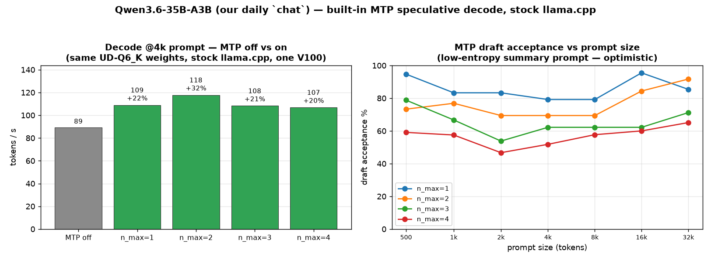

Steady-state at a 4k-token prompt:

| Config | Prefill @4k | **Decode @4k** | Δ decode | Draft accept | Peak VRAM |
|---|---:|---:|---:|---:|---:|
| **MTP off** (baseline) | 1182 t/s | **89.3 t/s** | — | — | 29.2 GB |
| MTP `n_max=1` | 1129 t/s | 109.0 t/s | **+22%** | 79% | 29.8 GB |
| **MTP `n_max=2`** | 1129 t/s | **117.8 t/s** | **+32%** | 69% | 29.9 GB |
| MTP `n_max=3` | 1125 t/s | 108.3 t/s | +21% | 62% | 29.9 GB |
| MTP `n_max=4` | 1124 t/s | 106.9 t/s | +20% | 52% | 30.0 GB |

Takeaways:

- **MTP is a real, lossless decode win on our actual daily model**: ~**+20–32%** decode at
  identical weights (peaks ~**+37–43%** at shorter 512-token prompts). Output is unchanged — the
  main model verifies every drafted token.
- **`n_max=2` is the sweet spot** (matches unsloth's recommendation). Deeper drafting
  (`n_max` 3–4) *lowers* acceptance (52–62%) — more wasted draft passes — and nets less.
- **Long context benefits *more*, not less.** Across the 500→32k sweep, `n_max=2` decode gain
  rises from **+32% @4k to +57% @32k** (116.8 vs 74.5 t/s baseline) — the baseline decode slows
  under the growing KV while the cheap MTP verify step does not. Acceptance is **U-shaped**: it
  dips through the 2–8k mid-range (~69%) then *recovers* to **~85–92% at 16–32k** as the
  low-entropy summary prompt becomes more predictable. The +32% @4k figure is a floor, not a
  ceiling, for long-context chat.
- **Prefill cost is negligible** here (~4%, 1182→1129 t/s) — much cheaper than the pxq_llama
  fork's MTP, which taxed prefill heavily (§14). Stock llama.cpp's in-model MTP only adds a small
  per-step draft.
- **VRAM cost is ~0.6–0.8 GB** (draft path + head). **Production fit:** our `chat` slot serves
  MTP at **ctx 98304 (96k)** — a near-full 90k prefill peaks **31.86 GB / 32 GB** (~0.9 GB
  headroom, measured). 128k would OOM with MTP, so this trades 32k of context for the speedup.
  `chat` runs alone on idx2 (comfyui-secure evicts it before image gen via the free_gpu hook), so
  the full-card peak is the real ceiling.
- **Acceptance here is optimistic**: the summarization prompt is low-entropy (highly
  predictable), so real chat/code will accept less and gain less than +32%. Still, even a
  conservative +15–20% is free throughput from a model swap + one flag.

**How to enable** (this is the shipped `chat` block — ctx capped at 96k to fit MTP):

```bash
llama-server \
  --model models/qwen3.6-35b-a3b-mtp/Qwen3.6-35B-A3B-UD-Q6_K.gguf \
  --ctx-size 98304 --cache-type-k q8_0 --cache-type-v q8_0 \
  --parallel 1 --batch-size 2048 --ubatch-size 2048 --flash-attn on \
  --spec-type draft-mtp --spec-draft-n-max 2
```

### MTP on the `coding` model — Qwen3.6-27B Q6_K (2026-07-23)

Same test, same method, on the dense **`coding`** model (`unsloth/Qwen3.6-27B-MTP-GGUF`
`Qwen3.6-27B-Q6_K.gguf`, byte-identical Q6_K weights + embedded `blk.64.nextn.*` head, +0.35 GB).
One V100 (idx1), q8_0 KV, `--parallel 1`, batch/ubatch 2048, flash-attn on;
ctx 40960 test, prompt sweep **500 → 32k tokens**.

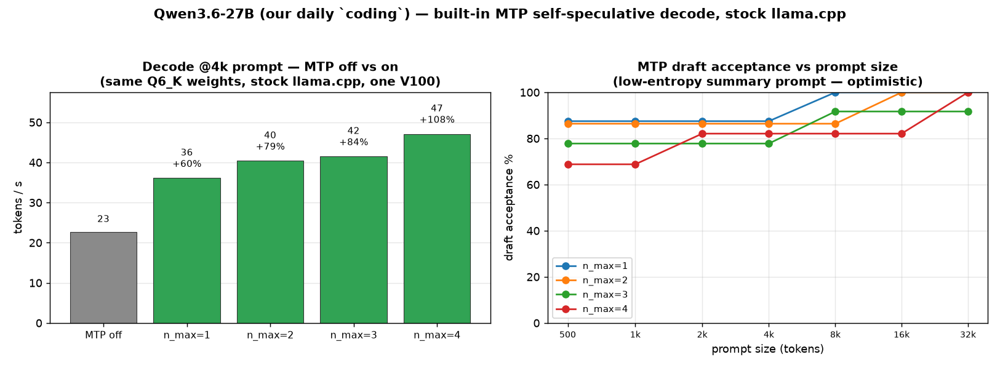

Decode throughput, MTP off vs on (steady-state at a ~4k-token prompt):

| Config | Prefill t/s | Decode t/s | Δ decode | Accept % | VRAM (@4k) |
| --- | --- | --- | --- | --- | --- |
| **MTP off** (baseline) | 857 t/s | **22.6 t/s** | — | — | 23.8 GB |
| MTP `n_max=1` | 813 t/s | 36.1 t/s | **+60%** | 88% | 24.4 GB |
| **MTP `n_max=2`** | 813 t/s | **40.4 t/s** | **+79%** | 86% | 24.6 GB |
| MTP `n_max=3` | 811 t/s | 41.5 t/s | +84% | 78% | 24.7 GB |
| MTP `n_max=4` | 812 t/s | 47.1 t/s | +108% | 82% | 24.8 GB |

Takeaways:

- **MTP is a much bigger win on `coding` than on `chat` (+79% vs +32%).** The dense 27B is
  memory-bandwidth-bound (~22.7 t/s baseline) *and* has very high draft acceptance (~86–88%), so
  each cheap draft step lands far more often than on the already-fast MoE `chat`. `n_max=2` is the
  safe sweet spot; `n_max=3/4` post higher peaks but with lower/erratic acceptance.
- **Prefill cost ~5%** (857→813 t/s) — negligible, as with `chat`.
- **Long context benefits *more*.** Across the 500→32k sweep the `n_max=2` gain *rises* to
  **+92% @32k** (37.5 vs 19.5 t/s) as draft acceptance climbs to ~100% on the low-entropy
  summary prompt — the dense 27B stays bandwidth-bound under the growing KV while the cheap
  MTP verify step does not.
- **VRAM ceiling forces a ctx trade.** MTP adds an extra ~1 GB compute buffer, so the old **200k**
  context **OOMs** with MTP. Measured ctx-ceiling (MTP `n_max=2`, near-full prefill peak):

  | ctx | Peak VRAM | Free | Fits? |
  | --- | --- | --- | --- |
  | 204800 (200k) | — | — | ❌ OOM (needs +1072 MiB it can't get) |
  | **184320 (180k)** | 32.02 GB | **~0.75 GB** | ✅ (shipped) |
  | 163840 (160k) | 31.02 GB | ~1.75 GB | ✅ |
  | 131072 (128k) | 29.42 GB | ~3.35 GB | ✅ |

  We ship **180k** — the max that fits, matching the thin-margin precedent set by the `chat` slot.
  KV scales ~48.8 MiB / 1k ctx; decode is flat ~40.7 t/s across all fitting ctx sizes. `coding`
  runs alone on idx1 (comfyui-open evicts it before image gen via the free_gpu hook), so the
  full-card peak is the real ceiling.

**How to enable** (this is the shipped `coding` block — ctx capped at 180k to fit MTP):

```bash
llama-server \
  --model models/qwen3.6-27b-mtp/Qwen3.6-27B-Q6_K.gguf \
  --ctx-size 184320 --cache-type-k q8_0 --cache-type-v q8_0 \
  --parallel 1 --batch-size 2048 --ubatch-size 2048 --flash-attn on \
  --spec-type draft-mtp --spec-draft-n-max 2
```

> MTP is a **single-stream latency** win, so the `agentic` mode (which runs `coding` as a P=2
> throughput pool) overrides back to the non-MTP Q6_K file at 200k with spec off; `heavy-coding`
> keeps MTP on the single-slot interactive `coding` primary.

### Chaining `ngram-mod` before `draft-mtp` on the `coding` slot (2026-07-25)

A reader of the MTP benchmarks suggested chaining a **model-free n-gram drafter ahead of MTP**
on a coding slot:

```bash
--spec-type draft-mtp,ngram-mod --spec-draft-p-min 0.85 --spec-draft-n-max 4 \
  --spec-ngram-mod-n-match 24 --spec-ngram-mod-n-min 8 --spec-ngram-mod-n-max 16
```

Our stock build (b9850) supports the comma-list `--spec-type` and the `--spec-ngram-mod-*` flags.
`ngram-mod` proposes drafts by matching the **generated suffix against the context history** — so
it only helps when the model **echoes** its input (large diffs, "return the whole file", refactors,
boilerplate), and does nothing for freshly-generated prose/logic. To expose that, `mtp-bench.py`
grew a `--prompt code` mode (an echo-heavy "reproduce this module verbatim" prompt) alongside the
default generative `summary` prompt, plus a `--spec-type` override. A/B on `coding`
(Qwen3.6-27B Q6_K, V100 idx1, ctx 40960, q8_0 KV, 512-tok gens, temp 0) — **decode tok/s (accept%)**:

| prompt | size | off | `draft-mtp` n2 (shipped) | `draft-mtp` n4 | `draft-mtp,ngram-mod` n4 |
|--------|-----:|----:|-------------------------:|---------------:|-------------------------:|
| **code** (echo-heavy) | ~5k  | 21.8 | 42.6 (100%) | 53.2 (100%) | **64.9 (74%)** |
| **code** (echo-heavy) | ~21k | 20.1 | 38.8 (100%) | 48.3 (100%) | **58.2 (73%)** |
| summary (generative)  | ~4k  |  —   | 40.6 (86%)  | 47.3 (82%)  | **32.1 (66%)** |
| summary (generative)  | ~16k |  —   | 41.4 (100%) | 44.0 (82%)  | 51.4 (92%)† |

**Takeaways:**
- **On echo-heavy coding, `ngram-mod` is a genuine, isolated win.** Separating it from the
  `n_max` 2→4 bump: ngram adds **+22 % over `draft-mtp` n4** and **+52 % over the shipped n2**
  (**+198 % vs off**) at ~5k, holding to +50 %/+20 % at ~21k. `ngram-mod` proposes long verbatim
  spans that get accepted in bulk, so per-token accept **drops** (74 %) while throughput jumps —
  accept% is misleading here; look at tok/s.
- **It can hurt pure generative short-context** (−32 % vs `draft-mtp` n4 @4k summary): with no echo
  to match, rejected n-gram drafts waste decode steps. († the 16k "gain" is an artifact of the
  synthetic filler prompt degenerating into repetition, which `ngram-mod` then matches — not a real
  generative win.)
- **Side finding (now shipped as `n_max=3`):** simply raising MTP `n_max` above 2 helped *both*
  workloads unconditionally. This was validated on the full 500→32k sweep below and the `coding`
  slot now ships `--spec-draft-n-max 3`.
- The suggested `--cache-type-k-draft/v-draft q4_0` are **no-ops for this slot** — they quantize a
  *separate draft model's* KV cache, but `coding` uses an **embedded** MTP head + the model-free
  `ngram-mod`, so there is no draft-model KV to quantize. Omitted here.

**Decision:** the daily `coding` slot serves a **mix** of echo and generative work, so blanket
`ngram-mod` is not shipped (risks ~30 % regressions on generative turns). It's best as an **opt-in
for edit/refactor-heavy sessions** (candidate: a `coding-edit` mode overlay). The deeper-MTP side
finding *was* worth shipping — see the sweep below.

Data: `docs/data/mtp/coding-ngram-hybrid.csv`. Reproduce:

```bash
M=models/qwen3.6-27b-mtp/Qwen3.6-27B-Q6_K.gguf
# echo-heavy code prompt: off + shipped MTP n2 + deeper n4
python3 scripts/mtp-bench.py --model $M --gpu 1 --ctx 40960 --ubatch 2048 \
  --prompt code --sizes 4096,16384 --gen 512 --nmax 0 2 4 --label coding-code --no-restore
# hybrid: ngram-mod ahead of MTP
python3 scripts/mtp-bench.py --model $M --gpu 1 --ctx 40960 --ubatch 2048 \
  --prompt code --sizes 4096,16384 --gen 512 --nmax 4 --label coding-code --no-restore \
  --spec-type "draft-mtp,ngram-mod" \
  --extra "--spec-draft-p-min 0.85 --spec-ngram-mod-n-match 24 --spec-ngram-mod-n-min 8 --spec-ngram-mod-n-max 16"
```

### MTP draft-depth sweep on `coding` — shipping `n_max` 2→3 (2026-07-25)

The ngram A/B incidentally showed that deeper MTP (`n_max` > 2) helps *both* echo and generative
work, so I validated it properly before touching the shipped default. Full **500→32k** sweep,
`n_max ∈ {0,2,3,4}`, on both the echo `code` and generative `summary` prompts (Qwen3.6-27B Q6_K,
V100 idx1, ctx 40960, q8_0 KV, 512-tok gens, temp 0):

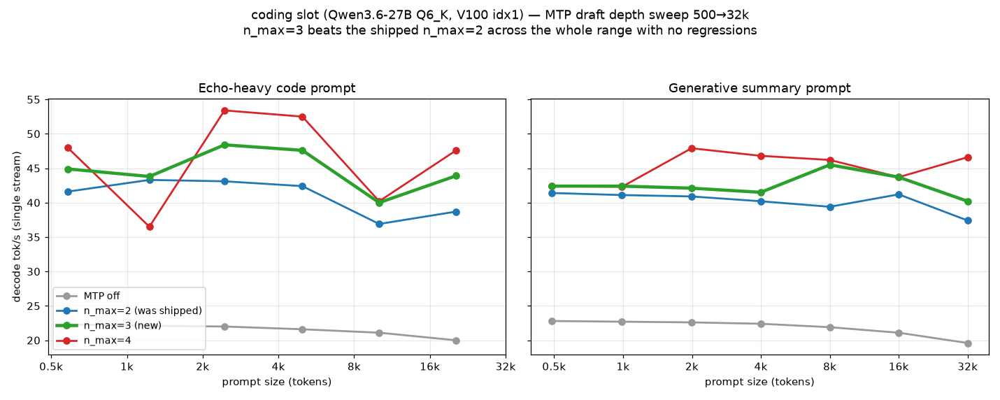

Mean decode tok/s across the sweep (and per-cell regressions vs the shipped `n2`):

| prompt | `n2` (was) | `n3` (new) | `n4` | cells below `n2` |
|--------|-----------:|-----------:|-----:|------------------|
| code (echo)      | 41.0 | **44.8** (+9 %) | 46.4 (+13 %) | `n3`: none · `n4`: 1 (@1.3k: 36.5 vs 43.3) |
| summary (generative) | 40.2 | **42.5** (+6 %) | 45.1 (+12 %) | `n3`: none · `n4`: none |

**Why `n3`, not `n4`:**
- `n3` beats `n2` in **every one of the 13 cells** (both prompts) — a clean, monotonic upgrade with
  no regressions.
- `n4` has a higher *average* but **regresses at some sizes** (draft over-shoot — e.g. code @1.3k
  drops to 36.5 vs `n2`'s 43.3, accept 59 %), so it's not a safe unconditional default.
- **VRAM at the production 180k ctx** (measured, near-full prefill peak): `n2` 32.02 GB → `n3`
  ~32.18 GB → `n4` 32.32 GB on the 32 GB card. `n3` keeps ~0.6 GB headroom; `n4` leaves only
  ~0.45 GB — too tight for a card that already runs near-full.
- A temp-0.7 spot check confirmed `n3`/`n4` still beat `n2` under realistic sampling (echo stays
  ~100 % accept; generative accept falls to ~65-86 % but throughput still wins) — no repeat of the
  `n=5` @ T1 slowdown seen in the prompt-type/temperature study.

Shipped: `config/llama-swap.base.yaml` `coding` block → `--spec-draft-n-max 3` (daily/heavy-coding
inherit; `agentic` still strips MTP for its P=2 pool). Data: `docs/data/mtp/coding-nmax-sweep.csv`.

```bash
M=models/qwen3.6-27b-mtp/Qwen3.6-27B-Q6_K.gguf
python3 scripts/mtp-bench.py --model $M --gpu 1 --ctx 40960 --ubatch 2048 \
  --gen 512 --nmax 0 2 3 4 --prompt code    --label coding-nmax-code --no-restore
python3 scripts/mtp-bench.py --model $M --gpu 1 --ctx 40960 --ubatch 2048 \
  --gen 512 --nmax 0 2 3 4 --prompt summary --label coding-nmax-sum  --no-restore
```

### MTP on the `big` model — Qwen3.6-27B UD-Q6_K_XL, **dual-V100 split** (2026-07-23)

`big` is the max-quality dense 27B split across **both** V100s (`--split-mode layer`,
f16 KV, `--parallel 1`, 256k ctx). The open question was whether the `draft-mtp`
self-speculative path even *works* across a layer split between two GPUs — the earlier
`chat`/`coding` tests only exercised a single card. It does. Swapped to
`unsloth/Qwen3.6-27B-MTP-GGUF` `Qwen3.6-27B-UD-Q6_K_XL.gguf` (byte-identical UD-Q6_K_XL
weights + embedded `blk.64.nextn.*` head, +0.38 GB). Apples-to-apples, both V100s
(idx1+idx2), ctx 40960 test, **f16 KV**, `--split-mode layer`, `--parallel 1`, flash-attn on;
prompt sweep **500 → 32k tokens**.

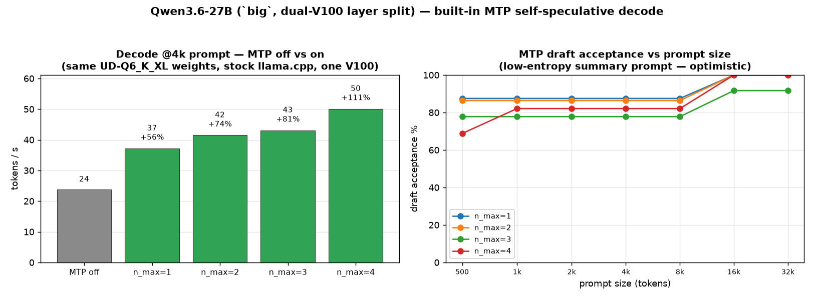

Decode throughput, MTP off vs on (steady-state at a ~4k-token prompt):

| Config | Prefill t/s | Decode t/s | Δ decode | Accept % | VRAM (@4k, both cards) |
| --- | --- | --- | --- | --- | --- |
| **MTP off** (baseline) | 879 t/s | **23.8 t/s** | — | — | 29.2 GB |
| MTP `n_max=1` | 822 t/s | 37.2 t/s | **+56%** | 88% | 31.1 GB |
| **MTP `n_max=2`** | 819 t/s | **41.5 t/s** | **+74%** | 86% | 31.2 GB |

Takeaways:

- **The dual-card layer-split MTP path works and is a big win (+75%).** Baseline decode is
  low (~24 t/s) because the inter-GPU layer split caps utilization at ~47%; MTP verifies cheap
  drafted tokens "for free" in that idle compute, lifting decode to ~42 t/s with the *same*
  ~86–88% acceptance the dense 27B posts on a single card. `n_max=2` is again the sweet spot.
- **Prefill cost ~7%** (879→819 t/s) — a bit higher than the single-card slots but negligible
  against the decode gain for `big`'s overnight long-context use.
- **Long context benefits *more*.** The `n_max=2` gain grows to **+95% @32k** (41.0 vs 21.0 t/s)
  at ~100% acceptance — the layer-split's idle compute verifies drafts for free even as the KV
  fills, so the win widens with context.
- **No context trade-off.** MTP adds only ~1.8 GB total across the two cards (~31 GB / 64 GB at
  32k). `big` keeps its full **262144 (256k)** native ctx — VRAM headroom is ample on the pair.

**How to enable** (this is the shipped `big` block):

```bash
CUDA_VISIBLE_DEVICES=1,2 llama-server \
  --model models/qwen3.6-27b-mtp/Qwen3.6-27B-UD-Q6_K_XL.gguf \
  --ctx-size 262144 --cache-type-k f16 --cache-type-v f16 \
  --split-mode layer --parallel 1 --flash-attn on \
  --spec-type draft-mtp --spec-draft-n-max 2
```

> `big` is `--parallel 1` in every serving mode (it preempts `coding`+`chat`), so MTP applies
> unconditionally — no mode overlay overrides it.

### MTP on the `fast` model — Gemma-4-26B-A4B MoE, **separate draft head** (2026-07-23)

Unlike Qwen3.6 (embedded `nextn` head), **Gemma-4 has no embedded MTP head** — self-spec
uses a **separate ~460 MB `gemma4-assistant` draft model** (`--model-draft` +
`--spec-type draft-mtp`), the same mechanism `fast-uncensored` already uses for the 12B.
Pulled `ironbcc/gemma-4-26B-A4B-it-MTP-GGUF` assistant heads (Q8_0 462 MB, Q4_K_M 325 MB;
vocab-matched to our `it-qat` base) and benchmarked both. P100 (idx0), ctx 33280 test (16 GB card),
f16 KV, ub1024, `--parallel 1`, `--reasoning-budget 0`, `--n-gpu-layers-draft 99`; prompt sweep
**500 → 32k tokens**.

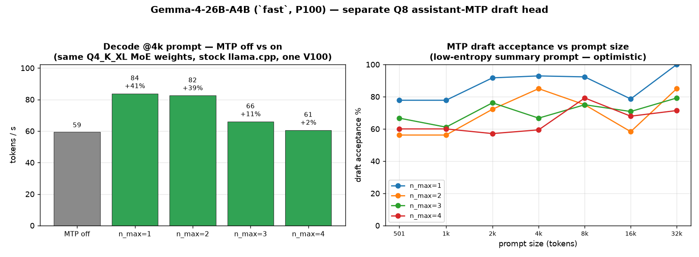

Decode throughput (steady-state at a ~4k-token prompt):

| Config | Decode t/s | Δ decode | Accept % | VRAM (@4k) |
| --- | --- | --- | --- | --- |
| **MTP off** (baseline) | **59.4 t/s** | — | — | 15.0 GB |
| **Q8 draft, `n_max=1`** | **83.8 t/s** | **+41%** | 85–100% | 15.6 GB (~0.4 GB free) |
| Q8 draft, `n_max=2` | 82.5 t/s | +39% (erratic) | 56–85% | 15.6 GB |
| Q4 draft, `n_max=1` | 81.9 t/s | +38% | 85–100% | 15.4 GB (~0.6 GB free) |
| Q4 draft, `n_max=2` | 73.4 t/s | +24% (erratic) | 56–85% | 15.4 GB |

Takeaways:

- **MTP works on the MoE too — a solid ~+40% decode** (~60 → ~84 t/s), lossless. Smaller than
  the dense wins (coding +79%, big +75%) because the MoE fires only ~3.8B params/token so it is
  far less bandwidth-starved, but still a clear latency win for the always-on chat slot.
- **`n_max=1` is the sweet spot.** The 1-token assistant head drafts a single token with high
  acceptance (~78–98%); `n_max=2` drops acceptance to ~56% on short prompts and gets erratic.
- **Q8 vs Q4 draft: near-identical decode at `n_max=1`.** Q8 (462 MB) lands at ~84 t/s, Q4
  (325 MB) at ~82 t/s. We **ship Q8** — the P100 is dedicated to `fast` while this model is loaded,
  so we spend the VRAM on the higher-precision draft head (still ~0.4 GB free at a 32k prompt). Q4
  is the fallback if headroom ever gets tight.
- **Long context stays positive.** The `n_max=1` gain narrows from +41% @4k to **+32% @32k**
  (68 vs 52 t/s) — smaller than the dense slots since the MoE fires only ~3.8 B params/token, but
  never negative across the full 500→32k range.

**How to enable** (this is the shipped `fast` block):

```bash
CUDA_VISIBLE_DEVICES=0 llama-server \
  --model models/gemma-4-26b-a4b/gemma-4-26B-A4B-it-qat-UD-Q4_K_XL.gguf \
  --ctx-size 32768 --parallel 1 --batch-size 2048 --ubatch-size 1024 \
  --reasoning-budget 0 --flash-attn on \
  --model-draft models/gemma-4-26b-a4b/mtp-draft/gemma-4-26B-A4B-it-assistant-Q8_0.gguf \
  --spec-type draft-mtp --spec-draft-n-max 1 --n-gpu-layers-draft 99
```

> MTP is single-stream only, so the `agentic`/`heavy-coding` overlays (which run `fast` as a
> P=2 worker pool) strip the draft via `spec: none` — the mode renderer now also removes the
> separate `--model-draft` / `--n-gpu-layers-draft` flags, not just `--spec-type`.

### MTP on the `fast-12b` model — Gemma-4-12B dense, separate draft head (2026-07-23)

The dense 12B fallback. Same separate-`gemma4-assistant`-draft mechanism as `fast`, but
because it is a **dense** model it is bandwidth-bound (~28 t/s baseline) with very high draft
acceptance — so MTP wins big, like the dense `coding` slot. Draft:
`Janvitos/gemma-4-12B-it-qat-assistant-MTP-Q8_0-GGUF` (465 MB, vocab-matched). P100 (idx0),
ctx 40960 test, f16 KV, ub2048, `--parallel 1`, `--reasoning-budget 0`, `--n-gpu-layers-draft 99`;
prompt sweep **500 → 32k tokens**.

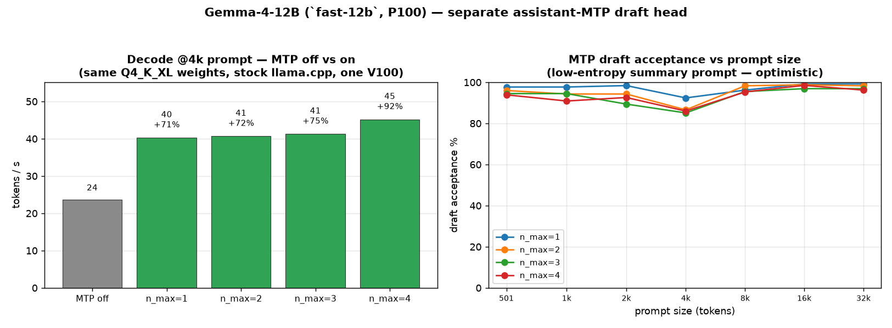

Decode throughput (steady-state at a ~4k-token prompt):

| Config | Decode t/s | Δ decode | Accept % | VRAM (@4k) |
| --- | --- | --- | --- | --- |
| **MTP off** (baseline) | **23.6 t/s** | — | — | 9.0 GB |
| **`n_max=1`** | **40.3 t/s** | **+71%** | 92% | 9.8 GB (~6.2 GB free) |
| `n_max=2` | 40.7 t/s | +72% | 87% | 9.8 GB |
| `n_max=3` | 41.3 t/s | +75% | 85% | 9.8 GB |
| `n_max=4` | 45.2 t/s | +92% | 86% | 9.8 GB |

Takeaways:

- **~+71% decode** (24 → 40 t/s), lossless — far bigger than the MoE `fast` (+41%) because the
  dense 12B fires all its params per token (bandwidth-bound) and the assistant head lands ~85–99%.
- **`n_max=1` is the shipped conservative pick.** Higher n_max posts bigger peaks (n=4 ~+92% @4k)
  at only slightly lower acceptance (~86%), but n=1 is the safe single-token draft that holds ~92%
  acceptance across the whole 500→32k range. Gains stay large at long context (**+62–78% @32k**).
- **VRAM is a non-issue.** The 465 MB Q8 draft costs ~0.8 GB (~9.8 GB / 16 GB); the full
  128k context and P100 co-hosting headroom are unaffected.

**How to enable** (this is the shipped `fast-12b` block):

```bash
CUDA_VISIBLE_DEVICES=0 llama-server \
  --model models/gemma-4-12b/gemma-4-12B-it-qat-UD-Q4_K_XL.gguf \
  --ctx-size 131072 --parallel 1 --batch-size 2048 --ubatch-size 2048 \
  --reasoning-budget 0 --flash-attn on \
  --model-draft models/gemma-4-12b/mtp-draft/gemma-4-12B-it-qat-assistant-MTP-Q8_0.gguf \
  --spec-type draft-mtp --spec-draft-n-max 1 --n-gpu-layers-draft 99
```

> `fast-12b` is a `--parallel 1` fallback with no mode overlay override, so MTP applies in every
> serving mode.

### MTP on the uncensored `chat-uncensored-q6` model — Qwen3.6-35B-A3B heretic (2026-07-23)

Our uncensored slot ran the **HauhauCS-Aggressive** abliteration of Qwen3.6-35B-A3B, which has
**no MTP variant** (HauhauCS only ships MTP for their Gemma models), and Qwen's MTP head is
*embedded* — you can't bolt a separate draft onto abliterated weights. To get MTP here we swapped
the abliteration lineage to **`Qwen3.6-35B-A3B-uncensored-heretic-Native-MTP-Preserved`**
(repo `TopherAU/…-GGUF`), which explicitly preserves the native `blk.40.nextn.*` head. Same
in-model mechanism as `chat` (`--spec-type draft-mtp`, no separate draft file). The heretic **Q6_K
is 29.3 GB — 1.3 GB *smaller* than the old HauhauCS Q6_K_P (30.6 GB)** — so despite MTP's ~0.7 GB
buffer the tight Q6 slot has *more* headroom than before. Single V100 (idx1), q8_0 KV, ub2048,
`--parallel 1`; ctx 40960 test, prompt sweep **500 → 32k tokens**. Harness: `scripts/mtp-bench.py`.

> We benchmarked a Q4_K_M of the same heretic model too (256k-capable, +30% decode) but **dropped
> it to save disk** — the Q6 is the sole uncensored slot.

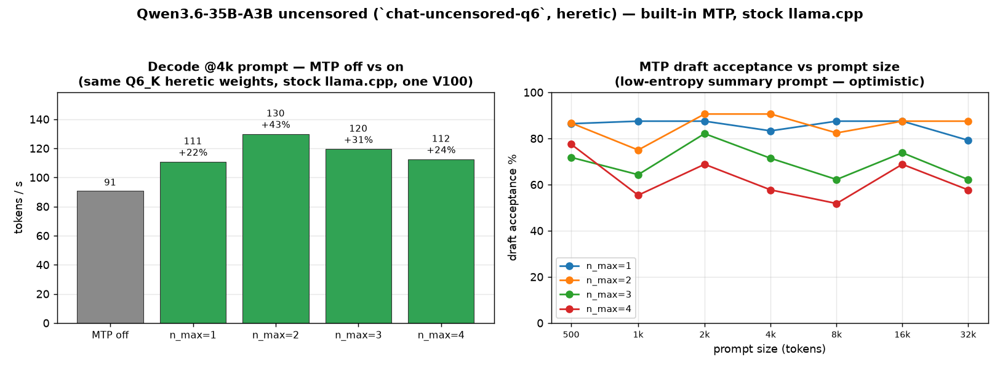

Decode throughput, MTP off vs on (steady-state at a ~4k-token prompt) — **`chat-uncensored-q6`**
(Q6_K, 29.3 GB):

| Config | Decode t/s | Δ decode | Accept % | VRAM (@4k test) |
| --- | --- | --- | --- | --- |
| **MTP off** (baseline) | **90.9 t/s** | — | — | 29.2 GB |
| `n_max=1` | 110.8 t/s | +22% | 83% | 29.8 GB |
| **`n_max=2`** | **129.9 t/s** | **+43%** | 91% | 29.8 GB |

Takeaways:

- **~+43% decode**, lossless — right in the MoE MTP band (`chat` got +32%), since Qwen3.6-35B-A3B
  fires only ~3 B active params/token. We ship **`n_max=2`**.
- **Holds at long context.** The `n_max=2` gain stays **+42% @32k** (109.4 vs 76.9 t/s) at ~88%
  acceptance across the 500→32k sweep — the same flat MoE profile as `chat`.
- **Fits at full 128k production context with MTP** (measured live via the router): **128k = 31.7 GB
  / 32 GB** (~1.1 GB headroom — still the ragged slot, but the smaller heretic weights keep 128k
  viable where the old 30.6 GB Q6_K_P left almost nothing). Do NOT raise ctx further.
- **This is a model swap, not just a flag** — the uncensoring persona changes from HauhauCS-Aggressive
  to the heretic lineage. Approved by the owner as the only path to MTP on this slot.

**How to enable** (shipped `chat-uncensored-q6` block):

```bash
CUDA_VISIBLE_DEVICES=1 llama-server \
  --model models/qwen3.6-35b-a3b/Qwen3.6-35B-A3B-uncensored-heretic-Native-MTP-Preserved-Q6_K.gguf \
  --ctx-size 131072 --cache-type-k q8_0 --cache-type-v q8_0 \
  --parallel 1 --batch-size 2048 --ubatch-size 2048 \
  --spec-type draft-mtp --spec-draft-n-max 2
```

> The uncensored slot is `--parallel 1` with no mode overlay override, so MTP applies in every
> serving mode.

### MTP on the `gemma-31b` model — Gemma-4-31B dense, separate draft head (2026-07-23)

The max-quality dense Gemma comparison slot. Same separate-`gemma4-assistant`-draft mechanism as
`fast`/`fast-12b`, and as a **dense** 31B it is heavily bandwidth-bound — so MTP delivers the
**biggest win of the whole rollout**. Draft: `NotMe404/gemma-4-31b-it-assistant-mtp-gguf` (Q8_0,
491 MB, vocab-matched at 262144 tokens). Single V100 (idx1), ctx 40960 test, q8_0 KV, ub2048,
`--parallel 1`, `--reasoning-budget 0`, `--n-gpu-layers-draft 99`; prompt sweep **500 → 32k tokens**.

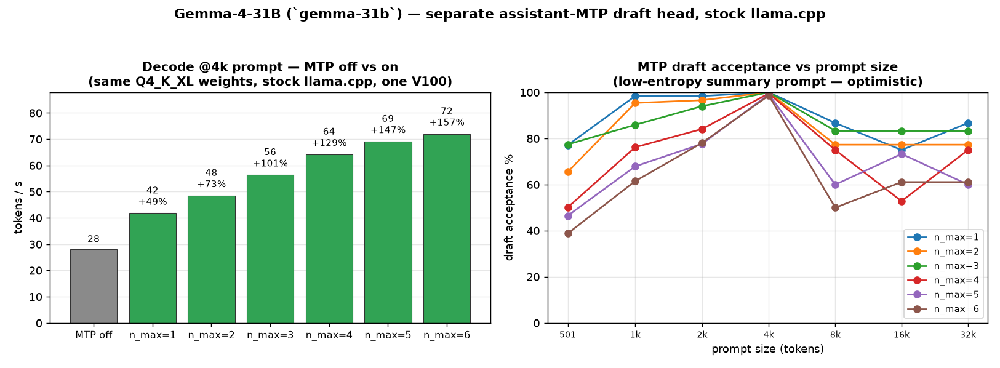

Decode throughput, MTP off vs on, across prompt lengths (t/s), with steady-state at ~4k:

| n_max | @512 | @2048 | **@4k (steady)** | Δ steady | Accept @4k |
| --- | --- | --- | --- | --- | --- |
| **off** (baseline) | 30.7 | 29.1 | **28.0** | — | — |
| 1 | 44.5 | 44.2 | 41.8 | +49% | 100% |
| 2 | 43.4 | 49.9 | 48.5 | +73% | 100% |
| **3** | **53.7** | 56.6 | **56.4** | **+101%** | 100% |
| 4 | 45.3 | 59.5 | 64.2 | +129% | 99.5% |
| 5 | 44.7 | 59.9 | 69.1 | +147% | 99.1% |
| 6 | 39.8 | 62.5 | 72.0 | +157% | 98.6% |

Takeaways:

- **~+101% decode** (28 → 56.4 t/s) at **n_max=3** — the assistant head lands ~90–100% acceptance
  because the dense 31B is highly predictable, so each verify step commits several tokens.
- **n=3 is the robust production pick.** Higher n_max posts bigger *steady-state* numbers (up to
  +157% at n=6) but **craters on shorter / less-predictable prompts** — acceptance at a 512-token
  prompt falls to ~50% (n=4) → ~40% (n=6), dragging real decode *below* n=3. n=3 is the only setting
  that is at or near the top across **every** prompt length (it is the outright best at 512 tokens).
- **At 32k the case for n=3 gets *stronger*.** Long-prompt acceptance for the high-n settings
  collapses (n=5 → 60%, n=6 → 61% @32k), so n=3 (+79% @32k, ~83% accept) leads the field where the
  aggressive settings fall behind — the opposite of their short-prompt peaks.
- **VRAM is a non-issue.** The 491 MB Q8 draft costs ~1.2 GB; full 128k production context loads at
  **28.1 GB / 32 GB** (measured live via the router, ~4.6 GB headroom).

**How to enable** (this is the shipped `gemma-31b` block):

```bash
CUDA_VISIBLE_DEVICES=1 llama-server \
  --model models/gemma-4-31b/gemma-4-31B-it-qat-UD-Q4_K_XL.gguf \
  --ctx-size 131072 --cache-type-k q8_0 --cache-type-v q8_0 \
  --parallel 1 --batch-size 2048 --ubatch-size 2048 \
  --model-draft models/gemma-4-31b/mtp-draft/gemma4-31B-it-assistant-Q8_0.gguf \
  --spec-type draft-mtp --spec-draft-n-max 3 --n-gpu-layers-draft 99
```

> `gemma-31b` is a `--parallel 1` comparison slot with no mode overlay override, so MTP applies in
> every serving mode.

### MTP benefit by prompt type & temperature — is "MTP hurts creative writing" a Metal artefact? (2026-07-24)

A Mac-Studio user (M2 Ultra, **Metal** backend) reported that with Qwen3.6-27B, MTP
speculative decode **helps for coding but *hurts* creative writing** even with params
tuned for their machine — MTP head n=5 gave 1.35× on code (temp=0) but **0.91×** on
creative writing (temp=1), and a 0.8B drafter at n=20 was worse still (0.88×). The
question: is that a **Metal-platform** quirk, or an intrinsic property of the prompt
type / sampling temperature that should reproduce anywhere?

We reproduced it on our **CUDA/V100** platform with the same model class (our `coding`
slot, `Qwen3.6-27B-Q6_K` with the embedded `nextn` MTP head). Their test *bundles*
content with temperature (code=temp0, prose/creative=temp1), so to disentangle the two
we ran the **full matrix**: `{code, technical-prose, creative} × {temp 0, temp 1} ×
{baseline, MTP n=2, MTP n=5}`, single V100 (idx1), ctx 8192, q8_0 KV, 320-token
generations. Because Qwen3.6 is a reasoning model, we **disabled thinking** (prefilled
empty `<think></think>`) so decode is measured over the *actual* code/prose/creative
tokens, not uniform reasoning text. Harness: `scripts/mtp-scenario-bench.py`.

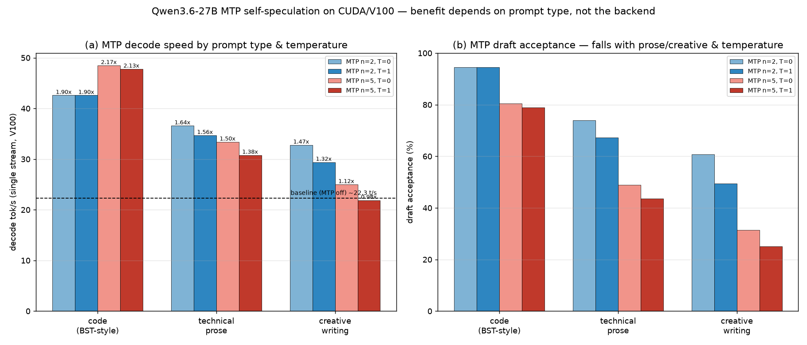

Decode tok/s (speedup vs the flat ~22.3 t/s baseline) and draft acceptance:

| Prompt type | Temp | Baseline | MTP n=2 (accept) | MTP n=5 (accept) |
| --- | --- | --- | --- | --- |
| **code** | 0 | 22.4 | 42.6 (**+90%**, 94.5%) | 48.5 (**+116%**, 80.4%) |
| **code** | 1 | 22.4 | 42.6 (+90%, 94.5%) | 47.8 (+113%, 78.9%) |
| technical-prose | 0 | 22.3 | 36.6 (+64%, 73.9%) | 33.4 (+50%, 49.0%) |
| technical-prose | 1 | 22.3 | 34.7 (+55%, 67.3%) | 30.8 (+38%, 43.6%) |
| **creative** | 0 | 22.3 | 32.8 (+47%, 60.8%) | 25.0 (+12%, 31.4%) |
| **creative** | 1 | 22.3 | 29.4 (+31%, 49.4%) | **21.9 (−2%, 25.1%)** |

Findings:

- **It reproduces on CUDA — so it is *not* a Metal artefact.** At the aggressive `n=5`,
  **creative writing at temp=1 nets 21.9 t/s vs 22.3 baseline (0.98×) — an actual
  slowdown**, the same direction as the reporter's 0.91×. The cause is universal to
  speculative decode: MTP only wins when drafted tokens are *accepted*; rejected drafts
  are wasted verify compute. The backend doesn't change that arithmetic.
- **Two independent axes drive acceptance down.** (1) **Content predictability** — even
  at temp=0, acceptance falls code 94% → prose 74% → creative 61% (n=2). Code has highly
  predictable structure (syntax, boilerplate) the MTP head nails; prose and especially
  creative writing are higher-entropy. (2) **Temperature** — raising temp 0→1 diverges the
  *sampled* token from the greedy draft, dropping creative acceptance 61%→49% (n=2). Both
  compound.
- **`n_max` is a risk dial, and higher is not "more tuned" — it's more aggressive.** A big
  `n` amplifies both outcomes: on code it extends the accepted run (n=5 → +116%), but on
  low-acceptance content it drafts long chains that get rejected, so the wasted work
  *exceeds* the savings and decode drops **below baseline**. This is exactly why the
  reporter's n=5 / n=20 configs hurt their non-code cases hardest.
- **Our shipped `n_max=2` never regresses.** Across every cell its worst case is creative
  temp=1 at **+31%** (29.4 t/s); it's +90% on code. The conservative `n=2` captures most
  of the code win while staying safe on prose/creative — vindicating the daily setting.

**Verdict:** the "MTP hurts creative writing" report is **real and platform-independent** —
it's the prompt type (token predictability) and sampling temperature governing draft
acceptance, not the Metal backend. Keep `--spec-draft-n-max 2` for a mixed workload; only
push `n_max` higher on a code-dominated, low-temperature slot where acceptance stays ≳80%.

**Reproduce:**

```bash
# full matrix (3 prompt types × 2 temps × {baseline, n=2, n=5}) on V100 idx1:
python3 scripts/mtp-scenario-bench.py --nmax 0 2 5 --temps 0 1 --gen 320
# chart:
venvs/comfyui/bin/python scripts/mtp-scenario-plot.py
```

Data: `docs/data/mtp/scenario-sweep.csv`.

## Output-quality benchmark — GSM8K across the served roster (2026-07-24)

Having verified the **speed** wins (MTP, `--parallel`, quant choices), this pass measures
**output quality** across every model in the daily llama-swap roster, to confirm those
speedups did not come with an accuracy regression and to rank the models on a reasoning task.

**Task:** GSM8K (grade-school math word problems), **5-shot CoT, greedy** (`temperature=0`),
scored by `exact_match` (flexible-extract). Driven through the reusable harness
`scripts/lm-eval-run.sh` (lm-evaluation-harness → OpenAI-compatible chat endpoint). GSM8K is
generative because llama.cpp's server returns no prompt-token logprobs (loglikelihood tasks
like hellaswag/winogrande can't run) and gemma-4's batched-eval path is broken in our build —
but its server *generation* is correct, so generative GSM8K is the portable quality proxy.

**How it was run:** accuracy is independent of GPU/parallelism, so instead of the slow single-slot
daily servers we spun up dedicated stock `llama-server` instances (`--parallel 6–8`) on the two
V100s in parallel, one model at a time — see `scripts/roster-gsm8k-eval.sh`. Reasoning models
(Qwen3.6 thinking + gemma reasoning-on) used `max_gen_toks=6144` and `until=<|im_end|>` so the
task's default stop strings don't fire inside the thinking phase; non-reasoning models used
`max_gen_toks=512`. Weights/quant match production; MTP draft heads were omitted (lossless — they
don't change greedy output). Reasoning models were run at n=100, non-reasoning at n=200.

| served model | base / quant | params | GPU | reasoning | n | flexible | strict | ±stderr |
|---|---|---|---|:-:|--:|--:|--:|--:|
| `chat` | Qwen3.6-35B-A3B UD-Q6_K | 35B-A3B | V100 | ✓ | 100 | **99.0%** | 99.0% | 1.0 |
| `coding` | Qwen3.6-27B Q6_K | 27B | V100 | ✓ | 100 | **98.0%** | 98.0% | 1.4 |
| `big` | Qwen3.6-27B UD-Q6_K_XL | 27B | dual-V100 | ✓ | 100 | **98.0%** | 98.0% | 1.4 |
| `chat-uncensored-q6` | Qwen3.6-35B-A3B heretic Q6_K | 35B-A3B | V100 | ✓ | 100 | **98.0%** | 98.0% | 1.4 |
| `gemma-31b` | Gemma-4-31B Q4_K_XL | 31B | V100 | ✗ | 200 | **98.0%** | 98.0% | 1.0 |
| `coder-next` | Qwen3-Coder-Next-80B-A3B Q4_K_XL | 80B-A3B | dual-V100 | ✗ | 200 | **96.0%** | 94.5% | 1.4 |
| `fast-12b` | Gemma-4-12B Q4_K_XL | 12B | P100 | ✗ | 200 | **95.5%** | 96.0% | 1.5 |
| `fast` | Gemma-4-26B-A4B Q4_K_XL | 26B-A4B | P100 | ✗ | 200 | **95.0%** | 95.0% | 1.5 |
| `gemma-26b` | Gemma-4-26B-A4B Q4_K_XL | 26B-A4B | V100 | ✗ | 200 | **95.0%** | 95.0% | 1.5 |
| `fast-uncensored` | Gemma4-12B Uncensored HauhauCS-Balanced Q4_K_M | 12B | P100 | ✓ | 100 | **41.0%** | 41.0% | 4.9 |

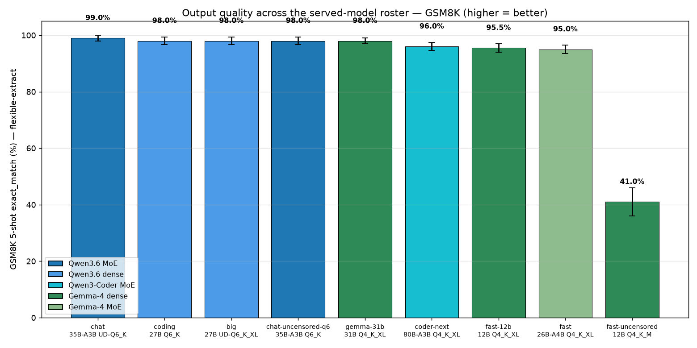

Data: `docs/data/lm-eval/roster-gsm8k.csv` (+ per-model `docs/data/lm-eval/<model>-gsm8k-*/`).
Chart: `scripts/roster-gsm8k-plot.py`. `gemma-26b` is the **same GGUF** as `fast` (different slot),
so it scores identically and is omitted from the chart.

**Findings**

- **No quality regression from the speed work.** All the production reasoning + coding + chat
  models cluster at **98–99%** — MTP self-speculative decode and the Q6_K/Q4_K_XL quant choices
  cost nothing on GSM8K. The daily trio (`coding` 98%, `chat` 99%, `fast` 95%) is healthy.
- **The uncensored *chat* model is fine; the uncensored *fast* model is not.** `chat-uncensored-q6`
  (Qwen3.6-35B heretic) matches the stock `chat` at 98–99%, so abliteration cost it nothing here.
  But **`fast-uncensored` collapses to 41%** — a ~55-point drop from the base `fast-12b` (95.5%).
  This is a *genuine* capability loss, not a harness artifact: 0/100 generations were empty, the
  model simply gets the arithmetic wrong (under greedy decoding the reasoning-on Balanced tune
  rambles/loops and frequently fails to converge on the correct number). **Treat `fast-uncensored`
  as a creative/uncensored-chat model only — do not route math/agentic/tool work to it.**
- **Size/quant ranking is intuitive.** The big reasoning models (Qwen3.6 35B/27B, Gemma-4-31B) lead;
  the small P100 Gemmas trail by a few points but are still strong (95–96%). `coder-next` (an
  80B-A3B *coding* model) lands at 96% — good for a code-specialized model on a math task.
- **`coder-next` loads on our stock build** (llama.cpp b9850) — the earlier b9850+ requirement is
  satisfied, no fork needed.

> **Caveat:** GSM8K is one narrow (grade-school math) axis and n is modest (±1–5 pts). It's a
> regression tripwire and a coarse ranker, **not** a full capability eval. The 41% `fast-uncensored`
> result is large enough to be a real signal regardless.

## Candidate eval — Ternary-Bonsai-27B (ternary Q2_0) on the P100 (2026-07-26)

Evaluated [`prism-ml/Ternary-Bonsai-27B-gguf`](https://huggingface.co/prism-ml/Ternary-Bonsai-27B-gguf)
— a **ternary** (`{-1,0,+1}`, `Q2_0_g128`, ~1.71 bits/weight) build of Qwen3.6-27B — as a possible
always-on P100 model. It is a genuine sub-2-bit weight format, **not** a K-quant: the GGUF tensors use
ggml type id **42**, which stock llama.cpp rejects, so it can only be served by the vendor's
[PrismML-Eng/llama.cpp fork](https://github.com/PrismML-Eng/llama.cpp) (custom 2-bit hybrid-attention
kernels). We built the fork at `/srv/ai/src/llama.cpp-prism` (CUDA `sm_60;sm_70`, commit `7529fda`).

**Quality — same harness/methodology as the roster GSM8K table above** (5-shot CoT, greedy
`temperature=0`, reasoning params `max_gen_toks=6144` + `until=<|im_end|>`, n=100), driven through the
fork's `llama-server` on the P100 (idx0):

| candidate | base / format | bits/wt | size | GPU | n | flexible | strict | ±stderr |
|---|---|--:|--:|---|--:|--:|--:|--:|
| **`bonsai-27b`** | Qwen3.6-27B ternary **Q2_0** | **1.71** | **6.66 GiB** | P100 | 100 | **98.0%** | 98.0% | 1.4 |

That **ties `coding`/`big`/`gemma-31b` (98%)**, sits 1 pt under `chat` (99%), and is **3 pts above the
current P100 residents `fast`/`gemma-26b` (95%)** — at a fraction of their footprint. The vendor's own
card claims 94.6% of FP16 across a 15-benchmark thinking-mode suite; our GSM8K point corroborates that
the ternary quantization keeps math reasoning essentially intact.

**Speed (P100, `llama-bench` + `llama-cli`):**

| config | pp512 | tg128 |
|---|--:|--:|
| bare `Q2_0` | 134.9 t/s | 17.3 t/s |
| `Q2_0` + DSpark drafter (`--spec-type draft-dspark --spec-draft-n-max 4`) | — | **23.3 t/s (1.35x)** |

Note Bonsai ships **no embedded MTP head** — the base `Q2_0` is bare, and **DSpark is a separate optional
drafter file** (`dspark-Q4_1.gguf`, 1.95 GB), i.e. a standalone EAGLE-style draft model rather than
Qwen3.6's embedded self-spec. So there is no wasted-head VRAM to strip for a throughput pool; you simply
omit `--model-draft`. The 1.35x is a **single-stream** win (like MTP), useless for a parallel fan-out.

**Verdict — not adopted (for now).**

- **Quality-per-GB is excellent**, and it clearly out-reasons the current P100 Gemmas on GSM8K.
- **But it's a *dense* 27B-equivalent compute load**: 17–23 t/s single-stream on the P100 vs the much
  faster **Gemma-4-26B-A4B MoE** (~4B active/token) that holds the P100 slot today. That makes it a poor
  fit for **agentic mode** (throughput / parallel fan-out) — its sweet spot is the opposite regime, a
  single-stream *max-quality reasoning* slot with DSpark on.
- **Operational cost:** requires maintaining a second (fork) llama.cpp binary.

Kept as a **cold-tier** candidate (`/srv/ai/models/cold/ternary-bonsai-27b/`) for a possible future
quality-oriented mode / separate project; the fork build stays at `/srv/ai/src/llama.cpp-prism`.

Data: `docs/data/lm-eval/bonsai-27b-gsm8k-20260726/`. Runner: `tmp/bonsai-eval/run-bonsai-gsm8k.sh`
(one-off, gitignored).

> **Caveat:** as with the roster table, GSM8K is one narrow axis at modest n (±1.4 pts). The vendor card
> also reports weaker agentic/tool-calling (BFCL/τ²-Bench ~74) and vision (~65) — the categories ternary
> holds least well — so a 98% math score should not be read as blanket parity with the served roster.

## Candidate eval — ThinkingCap-Qwen3.6-27B (token-efficient fine-tune) vs the `coding` base (2026-07-26)

Evaluated [`bottlecapai/ThinkingCap-Qwen3.6-27B`](https://huggingface.co/bottlecapai/ThinkingCap-Qwen3.6-27B)
— a **token-efficient thinking** fine-tune of **the exact base our `coding`/`big` slots run**
(Qwen3.6-27B). Its headline claim: **~50 % fewer thinking tokens on average** (up to 90 % best case) at
preserved accuracy. It ships only full-precision safetensors, but the authors + community publish GGUFs;
we tested the official **Q6_K** (22.4 GB, the same quant as `coding`). Both the official and the
`protoLabsAI` MTP GGUF already carry the **embedded `nextn` (MTP) head** (`blk.64.nextn.*`), so it is a
true drop-in: standard `qwen35` arch on our **stock** llama.cpp, same `--spec-type draft-mtp` self-spec.

We ran a **matched** comparison against the current `coding` file
(`models/qwen3.6-27b-mtp/Qwen3.6-27B-Q6_K.gguf`) — identical servers (one per V100), thinking **on**,
same GSM8K item set — measuring both **accuracy** and **thinking-token count** (llama-server routes the
reasoning phase into `reasoning_content`, which we tokenize per generation). Two sampler regimes: greedy
(`temp 0`, reproducible) and the model's **recommended operating point** (`temp 1.0`, `top_p 0.95`,
`top_k 20`, 5 samples/item).

| regime | model | accuracy | mean reasoning tok | mean total tok | σ(reasoning) | trunc @8k |
|---|---|--:|--:|--:|--:|--:|
| greedy (80×1) | stock Qwen3.6-27B | 87.5 % | 1137 | 1280 | — | 2 |
| greedy (80×1) | **ThinkingCap** | 91.2 % | **453** (**−60 %**) | 550 | — | 0 |
| temp 1.0 (40×5) | stock Qwen3.6-27B | 81.5 % | 1241 | 1406 | **1299** | 2 |
| temp 1.0 (40×5) | **ThinkingCap** | 83.0 % | **453** (**−63 %**) | 556 | **151** | 0 |

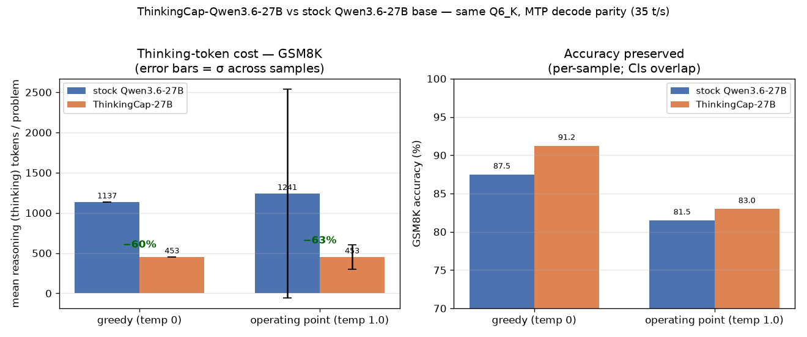

**Findings:**

- **~60–63 % fewer thinking tokens** — meets and beats the "~50 % avg" claim on both samplers.
- **Accuracy preserved** — 81.5 % vs 83.0 % per-sample (temp 1.0), 85.0 % vs 82.5 % majority@5; the base
  edges greedy 87.5 % → 91.2 % is offset the other way at temp 1.0. Differences sit inside the n=40–80 CI
  (±~4 pts): the honest read is **statistical parity**, not a quality win either way.
- **Variance collapse (the sleeper win).** The stock base's per-problem reasoning length is *wildly*
  unpredictable — σ **≈ 1299 tokens ≈ its own mean** at temp 1.0, occasionally running away into the 8 k
  cap (2/200 truncations, i.e. wrong answers from over-thinking). ThinkingCap's σ is **151** and it never
  truncated. For a serving slot that means **predictable latency** and no runaway generations.
- **MTP decode is at parity** — with `--spec-type draft-mtp --spec-draft-n-max 3` both models decode
  **~35 t/s** on the V100. So the per-token speed is unchanged; the end-to-end win comes entirely from
  emitting fewer tokens: **~2.3–2.5× faster wall-clock per answer** at the same quality
  (base ≈105 s vs ThinkingCap ≈46 s per GSM8K item in the greedy pass).

**Verdict — strong `coding`-slot candidate, kept hot for a live trial.**

It is a genuine drop-in (same base, quant, VRAM, MTP self-spec, stock engine) that returns equivalent
answers ~2.5× faster with far more predictable latency. GSM8K is a narrow, easy axis — the base
over-thinks it, which likely *flatters* the token-savings gap — so a live trial on real coding/agentic
traffic (where the vendor's own GPQA/MMLU-Pro/LiveCodeBench tables still show 25–68 % reductions) is the
right next step before swapping the daily `coding` model. Kept hot at
`/srv/ai/models/thinkingcap-27b/` (official Q6_K + `protoLabsAI` Q6_K-MTP).

Data + reproducible harness: `docs/data/thinkingcap-27b-20260726/` (`harness.py`, `run-matched.sh`,
`run-temp1.sh`, per-generation `*.jsonl`, item sets). Chart: `scripts/thinkingcap-plot.py`.

> **Caveat:** greedy (`temp 0`) is not the model's recommended operating point (`temp 1.0`); we report
> both. Accuracy is measured on GSM8K only at modest n — treat the parity claim as "no regression
> detected on math reasoning," not blanket equivalence. The thinking-token reduction is the robust,
> reproducible result across both samplers.

## ComfyUI V100 power-cap sweep — does generation benefit from more watts? (2026-08-04)

The V100s are capped at **175 W** at boot (`gpu-fan-control.config.json`), a limit chosen from the
*LLM-decode* thermal sweep (`power-cap-sweep.sh`, 2026-07-01): decode is memory-bandwidth-bound, so the
HBM2 pegs ~85 °C and soft-throttles, and 175 W was the point that held ~83-84 °C at ~91 % of full decode
throughput. Question: does **ComfyUI diffusion** — a very different, compute-bound workload — leave
performance on the table at 175 W?

Sweep on the `comfyui-open` V100 (idx1), SDXL `sd_xl_base_1.0` 1024×1024, 30 steps, euler/normal, 3 warm
runs per cap. The card was run clean (llama-swap unloaded), and each cap was **held by the fan daemon
itself** (the harness writes the cap into the daemon config and restarts it, so fans keep cooling and the
cap isn't reverted mid-run):

| cap | warm avg | speedup | peak HBM | core | peak W | min SM clk | SM % |
|----:|---------:|--------:|---------:|-----:|-------:|-----------:|-----:|
| 175 W | 10.63 s | — (base) | 65 °C | 61 °C | 191 | 1065 MHz | 82 % |
| 200 W | 10.09 s | 1.05× | 77 °C | 67 °C | 218 | 1147 MHz | 90 % |
| 250 W | **9.37 s** | **1.13×** | 76 °C | 74 °C | 253 | 1252 MHz | 87 % |

**Diffusion is power/clock-limited, not thermally limited.** Lifting the cap raises the sustained SM clock
(1065 → 1260 MHz) and cuts wall time ~13 % (175 → 250 W), and — unlike LLM decode — **HBM never approaches
the 85 °C throttle**, topping out at 76-77 °C while pulling the full 253 W. So the thermal reason the 175 W
cap exists (HBM-bound decode) simply doesn't apply to ComfyUI: the compute-bound diffusion kernels keep the
HBM cool even at 250 W.

**Caveats before acting on this:**
- Single card, **idx2 idle**. Two V100s under simultaneous load share the side-fan airflow and will run
  hotter; re-measure a dual-card (or diffusion + LLM) mix before trusting these thermals.
- The power cap is **global per-card, applied at boot** by the fan daemon — you can't raise it for ComfyUI
  without also raising it for LLM serving, which *is* the HBM-throttle-prone workload. Any permanent change
  needs the 175 W-vs-higher LLM-decode thermal check repeating at the new cap.
- Short T2I is a brief burst; sustained **video** generation gives HBM more time to climb and is the more
  decisive throttle test — see the video sweep below, which reverses the conclusion entirely.

### Video leg — MiniMax-H3 text-to-video (~23 min/clip): the opposite result

Same harness, an exported MiniMax-H3 t2v workflow (17 nodes, nvfp4 text encoder), 2 warm runs per cap on
the same V100 (idx1). The `--hbm-ceiling 90` safety abort fired on the 250 W run:

| cap | warm avg | speedup | peak HBM | core | peak W | min SM clk | SM % |
|----:|---------:|--------:|---------:|-----:|-------:|-----------:|-----:|
| 175 W | 1416 s | — (base) | 86 °C | 70 °C | 205 | 847 MHz | 100 % |
| 200 W | 1370 s | 1.03× | 87 °C | 73 °C | 221 | 675 MHz | 100 % |
| 250 W | 1370 s | **ABORTED** | **93 °C** | 78 °C | 264 | 570 MHz | 100 % |

**Sustained video is HBM-thermal-limited, not power-limited — the exact opposite of T2I.** The tells:

- **SM sits at 100 %** the whole run (vs 82-90 % for T2I): this genuinely saturates the card for ~23 min.
- **Sustained clock *falls* as the cap rises** — 847 → 675 → 570 MHz. That is the HBM throttle clawing back
  clocks: more watts → more heat → *lower* held clock, so wall time doesn't improve (200 W ≈ 3 % ≈ noise,
  250 W buys nothing).
- **HBM is already at/over its ~85 °C throttle at 175 W** (86 °C), and runs away to **93 °C at 250 W** — over
  comfort for the HBM2, which is why the safety ceiling aborted it. The power cap isn't even the binding
  limit: at 175 W the card only pulls 205 W peak; it's thermally capped, not power-capped.

**Combined verdict (both workloads):** short compute-bound work (T2I) is power/clock-limited and benefits
from more watts while HBM stays cool; long sustained work (video, and by extension LLM decode) is
HBM-thermal-limited and more watts only add heat + throttle. **Keep the 175 W cap** — the workloads that
actually stress the box are cooling-bound, and 175 W already sits right at the 85 °C HBM edge. The lever for
faster video is **cooling** (more/faster airflow over the V100 HBM, lower ambient), not power. Two side
notes: this workflow used the **nvfp4** text encoder, which on Volta (sm_70, no native fp4) is likely
dequantized/emulated and may be inflating the ~23 min runtime — worth an A/B against the int8 encoder; and
the 93 °C excursion is a longevity concern the abort correctly caught.

Harness: `scripts/comfyui-power-sweep.py` (requires sudo — restarts `gpu-fan-control` to apply caps).
Data: `docs/data/comfyui-power-sweep-t2i-20260804.csv`, `docs/data/comfyui-power-sweep-video-20260804.csv`.

```bash
sudo /srv/ai/venvs/comfyui/bin/python scripts/comfyui-power-sweep.py --label t2i --runs 3
# video leg: export a working workflow from the UI as API format, then
sudo /srv/ai/venvs/comfyui/bin/python scripts/comfyui-power-sweep.py \
  --label video --workflow ~/your_video_api.json --runs 2
```

## MiniMax-H3 video — native fp16 on V100 (`--fp16-unet` + overflow fix, 2026-08-27)

H3's DiT only whitelists bf16/fp32, so on Volta (no bf16) ComfyUI silently casts to **fp32** and
crawls. Forcing `--fp16-unet` alone runs on fp16 tensor cores but **black-frames** — three spots in
the H3 DiT overflow fp16's range (text-conditioning projection, attention-sink residual rows, a
couple of block output projections). The one-file node
`custom_nodes/minimax_h3_fp16_fix.py` (from `Amduraznak/minimax-h3-fp16-fix`, MIT) keeps just those
spots in fp32/rescaled while everything else runs fp16; it self-disables unless `--fp16-unet` is set.

Measured on our stack (ComfyUI v0.30.1, torch 2.6.0+cu124, dual-V100 visible, `fl2va-curve-Q5_1`
GGUF via **ComfyUI-H3-Multishot** + ComfyUI-GGUF, 25-frame clip):

| resolution | fp32 fallback | `--fp16-unet` **no fix** | `--fp16-unet` **+ fix** | speedup | frames |
|-----------:|--------------:|-------------------------:|------------------------:|--------:|:------|
| 512×512 | 14.88 s/it | 3.70 s/it | **4.05 s/it** | **3.67×** | black w/o fix, valid w/ |
| 768×768 | 35.34 s/it | — | **9.15 s/it** | **3.86×** | valid (mean 168) |

- **The fix is mandatory on a non-int8 model**: without it `--fp16-unet` gives pure black (`max=0`);
  with it the DiT runs native fp16 (`model weight dtype torch.float16, manual cast: None`) and
  output is clean. The ~9 % overhead vs the (broken) no-fix run is the fp32 islands — the correct
  trade.
- **Speedup grows with resolution** (compute-bound scaling: 3.67× → 3.86×); the Reddit-reported ~11×
  was at 1120×768 on a single card where compute fully dominates.

**Real-world confirmation (secure slot, single V100 idx2, 2026-08-27):** a full production clip run
back-to-back on the `comfyui-secure` instance via the status-page fp16 toggle — same GGUF workflow,
flag flipped between runs — gave **10m53s with `--fp16-unet` (native fp16, `manual cast: None`)** vs
**38m32s in the fp32 fallback (`manual cast: torch.float32`)**, i.e. **3.54×**, matching the s/it
benchmark above. Times read straight from `journalctl -u comfyui-secure` (`Prompt executed in …`).

- **Model format matters more than the fix.** Our earlier **int8_convrot** pruned/turbo weights only
  gained **1.28×** from the fix, because int8 GEMM dequantizes to fp32 accumulate and never reaches
  fp16 tensor cores regardless of `--fp16-unet`. A **GGUF** (or stock bf16) model dequantizes to the
  compute dtype, so it actually reaches native fp16 — that is what unlocks the ~3.9×.

`--fp16-unet` is a per-instance ComfyUI flag affecting **every** model on that instance, so it ships
**off** and is flipped per-session from the status page's per-ComfyUI **fp16** checkbox (editable only
while the instance is stopped; auto-resets off on reboot / quiet-hours end). See
`docs/server-setup.md` → "ComfyUI native-fp16 toggle".

#### Alternative evaluated — `Icbears/minimax-h3-v100-patch` (rejected, 2026-08-27)

A second patch, [`Icbears/minimax-h3-v100-patch`](https://github.com/Icbears/minimax-h3-v100-patch)
(GPL-3.0, v0.1.3), takes a different **delivery** approach: it registers fp16 as a supported inference
dtype for CUDA capability 7.0 at import time, so H3 instantiates in fp16 with **no `--fp16-unet`
flag** — which would let it run without our per-instance toggle and without affecting other models
on the instance. We A/B'd it on a temp instance (idx1, same fl2va curve Q5_1 GGUF, 768²×25, euler/simple):

| patch | flag needed | s/it @ 768² | vs fp32 fallback | frames |
|--------|-------------|-------------|------------------|--------|
| fp32 fallback | — | 35.34 | 1× | valid |
| `Amduraznak` (shipped) | `--fp16-unet` | **9.15** | **3.9×** | valid |
| `Icbears` v0.1.3 | none | 9.49 | 3.7× | valid (`mean≈112, std≈67`) |

It **installed cleanly on our 0.30.1** despite targeting 0.33.2 (all its structural gates passed) and
logged `registered native FP16 H3 loading for CUDA capability 7.0 … no --fp16-unet flag is required`.

**Verdict: keep Amduraznak, don't switch.** Inspecting both sources, Icbears applies the **identical**
overflow recipe at the **same three sites with the same constants** — fp32 `condition_proj`,
`out_proj` rescaled ×64 (`OUT_PROJ_SCALE = 64.0`), `fc2` rescaled ×256 (`MLP_FC2_SCALE = 256.0`),
fp32 residual stream — so it's Amduraznak's fixes repackaged with a no-flag dtype shim, not a
complementary technique. The two are **truly mutually exclusive** (Icbears refuses to stack; forcing
both would double-apply the rescales — ÷4096 / ÷65536 — and corrupt output). Icbears is ~4% *slower*,
GPL-3.0 (vs MIT), and built against a newer ComfyUI, and its only edge (dropping the global flag) is
already handled by our per-instance toggle. Recorded here as a verified fallback if we ever upgrade
ComfyUI or want to retire the toggle.

#### Power-cap vs speed — H3 Turbo LoRA, 175 W vs 225 W (2026-08-28)

Once native fp16 is in play, does raising the per-card power cap buy meaningful speed for H3
video? Ran the **same six-render matrix twice** on `comfyui-secure` (V100 idx2) — once at the
default **175 W**, once at **225 W** — using the Larryvrh **MiniMax-H3-Turbo** LoRA (v4-600 EMA,
4- and 6-step schedules) across three latent sizes (frames fixed at 37; only spatial res varies).
Per-step **s/it** (from tqdm) is the cap-independent metric; each render is matched 1:1 by identical
`x.shape` + step count. Data: [`docs/data/h3-turbo-powercap-20260828.csv`](data/h3-turbo-powercap-20260828.csv).

| latent (spatial) | steps | 175 W s/it | 225 W s/it | **speedup** | 225 W peak HBM | 225 W power-capped |
| --- | --- | --- | --- | --- | --- | --- |
| 1.45 M (30×54) | 4 | 29.0 | 24.8 | **1.17×** | 80–82 °C | 51–57 % |
| 1.45 M (30×54) | 6 | 29.04 | 24.94 | **1.16×** | 83 °C | 54 % |
| 2.85 M (42×76) | 6 | 85.9 | 75.5 | **1.14×** | 86–87 °C | 22–29 % |
| 3.68 M (48×86) | 6 | 135.4 | 123.6 | **1.09×** | ~87 °C | ~22 % |

- **The gain shrinks as the render gets heavier** — +50 W (+28 %) buys ~17 % on the small clip but
  only ~9 % on the big one. Reason: at 175 W the card is **100 % power-capped** on every shape; at
  225 W the *light* renders still sit ~50 % power-capped (headroom left → they gain most), while the
  *heavy* render stops being power-bound (~22 % capped) and pins **HBM at 86–87 °C** — the same
  HBM-thermal wall the earlier T2I/video sweeps hit. The heavy run's s/it even drifts up mid-render
  (first step 124.7 vs 123.6 median) = progressive HBM throttle.
- Same trend in wall-clock totals: 1.45 M 6-step 207.8 → 180.6 s, 2.85 M ~576 → 502 s,
  3.68 M 892 → 794 s.
- **Native fp16 confirmed on all 12 renders** (`model weight dtype torch.float16, manual cast: None`)
  via the Amduraznak fix — the power-cap comparison is on top of, not instead of, the fp16 win.

**Takeaway:** 225 W is a reasonable *watched* boost (~9–17 %) for short/low-res H3 clips, but for
sustained heavy video the payoff is small and it pushes HBM into the ~87 °C throttle zone — so
**175 W stays the default** (matching the T2I/video power-cap conclusion above: the lever for long
jobs is cooling, not power). The cap is global per-card, applied at boot by `gpu-fan-control`, and
resets to 175 W on reboot; raise it (`nvidia-smi -pl`) only for a supervised light-clip session.


(unsloth GGUFs, `general.architecture=qwen35` — drop-in on llama.cpp build 9850,
MTP `nextn` head embedded in the main GGUF). `chat` stays Qwen3.6-35B-A3B MoE.
This section records the full validation pass (throughput, MTP, GSM8K quality,
code evals) against the retained 3.6 numbers.

- **coding** = Qwen3.8-27B **Q6_K** (21.3 GiB), single V100 idx1, q8_0 KV,
  ctx **163840** (trimmed from 3.6's 180k — the larger 3.8 weights left only ~1 GB
  free at 180k; 160k = 30.7/32 GB, ~2 GB headroom), MTP `--spec-draft-n-max 3`.
- **big** = Qwen3.8-27B **UD-Q6_K_XL** (24.1 GiB), dual-V100 `-sm layer`, f16 KV,
  ctx 262144, MTP `n_max 2`. (Never BF16 — corrected stale doc claim during migration.)

Harnesses: `scripts/bench-qwen3.8-27b.sh` (llama-bench), `scripts/mtp-bench.py`
(`--model` the 3.8 GGUF), `scripts/roster-gsm8k-eval.sh coding big` (SPEC updated to
3.8), `scripts/eval-run.py`. Data: `docs/data/qwen3.8-27b-bench-20260815/`,
`docs/data/mtp/qwen38-{coding,big}-mtp.csv`, `docs/data/lm-eval/{coding,big}-gsm8k-20260815/`.

### Single-stream throughput (llama-bench, raw — no MTP), pp512 / tg128 t/s

| config | depth 0 pp / tg | depth 8192 pp / tg |
|---|---|---|
| coding Q6_K — single V100 (`-sm none`) | 755 / 22.8 | 665 / 21.7 |
| coding Q6_K — dual V100 (`-sm layer`)  | 770 / 25.0 | 674 / 24.3 |
| coding Q6_K — dual V100 (`-sm row`)    | 202 / 21.4 | 194 / 20.6 |
| big UD-Q6_K_XL — single V100 (`-sm none`) | 778 / 23.0 | 686 / 22.0 |
| big UD-Q6_K_XL — dual V100 (`-sm layer`)  | 801 / 24.3 | 700 / 23.4 |
| big UD-Q6_K_XL — dual V100 (`-sm row`)    | 198 / 21.0 | 191 / 20.3 |

Same picture as 3.6: `-sm layer` is the only viable dual-V100 split (row split
tanks prefill to ~200 t/s over the NVLink-less PCIe PHB). Raw decode ~22–23 t/s;
the real decode win comes from MTP (below).

### MTP self-speculative decode (echo-heavy `code` prompt)

`coding` Q6_K, single V100 idx1, q8_0 KV, ctx 40960 — decode t/s / draft-acceptance
by prompt size:

| n_max | ~512 | ~2.5k | ~5k | ~10k | ~21k | accept |
|---|---|---|---|---|---|---|
| 0 (off) | 22.4 | 22.1 | 21.7 | 21.2 | 20.1 | — |
| 2       | 43.6 | 43.1 | 42.3 | 41.0 | 38.3 | ~98% |
| **3 (shipped)** | **48.7** | **47.9** | **46.7** | **45.3** | **42.4** | ~94–98% |
| 4       | 52.9 | 53.0 | 51.4 | 49.7 | 45.2 | ~93–98% |

`big` UD-Q6_K_XL, dual-V100 `-sm layer`, f16 KV — decode t/s / acceptance:

| n_max | ~1k | ~2.5k | ~5k | ~10k | ~21k | accept |
|---|---|---|---|---|---|---|
| 0 (off) | 23.9 | 23.8 | 23.5 | 22.9 | 21.9 | — |
| **2 (shipped)** | **48.1** | **47.8** | **47.2** | **46.3** | **44.1** | ~98% |
| 3       | 51.1 | 51.0 | 49.8 | 48.8 | 47.6 | ~97–98% |

MTP gives ~2.2–2.4× decode on code with 93–99% acceptance (much higher than the
~0.55 seen on a generative summary probe — acceptance is prompt-dependent). Shipped
depths unchanged from 3.6 (coding n3, big n2); n4/n3 are marginally faster but
tighten VRAM and the 3.6 sweeps showed n4 regresses on generative prompts.

### GSM8K quality (5-shot, greedy, n=100)

| slot | model | flexible-extract | strict-match |
|---|---|---|---|
| coding | Qwen3.6-27B (was) | 0.98 | 0.98 |
| coding | **Qwen3.8-27B** | **0.99** | 0.92 |
| big | Qwen3.6-27B (was) | 0.98 | 0.98 |
| big | **Qwen3.8-27B** | **0.98** | 0.92 |

Flexible-extract (the accuracy metric) holds/improves. Strict-match dips to 0.92 —
this only reflects final-answer *formatting* under the reasoning template (the
right number is present but not always in the exact `#### N` shape strict-match
wants), not solve rate. (Measured at the model's default `reasoning_effort=xhigh`;
GSM8K fit within the 6144-token gen budget, so xhigh was fine here — but see the
next section for why xhigh is *not* fine for long-form codegen.)

### `reasoning_effort` — the `xhigh` default is pathological for codegen

Qwen3.8's chat template exposes `reasoning_effort` (`reasoning_effort|default('xhigh')`,
valid values `xhigh | medium | low`). At the default **`xhigh`** the model reasons
enormously on complex build-an-app prompts — on `dungeon-adventure-engine` it burned
**39,478 completion tokens** (and truncated `local-dungeon-web` even at a 49k cap),
i.e. ~20+ minutes for a single answer at ~32 t/s. This is a serving-quality bug: the
first eval pass hit `finish=length` with **0 bytes** of extractable code.

Dropping to **`medium`** collapses reasoning to a sane budget with no quality loss and
*more* complete output:

| test | xhigh tokens | medium tokens | medium output |
|---|---|---|---|
| dungeon-adventure-engine | 39,478 (`stop`@49k) | **9,565** | 38.8 KB, `stop` |
| local-dungeon-web | 49,152 (`length`, truncated) | **16,372** | 29.8 KB, `stop` |

We bake `--chat-template-kwargs '{"reasoning_effort":"medium"}'` into the `coding` and
`big` blocks of `config/llama-swap.base.yaml` so every request gets bounded reasoning.
Clients should also send the unsloth **thinking-mode sampling** set
(`temperature=1.0, top_p=0.95, top_k=20, min_p=0.0`) — `eval-run.py` gained `--min-p` /
`--presence-penalty` for this. `low` is available for even faster/terser replies.

### Code-generation evals (`scripts/eval-run.py`, objective `check.py` score)

All five tests at the **production setting** — `reasoning_effort=medium`, thinking-mode
sampling (`temp 1.0, top_p 0.95, top_k 20, min_p 0.0`) — vs the retained 3.6 outputs
(`*-qwen3.6` labels, run at the 3.6 default sampling). 3.8 medium reasoning lands at
~9–19k tokens/answer, comparable to 3.6's natural ~13k:

| test | coding 3.6 | coding 3.8 @medium | big 3.6 | big 3.8 @medium |
|---|---|---|---|---|
| dungeon-adventure-engine   | 29/29 | 29/29 | 29/29 | 27/29 |
| local-dungeon-web          | 41/41 | 41/41 | —     | 41/41 |
| localmind-landing-page     | 27/27 | 27/27 | 27/27 | 27/27 |
| localmind-landing-page-pro | 41/41 | 41/41 | 41/41 | 41/41 |
| logic-puzzle-reasoning     | 12/12 | 11/12 | 12/12 | 12/12 |

**3.8 @medium is at parity with 3.6.** The single-sample table above shows two
1-point dips (coding `logic-puzzle` 11/12; big `dungeon` 27/29), but a follow-up
**controlled variance study** (`docs/data/lm-eval/qwen38-sampling-variance-20260815.csv`,
3 samples per cell, all at `reasoning_effort=medium`) proves these are **sampling
noise from the temperature, not a model or reasoning regression**:

| test (slot) | temp 0.7 (3.6-matched) | temp 1.0 (unsloth thinking) |
|---|---|---|
| logic-puzzle (coding, pure reasoning) | 11, 11, 10 / 12 | **12, 12, 12** / 12 |
| dungeon (big, code generation)        | **29, 29, 29** / 29 | 29, **2**, 29 / 29 |

The confound: the retained 3.6 baselines ran at **temp 0.7** (eval-run default) while the
3.8 pass followed unsloth's thinking-mode rec of **temp 1.0** (+ `min_p 0.0`). Temperature
cuts both ways — on the *pure-reasoning* logic puzzle, temp 1.0 explores enough to hit the
"Ben = Reinforcement Learning" deduction (12/12 ×3), whereas the more deterministic temp 0.7
keeps routing the contradiction through the Robotics branch and misses that one w=1 check. On
*code generation*, temp 1.0 is too hot: one of three `big` runs emitted a non-parsing program
(`IndentationError` → 2/29), while temp 0.7 was rock-solid 29/29 ×3. `reasoning_effort=medium`
is used in **every** cell, so bounded reasoning is not implicated in either dip.

**Practical takeaway:** unsloth's `temp=1.0` thinking-mode preset is tuned for reasoning
benchmarks; for long-form **code** generation it adds tail-risk of broken output. Prefer
`temperature ≈ 0.6–0.8` for coding work (this is a per-request client sampler choice, not a
server setting) and reserve `temp 1.0` for reasoning/analysis prompts.

All ten single-sample runs finished cleanly (`finish=stop`), 3.6-54 KB output, decode
34-46 t/s with MTP on. Manual design scores (`scores.json`) are hand-entered and not part of
this automated pass. The game-agnostic playability harness gave mixed goal-reachability across
models (incl. 3.6 and `chat`); it keys off specific movement phrasing, so "not reached" is a
soft signal, not a regression given the objective scores.

**Verdict:** Qwen3.8-27B is a clean upgrade for `coding` + `big` — genuine quality parity with
3.6 (GSM8K flexible ↑ for coding; code evals at full parity once sampling is matched), MTP
intact (~2.3× decode, high acceptance on code), throughput on par. **The one required config
change is capping `reasoning_effort` at `medium`** — the `xhigh` default makes long-form codegen
unusably slow and truncation-prone. Shipped: coding Q6_K 160k n3, big **UD-Q8_K_XL** 256k n2
(see the Q6-vs-Q8 A/B below), both with `reasoning_effort=medium`. 3.6 GGUFs retained as rollback.

### `big` slot: UD-Q6_K_XL vs UD-Q8_K_XL A/B (2026-08-15)

The `big` slot is the "max quality" slot, so we A/B'd the Q8 dynamic quant against the Q6 it
shipped on. Both dual-V100 `-sm layer`, 256k f16 KV, MTP n2, `reasoning_effort=medium`, unsloth
thinking-mode sampling.

| | UD-Q6_K_XL | UD-Q8_K_XL |
|---|---|---|
| weights on disk | 25.9 GB | 31.5 GB |
| VRAM @256k (idx1 / idx2) | ~21.7 / 24.9 GB (~47 total) | ~23.2 / 27.7 GB (~51 total) |
| decode (avg across 5 evals) | ~43 t/s | ~41 t/s (**−5%**) |
| MTP acceptance | 0.76–0.93 | 0.79–0.93 (unchanged) |

**Eval scores (single sample, temp 1.0):** identical — dungeon 27→29/29, local-dungeon-web
41/41, localmind 27/27, localmind-pro 41/41, logic-puzzle 12/12. **No measurable quality gain.**

**Same temperature tail-risk:** re-running `dungeon` 3× on Q8 at temp 1.0 reproduced the exact
Q6 failure — 29/29, **2/29** (`IndentationError`, non-parsing), 29/29. So the code-break is
**sampling-driven, not quantization** — Q8 does not fix it (lowering temp to ~0.7 does). BF16
was ruled out: ~55 GB weights + KV overflow 64 GB at 256k.

**Decision:** shipped **UD-Q8_K_XL** as the `big` default — it fits 256k comfortably, keeps MTP
(acceptance unchanged), and costs only ~5% decode, which is acceptable for the occasional
max-quality slot. The quality delta over Q6 is below eval noise, so this is precision insurance
rather than a measured win. (Raw study: `docs/data/lm-eval/qwen38-sampling-variance-20260815.csv`
for the temperature effect; llama-bench numbers in the section above were taken on Q6_K_XL.)
